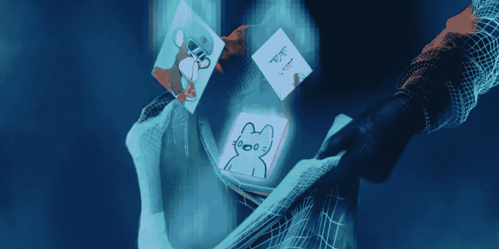

# 以下是 NFT 十大抢劫案…

> 原文：<https://medium.com/coinmonks/here-are-the-top-10-nft-heists-f4127fc43c91?source=collection_archive---------31----------------------->

NFT heists are a HUGE business worth billions in 2022.

以下是近年来 NFT 十大抢劫案:

1.  lympo—1870 万美元被盗
2.  农民世界—1570 万美元被盗
3.  无聊猿游艇俱乐部——1370 万美元被盗
4.  DragonSB Finance —被盗 1000 万美元
5.  open sea—340 万美元被盗
6.  top goal—223 万美元被盗
7.  变形人——2M 被偷了
8.  阿莱西亚·艾——180 万美元被盗
9.  月鸟——150 万美元被盗
10.  omni—143 万美元被盗

是的，可怕的是我们有足够的信息来列出这类事情的前 10 名。

请注意，这些只是前 10 名，而不是被盗的 NFT 总数。

随着我们的数字资产变得越来越珍贵，越来越多的用户加入 web3，NFTs 将是一个相当大的市场。

想知道 NFT 是怎么被偷的吗？

When you think about it carefully, how does an NFT get stolen?

我来分享几个最常见的方式。

它们主要围绕着网络钓鱼——窃贼会向你发送电子邮件、短信、不和谐的短信、社交媒体上的短信，试图获取你的信息。

1.  虚假的社交媒体账户——拼错流行的 NFT 收藏或著名的秘密人物，让你进入他们的网站，在那里他们从你那里收集重要信息
2.  虚假网站——让你链接你的钱包(你认为你正在铸造一个真正罕见的 NFT ),并不知不觉地让小偷拿走钱包里的所有东西
3.  黑进 Discords 和社区平台的管理员，用他们的账户建立链接，这将耗尽你的钱包
4.  侵入交易所和平台，直接从用户那里窃取信息(尽管需要大量的工作和努力)
5.  山寨 NFT——他们真的克隆了 NFT 系列，让你觉得这就是你想要的 NFT

正如你所看到的，NFT 被盗的大部分原因是用户暴露了自己。

Seth Green Reclaims His Stolen Bored Ape NFT by Spending Another $300K.

具有讽刺意味的是，大多数 NFT 攻击只有在用户不知不觉点击链接或允许访问他们的钱包时才可能实现。

黑客知道用户反应迟钝，警惕性不高，容易上当。

当然，黑客和小偷现在变得越来越有创造力和天赋。

诈骗、网络钓鱼和欺诈将变得更加复杂和奢侈。

随着更新的技术和工具的出现，攻击的诡辩性越来越高。

这是蓬勃发展的资产类别的副产品，是如此多的资金如此迅速地进入一个行业的不可避免的现实。

就像狮子和瞪羚一样，为了生存，一只必须跑得比另一只快。

*The Lion and Gazelle is a story you must have heard before.*

在非洲，每天早晨，一只瞪羚醒来。他脑子里只有一个想法:能够跑得比最快的狮子还快。如果他不能，那么他将被吃掉。

*在非洲，每天早上都有一头狮子醒来。他脑子里只有一个想法:能够跑得比最慢的瞪羚还快。如果他不能，他会饿死。*

*你选择做瞪羚还是狮子并不重要。知道随着太阳的升起，你必须奔跑，这就足够了。*

你必须比昨天跑得更快，否则你会死的。

这是生命的竞赛。”

随着 web3 和加密技术的普及，诈骗和网络钓鱼也会增加，我们必须更加警惕和机敏。

在外面注意安全。

买一个硬件钱包，保管好你的硬币和 NFT，永远不要分享你的种子短语。

记住:“唯一免费的奶酪在捕鼠器里”。

=)

-

NFT 的抢劫/诈骗能被彻底根除吗？

-

# startups # business # startupx # growth # success # social media # culture # web 3 # strategy # hacks # rattacks # bored apes # NFTs # scams # eth # BTC # crypto #黑客#钱包

> *交易新手？试试* [*密码交易机器人*](/coinmonks/crypto-trading-bot-c2ffce8acb2a) *或* [*复制交易*](/coinmonks/top-10-crypto-copy-trading-platforms-for-beginners-d0c37c7d698c)
> 
> *分散密码持有量，了解* [*币安替代品*](https://coincodecap.com/binance-alternatives)
> 
> *加入 Coinmonks* [*电报频道*](https://t.me/coincodecap) *和* [*Youtube 频道*](https://www.youtube.com/c/coinmonks/videos) *获取每日* [*加密新闻*](http://coincodecap.com/)

# 另外，阅读

*   [复制交易](/coinmonks/top-10-crypto-copy-trading-platforms-for-beginners-d0c37c7d698c) | [加密税务软件](/coinmonks/crypto-tax-software-ed4b4810e338)
*   [网格交易](https://coincodecap.com/grid-trading) | [加密硬件钱包](/coinmonks/the-best-cryptocurrency-hardware-wallets-of-2020-e28b1c124069)
*   [密码电报信号](/coinmonks/top-3-telegram-channels-for-crypto-traders-in-2021-8385f4411ff4) | [密码交易机器人](/coinmonks/crypto-trading-bot-c2ffce8acb2a)
*   [最佳加密交易所](/coinmonks/crypto-exchange-dd2f9d6f3769) | [印度最佳加密交易所](/coinmonks/bitcoin-exchange-in-india-7f1fe79715c9)
*   [面向开发者的最佳加密 API](/coinmonks/best-crypto-apis-for-developers-5efe3a597a9f)
*   最佳[密码借贷平台](/coinmonks/top-5-crypto-lending-platforms-in-2020-that-you-need-to-know-a1b675cec3fa)
*   [免费加密信号](/coinmonks/free-crypto-signals-48b25e61a8da) | [加密交易机器人](/coinmonks/crypto-trading-bot-c2ffce8acb2a)
*   [杠杆代币的终极指南](/coinmonks/leveraged-token-3f5257808b22)