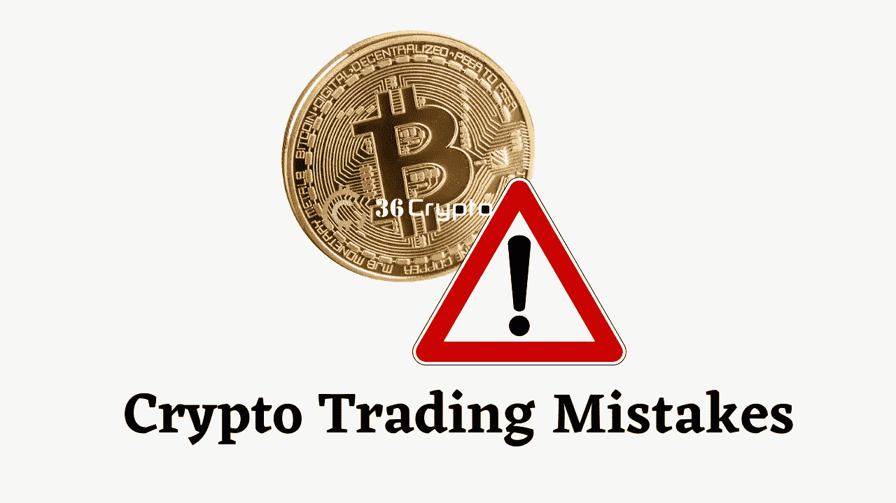
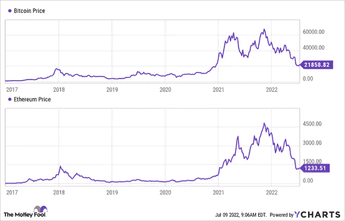

# 这里有一个你不应该在加密货币中犯的巨大错误

> 原文：<https://medium.com/coinmonks/here-is-a-huge-mistake-you-shouldnt-make-in-cryptocurrency-cffbdb78c8b9?source=collection_archive---------32----------------------->

最近不同的事件影响了加密货币 T1 的价格。乌克兰战争和经济问题就是几个例子。

在这样的艰难时期，投资者倾向于寻找最安全的投资，并蜂拥而至。由于这些情况，加密市场最近一直在遭受损失，这已经不是什么新闻了，结果，人们犯了一些他们最终会后悔的大错误。

加密货币非常不稳定，这使得它成为一项风险很高的投资。我们总是建议你在做决定之前做 DYOR(自己的研究)。这个行业很新，我们只能预测未来会发生什么。

自去年年底以来，加密货币市场的价值已从 3 万亿美元降至约 1 万亿美元。很明显，这些都是问题，可能现在就给你带来问题，但这不应该成为放弃希望和放弃的理由。你应该非常小心，确保不要犯这种特殊的加密货币错误。

# 这是什么错误？

人们可能会犯一个特别的错误，那就是“在熊市期间抛售你持有的所有加密货币。”

让我们检查一下。根据历史，熊市不会永远持续，它们总是暂时的，市场通常会反弹并变得更好。加密货币仍处于早期阶段。[比特币](https://36crypto.com/bitcoin/)于 2009 年首次推出。与股票市场相比，纽约证券交易所早在 1792 年就已经存在了。

> 交易新手？试试[密码交易机器人](/coinmonks/crypto-trading-bot-c2ffce8acb2a)或[复制交易](/coinmonks/top-10-crypto-copy-trading-platforms-for-beginners-d0c37c7d698c)

就像公司和它们的股票一样，总是有起有落，我们以前也见过。我们也看到一些声誉良好的公司在过去遭受损失，然后又恢复过来。沿着这条路走下去，加密货币仍然年轻，可能会重塑未来的商业模式。

由于其波动性，即使在熊市之前，加密货币也是一种风险投资。比特币、以太坊和其他强劲的加密货币仍然有强大的投资理由，尽管价格正在下降。

以[以太坊](https://36crypto.com/ethereum/)为例，仅今年就已经损失了 60%以上，但投资者仍然是游戏中仅次于比特币的第二强者。而且还是去中心化 app 和 NFT 的专业。

# 当你在困难时期卖出时会发生什么？

让我们看看像比特币和以太坊这样的顶级密码过去的表现，并分析如果你在崩溃期间出售会发生什么。举个例子，如果你在 2019 年或 2020 年熊市后卖掉了你的密码，那么你就错过了 2021 年比特币上涨 60%，然后以太坊上涨超过 400%的突破机会。

根据下面 Motely Fool 的图表，它显示加密货币在过去已经下降，然后继续增长。

[YCharts 比特币价格](https://ycharts.com/indicators/bitcoin_price)

你可能现在看着你的投资组合，开始担心，但事实是，在你卖出之前，你并没有亏损。

但就像我们常说的，加密投资是一个个人决定，应该只在一个人的判断。如果你看看你的投资组合，你对某项资产失去了信心，你认为下跌只会继续加深，那么你应该卖出并退出该头寸。

然而，如果你仍然相信一个特定硬币的未来，你应该抓住它，不要让市场的整体表现让你做出你会后悔的举动。

相反，用长期计划来考虑你的投资，你将能够避免这些错误。

最初发布于 [36crypto](https://36crypto.com/cryptocurrency/here-is-a-huge-mistake-you-shouldnt-make-in-cryptocurrency/)