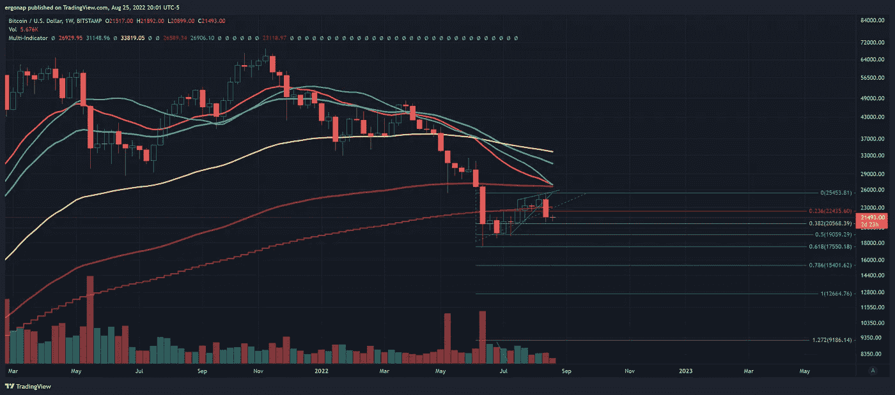

# 又来了

> 原文：<https://medium.com/coinmonks/here-we-go-again-4aa4638f65f5?source=collection_archive---------22----------------------->

## 加密货币/比特币市场分析 8/25

让我们看一看。我们有什么？嗯，BTC 正处于一个非常糟糕的趋势线上。

this does not spell happy fun times. [https://www.tradingview.com/x/cl83tt8H/](https://www.tradingview.com/x/cl83tt8H/)

我希望我注意到一个回到了六月的初始下降，因为它告诉我这里发生了什么。注意到什么了吗？这是我们第一次坐在上面。这告诉我，我们可能会崩溃。最重要的是，我们已经有一些严重的比特币转移到交易所，以降低价格。我认为这一点不会改变。2 亿美元的倾销是一个非常大的异常。小日期是指其中一笔资金流入的时间，而不是 24 小时内的一堆资金。

> 密码量子警报，[2022 年 8 月 24 日下午 5:17]
> 🚨🚨2，100.25 # BTC(＄45，281，767)
> 流入#双子座的资金总额
> 
> 密码量子警报，[2022 年 8 月 24 日下午 7:32]
> 🚨1，052.26 # BTC(＄22，473，323)
> 合计流入#比特币基地 Pro
> 
> 密码量子警报，[2022 年 8 月 24 日晚上 8 点 53 分]
> 🚨1，375.74 # BTC(＄29，724，319)
> 流入#双子座的资金总额
> 
> CryptoQuant 警报，[2022 年 8 月 24 日晚上 9:09]
> 🚨1，035.61 # BTC(＄22，313，172)
> 合计流入#比特币基地 Pro
> 
> 密码量子警报，[2022 年 8 月 24 日 10:04 PM]
> 🚨1，496.61 # BTC(＄32，224，643)
> 流入#比特币基地 Pro 的总额
> 
> 密码量子警报，[2022 年 8 月 25 日凌晨 1 点 39 分]
> 🚨🚨🚨3，462.24 # BTC(＄75，035，893)
> 流入#双子座的资金总额

除此之外，我们明天还有期货到期日和杰克逊霍尔会议。我们有拜登在某种程度上解决赤字和学生贷款问题。两者都将努力对抗通胀，并可能导致 DXY 飙升。当 DXY 飙升时……所有其他经济体都付出了代价，加密也付出了代价。请注意，人们在贷款问题上玩弄政治，这是粗略的。当保守派自己获得贷款豁免时，他们为什么会反对呢？是的，我们现在不需要回答这个问题。

即使我们涨到 23，000 美元，这是最不可能的，我认为在那之后，我们将下降一条腿。宏观经济变得更加悲观，而且非常明显。

this *really* doesn’t spell happy fun times. We are now starting to see faster MA’s start to catch up with the price [https://www.tradingview.com/x/GzrC9yd1/](https://www.tradingview.com/x/GzrC9yd1/)

周线显示的是，宏观熊市趋势在这里只是从**开始**。看到上面那些 MA 了吗？看到他们是如何缓慢下降以赶上价格了吗？看到它们是如何排列好让我们向下移动的了吗？在这一点上，即使 33k 美元(黄色)仍然是熊市。从周线的角度来看，没有一条均线我们不在下方。让我再说一遍。

# 从周线的角度来看，没有一条均线我们不在下方。

因此，出去。

> 交易新手？试试[密码交易机器人](/coinmonks/crypto-trading-bot-c2ffce8acb2a)或者[复制交易](/coinmonks/top-10-crypto-copy-trading-platforms-for-beginners-d0c37c7d698c)