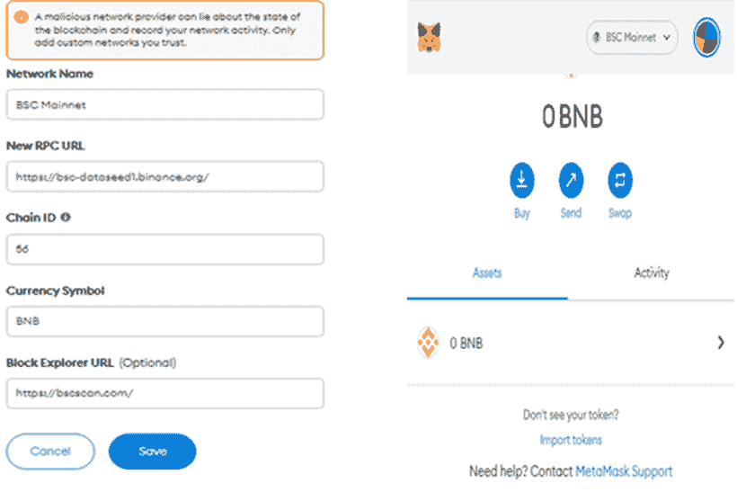

# 这里有一个快速的指南，可以轻松地检索发送到币安错误网络的加密

> 原文：<https://medium.com/coinmonks/heres-a-quick-guide-to-easily-retrieve-crypto-sent-to-a-wrong-network-on-binance-33894662e97b?source=collection_archive---------1----------------------->

加密货币交易是加密市场不可或缺的一部分，在加密市场中，资产可以根据情况需要进行交换、提取或发送到各种网络。当这些数字资产被交换时，它们通常通过加密钱包发送或接收，并最终被存储或保存。

所有的加密资产都标有各自的标准，反映了他们的网络或者可能是他们自己的区块链网络。每个标准还反映了它们与哪种区块链兼容以及钱包的类型——保管型或非保管型。

这就是为什么必须了解各个区块链的令牌标准，以及哪种令牌标准可以发送到特定的网络和钱包或通过特定的网络和钱包接收。

币安是一个集中的加密交易平台，加密爱好者和投资者可以在这里交易加密货币。它提供了一个保管钱包，用户可以在其中存储他们的数字货币和相关令牌。

由于币安是一个交易平台，大多数加密投资者和爱好者更喜欢将他们的资产存储在非托管钱包中，只使用币安来交换或清算他们的资产。

清算数字资产需要发送或撤回流程，如果处理不当，可能会出问题。当在币安上发送或接收加密时，知道你发送的网络和目的地是很重要的。

著名的加密网络或标准是 BEP-20、ERC-20、TRC-20 和 BEP-2。用户很容易将 BEP-20 误认为 BEP-2，将 ERC-20 误认为 TRC-20，反之亦然。

# 如何检索发送到错误网络的加密

如果您错误地通过币安智能链(BSC)发送了 ERC-20 令牌(ETH ),甚至通过以太坊网络发送了 BEP-20 令牌，请不要惊慌。在上述任何一种情况下，你的资产都可以被收回。

1.  如果您错误地将代币发送到兼容以太坊和 BSC 的钱包中。您可以将代币转移回币安的正确网络。
2.  **如果你错误地将代币发送到一个非托管钱包，而这个钱包只与以太坊网络或 BSC 兼容。**您的最佳选择是访问您的私钥，将错误发送的资产导入另一个支持两种网络的钱包。
3.  **如果您错误地将代币发送到加密交易所或保管钱包。**请咨询您交易所的客户服务，以获取可能的信息。

# 如果您错误地将 BEP-20 或 ERC-20 令牌发送到错误的网络，该怎么办

如果您错误地向 BSC 发送了 ERC-20 令牌，或者向以太网发送了 BEP-20 令牌，该令牌将反映在首选网络上的指定钱包地址中，但该令牌的标准将会改变。

例如，如果您将 ETH 发送到 BSC，它将作为 BEP-20 令牌出现在您的 ETH 钱包中，而不是原来的 ERC-20 令牌。

这种可能性是可能的，因为以太坊和 BSC 公钥是相同的，并且可以用相同的私钥访问。但如果你想确认交易的批准，你必须检查目的地网络。

如果您错误地向以太坊发送了 BEP-20 令牌，您将不得不在以太坊上确认交易状态，如果您错误地向 BSC 发送了 ERC-20 令牌，您将不得不在 Bscscan 上确认交易状态。

在这种情况下，您的令牌不会丢失。您只需将令牌发送回您的首选网络。

# 从支持以太坊和 BSC 的钱包中检索令牌

如果一个钱包支持以太坊和 BSC 两种网络，那么寻找和取回你的代币应该是无缝的。搜索每个网络的令牌列表；如果您的令牌未启用，您可以撤销并启用它。

例如，使用元掩码，您必须单击“导入令牌”来搜索您的首选令牌并添加它。

*   在下一个界面中，在搜索字段中输入您的令牌名称并选择令牌，然后单击“下一步”选项卡添加您的令牌。

*   但是，如果您找不到您的令牌，您必须通过单击“自定义令牌”来手动导入它
*   接下来是在提供的字段中分别输入“令牌合同地址、令牌符号和令牌十进制数”。然后，单击“添加自定义令牌”选项卡。

您可以使用两个选项将令牌转移回您的首选网络。你要么用币安桥，要么用手动程序。

# 什么是币安桥

币安桥是一个门户或平台，用于将来自其他网络的令牌转换为 BSC 兼容的令牌，反之亦然。它允许用户和投资者将跨链代币从一个网络无缝转移到另一个网络。

# 手动程序

将代币转移到首选网络的手动过程需要将错误发送的代币发送回币安。这要求您在币安上存入的钱包的网络必须与您当前存储或持有令牌的网络相同。

如果你错误地发送了一个 BEP-20 令牌到以太网，你必须通过以太网将令牌作为 ERC-20 令牌发送回币安。当您的令牌反映在您的币安帐户中时，您可以将其发送到您预期的钱包和网络中。

# 将 BEP-20 ETH 转化为 ERC-20 ETH

要做到这一点，您需要 BNB 支付汽油费，因为交易或转换是在 BSC 上进行的，您会记得 BNB 是 BSC 的本地令牌。

*   首先，进入币安现货钱包，点击 ETH，然后选择“取款”，点击“通过加密网络发送”选择 BEP-20 作为存款网络。

*   复制公钥或钱包地址，并将其输入发送令牌的必填字段。
*   一旦以太网反映在您的币安钱包中，您可以通过提取或转移到与以太网兼容的钱包中，将其转换为 ERC-20。为此，选择 ERC-20 作为您的转移或撤回网络。

*   验证后，您的令牌将反映在正确的网络中。

# 从仅支持以太坊或 BSC 的钱包中检索令牌

在这种情况下，要取回您的令牌，您必须将钱包的私钥导入到一个与以太坊和 BSC 网络兼容的新钱包中。根据托管钱包的不同，您可以使用助记短语来代替您的私钥。

# 将私钥导入另一个钱包

在导入任何私钥之前，需要注意的是，该功能仅适用于非保管型钱包，因为保管型钱包没有私钥。当您将一个非保管钱包的私钥导入另一个同类钱包时，您将可以通过后一个钱包访问前一个钱包中的令牌。

将一个钱包的私钥导入另一个钱包并不意味着你将前一个钱包中的令牌发送给后者。后一个钱包就像是前一个钱包的延伸，通过后一个钱包可以访问前一个钱包。

用于此过程的著名钱包包括 MetaMask、Math wallet、SafePal、TokenPocket 和 Trust Wallet。

# 使用 MetaMask Chrome 扩展检索错误发送到 BSC 的 ETH

*   首先，通过单击元掩码扩展图标访问元掩码钱包，并在需要时使用您的密码登录。

*   点击右上角的圆圈图标访问您的帐户详情，并选择“导入帐户”

*   如下所示，您可以使用您的私钥或 JSON 文件来导入您的帐户。

*   然后，您需要点击网络下拉菜单，然后点击“添加网络栏”，手动将 BSC 网络添加到您的钱包中

*   然后，在弹出的界面中，在相应的字段中填写以下信息，并单击“保存”

**网络名称:BSC Mainnet**

【https://bsc-dataseed1.binance.org/】新 RPC 网址:<(https://BSC-dataseed 1 . binance . org/)

【https://bscscan.com/】链条 ID: 56 [**链条**](https://bscscan.com/?ref=hackernoon.com)

*   下一步是将正确的令牌合同添加到您的钱包中，使您的首选 BEP-20 兼容钱包能够扫描您丢失的令牌。
*   可以从 BSCscan 获得令牌列表及其合同。对于错误发送给 BSC 的 ERC-20 ETH，请点击“币安-Peg 以太坊令牌(ETH)”查找令牌的合同地址。

*   抄写合同地址并记下小数的对应关系。
*   接下来，返回元掩码 BSC 主页，单击“导入令牌”

**在必填字段输入以下信息:令牌合同地址:0x 2170 ed 0880 ac9a 755 FD 29 b 2688956 BD 959 f 933 f 8 令牌符号:ETH 精度小数位数:18**

*   然后点击下一页的“添加自定义令牌”栏和“导入令牌”栏，如上图所示。
*   你的 ETH 令牌现在应该反映在你的钱包里了。你现在可以把它寄回你在币安的 BEP-20 钱包里。

# 结论

当你在币安转移或撤回你的数字资产时，选择正确的网络可能是一件棘手的事情，直到你理解它。一旦你明白如何正确地完成，你就不会再把你的数字资产发送到错误的网络。

如果你这样做，请记住，你可以通过币安桥或手动程序取回你的令牌。

> 交易新手？试试[密码交易机器人](/coinmonks/crypto-trading-bot-c2ffce8acb2a)或者[复制交易](/coinmonks/top-10-crypto-copy-trading-platforms-for-beginners-d0c37c7d698c)