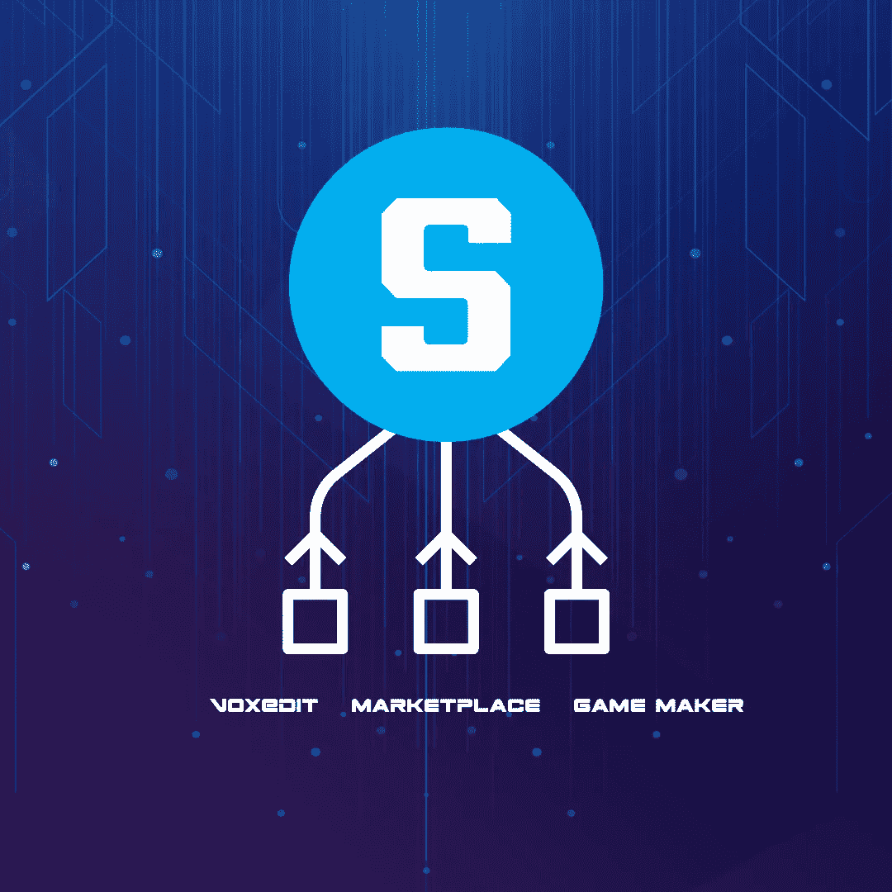

# 这里是你需要知道的关于沙盒的一切——以太坊元宇宙

> 原文：<https://medium.com/coinmonks/heres-all-you-need-to-know-about-the-sandbox-the-ethereum-metaverse-4a4f2a162825?source=collection_archive---------32----------------------->

沙盒是一款元宇宙游戏，建立在[以太坊](https://ethereum.org/en/)之上，允许玩家[购买虚拟土地](/@orbis86/the-definitive-guide-to-buying-virtual-land-in-the-metaverse-587ab215cdf6?source=user_profile---------9----------------------------)，并通过互动体验和活动对其进行个性化设置。它最早和最知名的版本包括 2011 年的《沙盒》和 2016 年的《沙盒进化》,这两款非常受欢迎的手机游戏在 iOS 和 Android 上已经积累了 4000 万次下载。2018 年，开发商/发行商 Pixowl 决定将受欢迎的用户生成内容游戏 IP 及其规模可观的移动制作社区转移到区块链环境。通过以 NFTs 的形式给予创作者对其作品的实际所有权，并奖励他们对生态系统的贡献，[沙盒](https://www.sandbox.game/en/)旨在颠覆《我的世界》和 Roblox 等老牌游戏开发商。

# **沙盒组件**

沙盒平台由三个相互连接的产品组成，它们通过用户生成的内容共同创造了全面的生产体验。由于捆绑的解决方案，用户甚至可以使用区块链和智能合同获得他们作品的版权。

*   VoxEdit**VoxEdit** [VoxEdit](https://www.voxedit.io/#/en/)是一款功能强大的 3D 体素建模和 NFT 创建应用，适用于 Windows 和 Mac，免费且易于使用。用户可以设计 3D 资产并制作动画，如人、动物、汽车、植物、工具和其他对象。体素编辑可用于通过操纵体素来快速构建令人惊叹的对象，体素是类似于构建块的方形 3D 像素。一旦构建完成，项目可以从 VoxEdit 导出，并在沙盒上购买，用作 NFT 游戏资产。
*   **market place
    market place**用户可以在沙盒的 NFT [marketplace](https://www.sandbox.game/en/shop/) 上传、发布和交易他们的 VoxEdit 制作的 NFT 产品。为了实现分散存储，创建的对象必须上传到 IPFS 网络，然后在区块链上注册以建立所有权。完成后，这些作品就被转化为资产，可以通过在市场上发布初始出售要约来出售，然后买家可以购买它们。
*   **游戏制作人** 任何人都可以用[沙盒游戏制作人](https://www.sandbox.game/en/create/game-maker/)免费制作难以置信的 3D 游戏。由于易于访问的可视化脚本工具，漂亮的 3D 游戏可以快速制作，无需代码。创作者可以添加到一个巨大的元宇宙，充满了各种各样令人难以置信的互动作品。

为了在所有将参与平台的用户类型中创建循环经济，包括游戏玩家、艺术家、策展人和土地所有者，沙盒利用了各种令牌-资产、土地和沙子。

# **沙子**

SAND 于 2020 年 8 月在[币安](https://www.binance.com/en)推出，是沙盒平台的重要组成部分。这是一个以太坊区块链 ERC-20 实用令牌，具有许多功能，最终将作为沙盒内交易的基础。沙是玩家用来购买商品、玩游戏、修改头像角色的货币。创作者用沙子来购买资产、土地和股份。土地销售将推动购买土地对沙子的需求。为了在市场上发布资产和购买宝石以确定稀有性和稀缺性，艺术家将使用沙子。

作为治理令牌，SAND 使用 DAO 框架让持有者参与治理决策。他们能够在重大问题上使用他们的投票特权，如平台路线图上的功能优先级以及游戏和内容制作人的基金会拨款归属。沙的所有者可以为自己投票，或者选择他们可以提供投票特权的其他玩家。此外，它允许赌注，这增加了你从土地上获得的沙子数量，并产生被动收入。目前没有其他方法可以获得生产资产所需的昂贵宝石和催化剂。

将征收所有沙盘代币交易的 5%的交易费，其中 50%的收入将作为对正在下注沙盘代币的代币持有者的补偿，其余 50%将进入下注池。该基金会的目标是通过提供资金鼓励在平台上创建高质量的互动内容和游戏来促进沙盒的生态。到目前为止，已经有超过 15 个游戏项目收到了该基金会的资金，并且该基金会已经给了 100 多名艺术家赠款，让他们在公开亮相之前创作 NFT。通过基金会赞助的所有游戏的总估价，元宇宙的总价值将增加，开始一个正反馈循环，这将使得有可能资助更大的游戏和体验。

# **着陆**

土地是一块虚拟的土地，用户可以在沙盒中购买，以创建交互式体验。一旦你购买了一片土地，你可以添加游戏和资产。区块链公共以太坊拥有一个独特的、不可替代的令牌，称为每个用户的土地(ERC-721)。沙盒最多有 166，464 块土地，每块土地都包含在组成沙盒元宇宙的地图中。

沙盒地图包含两种宗地:土地和地产。基本的沙盒单元，游戏世界中的每块土地的尺寸为 96 × 96 米，足以支持各种区块链游戏活动，同时可供一个人管理。另一方面，庄园由许多土地组成。艺术家团体有潜力在这里建立更广阔、更吸引人的在线体验。

# **资产**

由使用用户生成内容的玩家创建的令牌称为资产。使用 ERC-1155 标准并可以在公开市场上出售的资产的主要目的是作为沙盒游戏制作者创作的构建块。

# **前进的道路**

超过 165 家企业，包括像行尸走肉、蓝精灵和雅达利这样的知名企业，已经与沙盒合作。这些合作采取了 Snoop Dogg 和 Deadmau5 的虚拟表演以及一个行尸走肉游戏的形式。今年，额外的元宇宙功能也将提供给那些创造了卓越游戏体验的土地所有者。预计该组织还将在今年第二季度发布沙盒 DAO。对于 2022 年第四季度，它的目标是推出移动版本，以及其他社区令牌，完全致力于进一步开发和扩展元宇宙游戏。

> 交易新手？尝试[加密交易机器人](/coinmonks/crypto-trading-bot-c2ffce8acb2a)或[复制交易](/coinmonks/top-10-crypto-copy-trading-platforms-for-beginners-d0c37c7d698c)