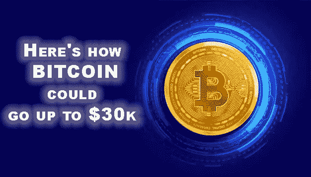

# 以下是比特币涨到 3 万美元的过程

> 原文：<https://medium.com/coinmonks/heres-how-bitcoin-could-go-up-to-30k-ce6ee9ce2492?source=collection_archive---------17----------------------->

## 秘密新闻

## 新闻加密

因此，我们仍然被宏观方面的不确定性所包围，越来越多的紧张来自台湾，但 SEC 刚刚将九种加密货币视为证券。正如你所料，这对这些加密货币来说不是一个好兆头。