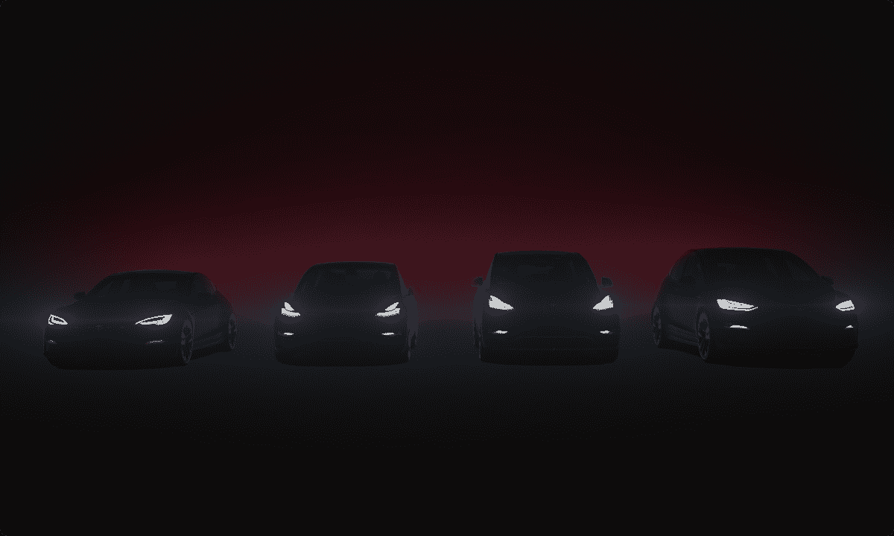

# 这是特斯拉如此特别的秘密。

> 原文：<https://medium.com/coinmonks/heres-the-secret-of-what-makes-a-tesla-so-special-2167ae7adb40?source=collection_archive---------35----------------------->

Is Tesla a Car or Software company?

在驾驶特斯拉 Model 3 几周后，我可以有把握地说，它应该在每个有驾驶执照的人的名单上。

不是因为它像保时捷 911 一样是一辆令人激动的快速跑车，也不是因为它像劳斯莱斯一样超豪华。

而是因为这是一种完全不同于我们熟悉和喜爱的普通汽车的全新驾驶体验。

驾驶现代特斯拉就像玩电子游戏一样。

字面上。

特斯拉的技术，以及它的多个摄像头，特斯拉视觉，触摸屏，自动驾驶仪和简单得可笑的用户界面，使它成为一种非常有趣的体验。

15 寸的屏幕就像放大的 iPhone。

它拥有 LTE、清晰的分辨率、出色的用户界面和流畅的触摸屏功能，就像 iPhone 一样！

Full spec, remote control gaming in the Tesla anyone?

还记得老款车的触摸屏就像玻璃砖一样，非常惰性，需要 5 秒钟才能加载吗？

特斯拉的车载电脑直观、时尚，最重要的是，很酷。

是的，酷。

这就像是把一台装有漂亮的新操作系统的 iPhone 13 Pro Max 和一台装有陈旧 CPU 的奔腾 3 进行比较。

仔细想想，真正改变游戏规则的是软件。

特斯拉(或者更确切地说是埃隆)的辉煌在于对其软件的依赖(或者过度依赖)。

特斯拉车上的人工智能比其他任何人都强。

这是你在现实世界中能从贾维斯那里得到的最接近的东西。

这就像有一个连接到互联网的强大大脑，可以随时升级。

甚至还有彩虹路牛铃复活节彩蛋，非常有趣。

Engage the “Rainbow Mario Kart” mode by pressing the Drive stick down 4 times real quick!

想要完全的自动驾驶能力？

自动停车？

所有这些都是由特斯拉推出的，甚至通过空中更新现有的模型。

你有 20 分钟时间舒适地坐在特斯拉里充电？

别担心，您可以舒适地玩游戏、看网飞、上网、完成工作。

特斯拉团队真的把这些事情想通了！

即使当汽车停放时，您也可以激活哨兵模式，该模式基本上使用外部摄像头记录周围环境。

这些应用程序、哨兵模式、自动驾驶仪和其他所有东西都可以随时随地通过无线方式轻松更新。

这改变了游戏。

你不需要打电话，安排时间，等着把你的车开到车间，插入专有工具，只是为了更新一些愚蠢的东西。

您需要的所有分析都可以在触摸屏上获得。

那么是什么让特斯拉真正与众不同呢？

Tesla’s superpower is its amazing software that compliments the hardware superbly.

它的软件。

但这也意味着，如果被黑，整辆车都将受到黑客的摆布。

将所有的控制和其他东西复杂地绑定到汽车的软件上，确实会给人一种流畅而强大的体验，但这也是有代价的。

嗯，没有什么是完美的。

也就是说，这确实是一种新颖、现代的汽车拥有体验。

特斯拉的秘密在于它的软件和人工智能技术。

基本上，特斯拉不是一家汽车公司。

它是一家人工智能软件公司，恰好制造非常酷的汽车。

-

特斯拉是软件公司还是汽车公司？

-

#创业#商业#创业#成长#成功#社交媒体#增压器#创业#战略#埃隆马斯克#埃隆#电动汽车#特斯拉#模型 3 #推特

> 交易新手？试试[加密交易机器人](/coinmonks/crypto-trading-bot-c2ffce8acb2a)或者[复制交易](/coinmonks/top-10-crypto-copy-trading-platforms-for-beginners-d0c37c7d698c)