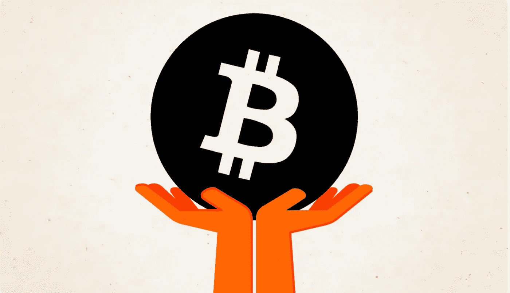

# 这就是为什么比特币是世界上最具包容性的货币

> 原文：<https://medium.com/coinmonks/heres-why-bitcoin-is-the-world-s-most-inclusive-money-52290594e03a?source=collection_archive---------46----------------------->

## 比特币正在扰乱金融体系，并将带来一个更具包容性的全球经济。

*本文原帖*[*【NOAH.com】*](http://noah.com/)*。NOAH 是一款用于全球支付和赚取比特币和 stablecoins 利息的一体化货币应用程序。报名候补* [*这里*](https://mandrillapp.com/track/click/30895797/noah.com?p=eyJzIjoianNhRFBvdkV6c3BFY2JCTjZtcHcxSjlYN3dVIiwidiI6MSwicCI6IntcInVcIjozMDg5NTc5NyxcInZcIjoxLFwidXJsXCI6XCJodHRwczpcXFwvXFxcL25vYWguY29tXFxcLz9yZWZlcnJhbD00Y3pia2Z2JnJlZlNvdXJjZT1jb3B5XCIsXCJpZFwiOlwiYmM2OTFmYmVhMGVhNGRiOWIyMzc1Y2JlMzI4OGI0ZmJcIixcInVybF9pZHNcIjpbXCI0ZTUwMzQwOTI2NTBkMDBlZWIxM2Q1NzM1NWNjNTg4YTExYTgwOGEzXCJdfSJ9) *。*

本着 2022 年骄傲的精神，我想研究一下比特币为什么是人类有史以来最具包容性的货币。在一个金融排斥和歧视的世界，比特币提供了一种公平竞争的方式，让任何有互联网连接的人都能获得与其他人一样的经济机会。LGBTQ+人群——尤其是跨性别青年——经常被拒绝获得银行服务，并且难以获得贷款、开立信用额度，甚至难以租赁公寓。

比特币提供了一种颠覆传统金融基础设施的方式，即选择一个中立、去中心化的平台，不受同样的偏见和限制。特别是在反 LGBTQ+领导压迫和暴力的国家，比特币为个人提供了一种维护隐私和安全的方式，同时仍然可以获得基本的金融服务。

> 这种经济歧视严重阻碍了社会流动性，并使整个社区无法发挥其潜力。这不仅仅是不公平的市场失灵。这是人性的失败。

# 金融歧视是什么意思？

货币是一切经济活动的根源。它是我们文明的命脉——我们社会跳动的心脏。从物物交换体系到美索不达米亚的谢克尔，再到黄金和美元，几千年来，货币有多种形式。它是繁荣的源泉，是向上流动的工具，是梦想更光明未来的途径。

但是金钱也是许多人类痛苦的来源，那些没有足够钱的人可以证明这一点。它是许多人类不平等和排斥的唯一促成因素。它在腐败和犯罪中扮演着重要角色。金钱让世界运转，但通常在某些方面，我们并不满意。

金钱给人类带来了巨大的痛苦，但它本身并没有造成这种痛苦。贪婪是人类灵魂的漏洞，当有人控制了货币供应，就控制了人民的命运。通过印钞来资助战争、不负责任地消费和救助腐败机构的情况在历史上屡见不鲜，而且经常导致恶性通货膨胀、经济停滞和公民权利被剥夺。但这些外部性很少落在掌控者身上，坎蒂伦效应就是明证，或者为什么华尔街得到了救助，而你却没有。

> 交易新手？试试[加密交易机器人](/coinmonks/crypto-trading-bot-c2ffce8acb2a)或者[复制交易](/coinmonks/top-10-crypto-copy-trading-platforms-for-beginners-d0c37c7d698c)

这就是为什么控制货币供应的人最终伤害了那些最需要钱来过简单生活的人。通货膨胀不成比例地侵蚀着低收入家庭，他们靠一张张的薪水过活，一直处于经济不稳定的状态。另一方面，富人可以很好地度过通胀时期，因为他们有更多的钱可以投资，并可以利用货币贬值带来的机会。

但它并不止于此。全球超过 20 亿人没有银行账户。虽然有各种各样的原因，但主要是因为金融机构没有为他们服务，或者无法接近他们。这些人被金融体系拒之门外，无法参与全球经济。把它们存入银行无利可图，所以它们被排除在外了。让他们获得和其他人一样的金融机会是不“值得”的，所以他们只能旁观。

获得金钱也与种族主义、同性恋恐惧症、仇外心理以及几乎任何形式的歧视交织在一起。有色人种经历了更多的种族偏见，遭遇了更多的繁文缛节，在获得贷款时也更具挑战性。由于高昂的费用，移民很难寄钱回家。银行将跨性别者的银行账户标记为欺诈——因为听起来不像他们的“真名”——几乎没有追索权。这样的例子不胜枚举。

这种经济歧视严重阻碍了社会流动性，并使整个社区无法发挥其潜力。这不仅仅是不公平的市场失灵。这是人性的失败。

**杰克森·里昆是一名编剧、文案和密码爱好者。杰克逊的写作集中在加密货币、心理健康、性等方面。**

你可以在[推特](http://twitter.com/jacksonrickun)和 [Instagram](https://www.instagram.com/jacksonrickun/) 上关注他。

*免责声明:我是诺亚的活跃文案和内容撰稿人。以上并非投资建议，仅供参考。*