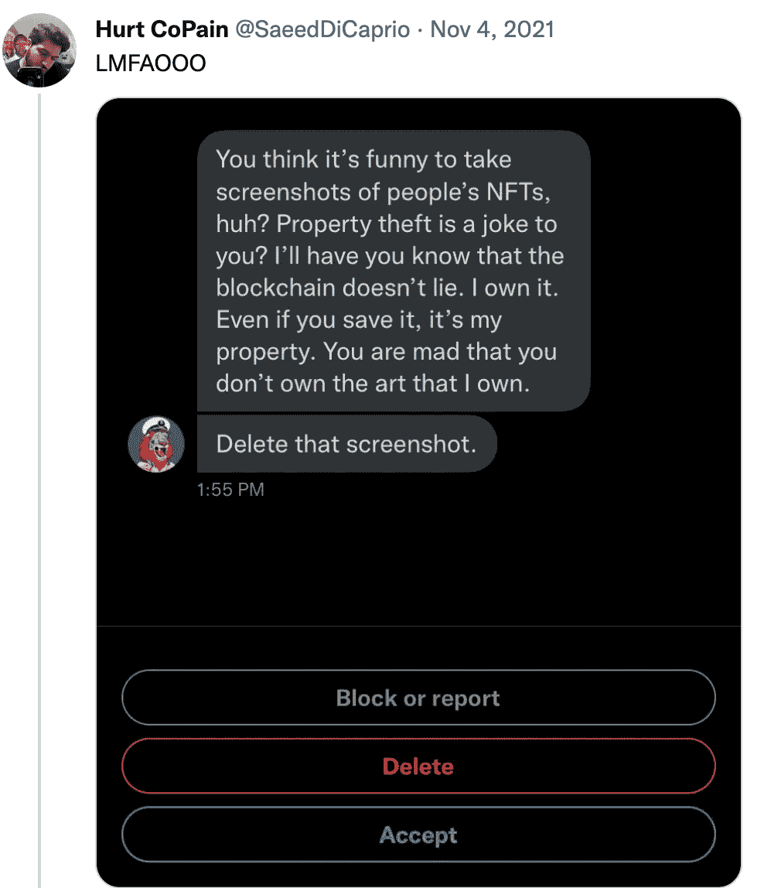
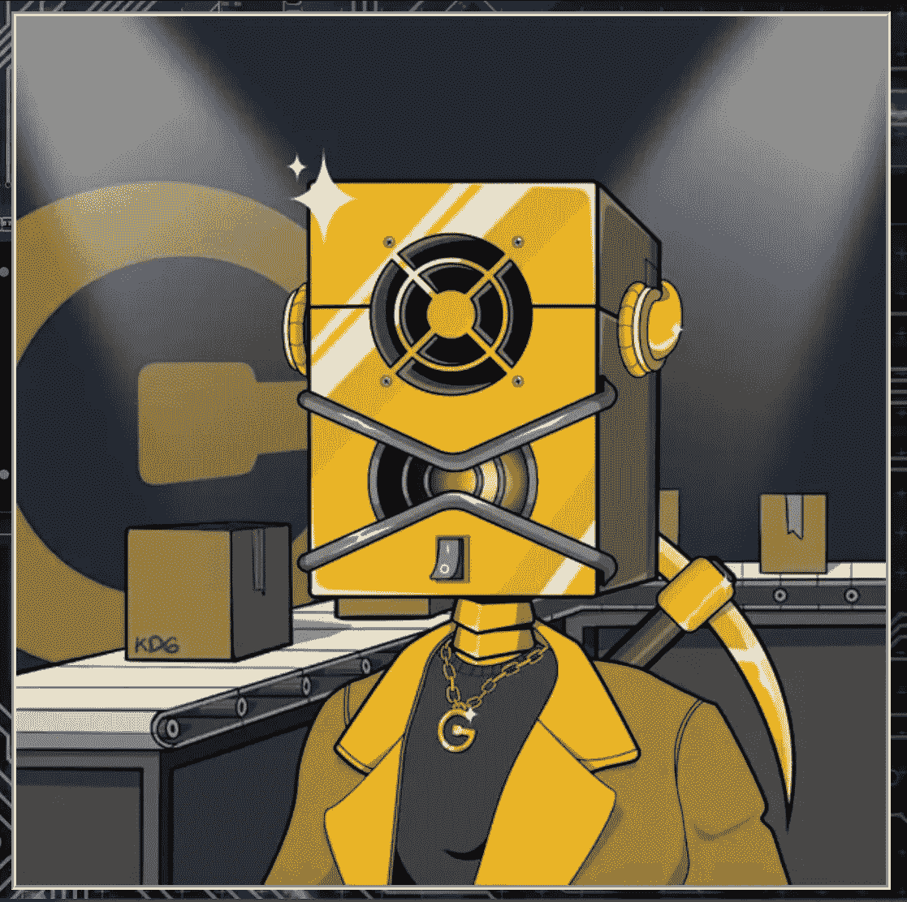

# 这就是为什么你的 NFT 可能一文不值

> 原文：<https://medium.com/coinmonks/heres-why-your-nfts-could-be-worthless-bcc0260ddd25?source=collection_archive---------15----------------------->

“如果听起来好得不像是真的，那很可能是真的，”幸运的是，在隐诗句的大多数角落里，这并不是一个好建议。加密投资者正在打破一些普遍持有的信念，即一个人可以重视什么，什么构成价值，这对促进全球整体繁荣真的很好。你能想象一个贫困或饱受战争蹂躏的社区的下一代企业家，通过照片和录音，在 [OpenSea](https://opensea.io/) 或 [Magic Eden](https://magiceden.io/) 上转换成 NFT，开始启动一个恢复计划吗？

我跑题了。今天存在的绝大多数 NFT 都是由乘着只升不降的价格炒作浪潮的人和乘着只升不降的价格炒作浪潮的人组成的社区建设浪潮创建的，这使得 meme 令牌和 NFT 的当前状态之间的差异基本上为零。一个文件的对应图像与“独特的”代码行相关联，使其区别于所有其他文件，这并不是稀有的真正信号。所有能想到的东西，无论是线上的还是线下的，都是独一无二的。自从主流生产线被发明以来，有价值的产品就被打上了序列号，从来没有人开始声称他们的模具研磨机比一个相同的型号更值钱，因为它在登月那天离开了工厂。如果我们谈论的是可以以几乎为零的额外成本以各种重要方式复制的东西，稀有就毫无意义。这就是 NFT 市场的现状。

This viral tweet pretty well sums up the state of the current NFT market.

NFT 是好的价值储存手段吗？这仍有待长期观察，但肯定有几个著名的收藏已经成名，并引发了大量的媒体报道和周围的炒作。

A picture of a Bored Ape Yacht Club (BAYC) NFT

无聊猿和加密朋克在主流文化中是常见的名字，因为他们得到了名人的认可，BAYC 甚至在传统媒体上得到推广，包括下午和深夜节目，如艾伦和吉米·法伦的今夜秀。尤其是《无聊的猿》,很可能是街上路过的任何人都知道的唯一一个 NFT 系列。这是为什么呢？这是一个很长的故事，但如果有兴趣，你可以看看菲利翁对这个概念的起源的深入探究，以及创作者是如何走到一起的[这里](https://youtu.be/XpH3O6mnZvw)。这个视频的目的当然是把 BAYC 的创作者放在一个负面的位置上，间接证据压倒性地表明，创作者至少有一种黑色的幽默感。有隐藏的种族主义狗哨子有目的地弥补了这个项目的一切创造性。

我之所以提到 BAYC 和最近披露的迄今为止最有价值的 NFT 系列之一(目前市值约为 776，500 ETH 或 15 亿美元)背后的故事，是为了突出这件珍贵的艺术品所代表的意义。当然，从最低的罪恶感标准来看，这是一组图像，每一幅都可以被认为相当于用隐形墨水在一件有价值的当代艺术品上写下“去你的”，有人花了一大笔钱买下这件艺术品，希望未来价格会更高。我拒绝相信任何人看着无聊的猿(或任何高价 NFT ),看到了承担这种风险水平的价值。BAYC 的开发者竭尽全力使用纳粹和普鲁士的图像，他们认为除了他们的小而私人的朋友群体之外，没有“正常人”会理解。开发者至少是一群窃笑的孩子，居住在精通技术的程序员、图形艺术家和网页设计师的头脑和身体里，他们对历史上的伟大战争有着深刻的了解和热情，特别是对民族主义运动和白人至上理论使用的口号和图像有着浓厚的兴趣。他们是否是隐蔽的白人民族主义者，意图贿赂和/或欺骗名人和媒体，将仇恨符号推入主流文化，以推动他们认为对塑造他们所设想的世界至关重要的事业？或者，他们只是简单地用马克笔在 De-fi 的墙上画鸡巴，看着每个人支付疯狂的价格来拥有这些作品，然后想，“我在这些画中隐藏了禁忌的图像，并通过拥有一个来欺骗大众，让他们认为他们是赛博朋克社交名流精英俱乐部的一员。这些醒来的白痴只是被迷惑了，“什么？我不知道。甚至有可能开发人员并不十分了解自己。每个人都有遗憾。也许他们私下里后悔围绕 19 世纪的纳粹和普鲁士符号建立了 BAYC 精神，但在我看来他们很可能是反社会者。他们不关心人。他们当然喜欢撒谎，觉得自己比别人聪明。他们可能会认为，人类的互动仅仅基于“适者生存”的进化机制和任何积极的世界观，相信慈爱的上帝或相信人天生善良，社会会随着时间的推移而逐渐变得更好，会让你成为被全球精英权力玩家驱赶的妄想绵羊，或者你自己完全不诚实，如果你促进扩大人权，公平经营业务，遵守道德或珍惜法律规则，你会有一些替代的自私结局。这很好，但你真的想拥有那东西吗？

BAYC #BurnBAYC 事件证明，随着时间的推移，人们对 NFT 系列的看法可能会改变。这可能是对期货价格预测的看涨或看跌，你可能会看到趋势回归或永远消失，除非你能像 BAYC 一样操纵文化中的产品植入，否则很难说出什么会重新获得意义。趋势的消退也适用于任何东西，包括比特币和任何替代币或代币项目，主要区别是 NFT 将自己(和相关的价值)置于一个独特的形象或声音片段中，随着时间的推移，这可能成为政治分裂、有毒或对代币持有价值来说可能是最糟糕的事情:*过时，*。对于 BAYC 这样规模的品牌，从长远来看，这肯定是不好的。另一方面，比特币和朋友几乎是完全良性的、永远中立的技术、实用工具或工具。

我试图从最积极的角度说明，有史以来最成功的 NFT 系列只不过是一个秘密的“你被朋克了”的恶作剧，而从消极的角度来看，它可能是彻头彻尾的邪恶的反人类宣传。而且那些都是成功的！NFT 空间的其余部分围绕着最受欢迎的杰出人物的克隆和熟悉的后代。但愿至少某些特定的 NFT 艺术能够像其他不被认为是“独一无二”的加密代币一样发挥作用，并保留市场，从而保留一定程度的安全性和存储价值。下注你的 NFT 可以是一种选择，但它不会给任何“常规”代币带来附加值。我真的相信 NFT 趋势唯一可持续的未来在于现实世界。视觉艺术是伟大的，数字艺术可以看起来令人惊叹，有一把熟悉的钥匙来打开你的秘密加密钱库，让你不时地欣赏，这很好。这是一句戏谑的话，是对我认为维持任何事物的长期价值感知所必需的效用的一点补充。当你对任何价值主张进行逆向工程时，效用只存在于现实世界中。只有当你超越了马斯洛金字塔的几个层次，艺术才有价值。例如，电并不存在于比特币、元宇宙或你的 NFT 中，它是由人类的聪明才智、地球上珍贵的材料和大量熟练工人的合作产生的。由于我们家的加热和冷却系统，大量的屏幕和娱乐设备，我们现在能够生活在绝对富裕和舒适的环境中，按需给我们带来墨西哥玉米卷，通过视频，语音或文本与世界上的任何人即时交流，欣赏我们被石头砸死的海豚的漫画肖像，这些都是通过燃烧材料的热炉和转动的涡轮机而成为可能的。我们舒适的现代生活是由坚硬的钢铁支撑的。那就是真正持久的感知价值必须存在的地方，尖叫着热金属转动生产齿轮。

NFT 为任何人提供了几乎瞬间证明他们在现实世界中拥有某些东西的能力，这可能被证明是未来游戏规则的改变者。不可替代的代币最终可能会淘汰整个法律实践和审判行业。在一个日益以交易为中心的社会中，效率水平的提高可能是巨大的。买卖财产，车辆和合同，合同，从你的生意到你的生活的一切合同都可以通过 NFTs 安全和不可更改地达成一致。遗嘱、离婚协议和子女监护权都有可能在执法部门使用 NFTs 作为签署协议的情况下当场解决，在其他商业使用案例中，它们可以作为一件友好、有趣或熟悉的艺术品，也可以在一个崭露头角的商业风险中解锁您的所有权证明。

A picture of one of the Kadena Mining Club NFTs representing ownership of 640 Gigahash produced by the NFT holder’s specific ASIC blockchain miner.

2 custom Goldshell KD-Box Pros prepared as sweepstakes giveaways by the development team. The KMC NFTs will represent portions of higher capacity top-of-the-line ASIC miners that will operate at a prepaid cost at a facility in Manitoba, Canada.

最近，有一个项目已经通过 NFTs 跃入了现实世界的资产所有权。嘉手纳矿业俱乐部 (KMC)已经启动了一个公共造币厂，为几个高容量工业采矿钻机的采购订单提供资金，这些钻机将使用水力发电运行，以确保工作证明，“多链”区块链网络[嘉手纳](https://kadena.io/community/)。一旦嘉手纳被开采，硬币的所有者将通过他们的 NFTs 进行验证，相应的金额将被发送到相应的 NFT 持有者的钱包中。Kadena Mining Club 的开发者有目的地选择使用这种拥有物理矿工的方法，而不是创建一个分散的自治组织(DAO)，因为这既是一种利用 NFTs 的未开发途径，也是“针对 DAO 操作空间未来可能出现的监管的保护措施”，该项目的创始人 Matthew Durnya 在最近的 Twitter spaces 采访中表示。

“我们厌倦了看到 nvt，即无价值的代币涌入市场，”KMC 团队成员 Ktuck 在一个现场社区不和谐电话中说。Durnya 在同一个电话中说:“在我们出售第一和第二阶段后，我们计划积极扩大我们的采矿业务，并可能在未来与其他领域的可信团队合作。”对于一家加密采矿初创企业来说，采取 KMC 的方式筹集社区驱动的投资资金，在 Kadena 上创建第一个 NFT 所有权证明采矿业务，无疑是朝着新方向迈出的一步，我认为这是朝着未来大规模采用 NFTs 的正确方向迈出的一大步。

“让好东西变得更好”——穆尼·穆恩斯坦

> 交易新手？试试[密码交易机器人](/coinmonks/crypto-trading-bot-c2ffce8acb2a)或[复制交易](/coinmonks/top-10-crypto-copy-trading-platforms-for-beginners-d0c37c7d698c)