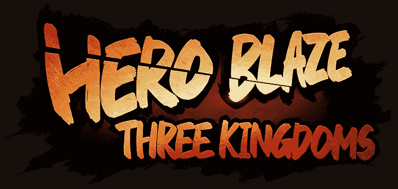
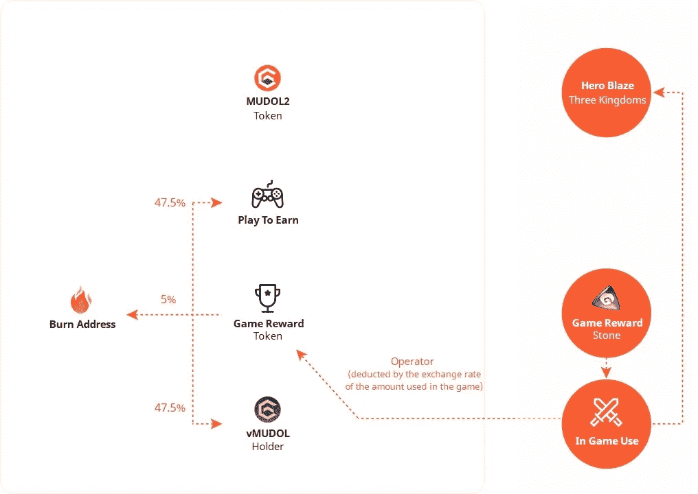

# 英雄火焰:三国-全球发布

> 原文：<https://medium.com/coinmonks/hero-blaze-three-kingdoms-global-launch-1a82a0b26133?source=collection_archive---------1----------------------->

分析全球发布和$MUDOL2 令牌更新

## **-目录-**

**英雄火焰:三国(MUDOL2)全球亚洲首发**

**英雄火焰:三国，2021 年朝鲜早期 P2E 成功案例**

**全球上市，符合国内市场最新法规**

**$MUDOL2，从快速增长的行业中吸取经验教训的全面改进** -面向全球用户的连锁迁移和 CEX 上市
- MUDOL2 代币价值累积和稳定措施
-通过全球发布并行扩展用户社区
-通过免费游戏赚取利润实现游戏玩家生态系统的可持续性
-具有实际 Web3 体验的游戏工作室

**Hero Blaze 全球首发——开创从本土市场拓展到全球舞台的新先例**

**链接**

**免责声明**

## **英雄火焰:三国(MUDOL2)全球亚洲首发**

《英雄火焰:三国》(Hero Blaze):一款来自 Natris 的休闲移动 RPG 游戏，作为国内市场的首批 P2E 游戏之一，在韩国引起了极大的关注，继 14 日推出全球亚洲游戏服务后，将于 2022 年 7 月 15 日在多个全球交易所上市其令牌$MUDOL2。在全球发布之前，Google Play 的预注册已经积累了 50 万用户。2022 年 7 月的全球发布是其首次覆盖大多数亚洲市场。Natris 计划在其他全球市场进行后续的全球发布，包括日本、香港、台湾和澳门，这些市场不包括在 2022 年 7 月的全球发布中。

## **英雄冒火:三国演义，2021 年 P2E 在朝鲜成功案例**

《英雄火焰》被许多人认为是韩国第一款手机 P2E 游戏，自 2021 年 11 月首次推出后，在韩国市场迅速崛起。2021 年 12 月，它在 Google Play 和 Apple App Store 热门榜单上均排名第一，首次将 P2E 应用到其简单易学、令人上瘾的休闲手机游戏中。当你考虑到没有一次大规模的营销活动时，这更令人印象深刻。玩家在游戏中获得代币奖励(KLAYTN 链上的原始代币$MUDOL ),他们可以在 DEX(分散交换)上转换成其他代币，反之亦然。

> 交易新手？试试[加密交易机器人](/coinmonks/crypto-trading-bot-c2ffce8acb2a)或者[复制交易](/coinmonks/top-10-crypto-copy-trading-platforms-for-beginners-d0c37c7d698c)

当韩国监管机构 GRAC(游戏分级和管理委员会)取消了这款游戏的分级时，Hero Blaze 最初的成功意外停止。根据当地法律，游戏应该在韩国服务之前获得评级。然而，对于手机游戏，谷歌和苹果等平台服务提供商会先给出评级，然后 GRAC 会对评级进行监控。GRAC 取消了《英雄火焰》的初步评级，认定该游戏违反了韩国的《游戏产业促进法》。该法律于 2006 年颁布，当时一款名为“海洋故事”(Sea Story)的非法数字老虎机游戏在全国范围内引发了赌博热潮，该法律禁止将通过游戏获得的任何结果转化为法定货币。Natris 准备在全球推出，不仅要符合国内法规，还要通过引入$MUDOL2 token 来改善价值累积和 tokenomics。

## 符合国内市场最新法规的全球发布

英雄火焰作为一个全球性的一个建设服务将不会有 P2E 支付或游戏本身的转换机制。Natris 已经将游戏内货币和$MUDOL2 代币之间的官方代币兑换分离给了官方网站[，根据 GRAC 的规定，该网站将不对韩国 IP 开放。由于 2006 年国家赌博游戏丑闻的法律正在作为新的加密游戏行业的一揽子法规，Natris 必须像许多其他韩国工作室一样做出最佳决策。目前的监管标准远非完美，因为海外工作室的作品、通过各种平台提供服务的 PC 游戏、像 StepN 这样的加密应用程序(其加密方面是其设计的一部分，但被视为非游戏)都免受《游戏产业促进法》的审查(真是讽刺)。我们相信，对于如何最好地培育和管理韩国新兴的加密游戏产业，将会有一场全行业范围的讨论(或者我们至少希望如此..).](https://heroblaze3kd.io/)

## **$MUDOL2，从快速增长的行业中吸取教训的全面改进**

凭借在 Google Play 和 App Store 上最受欢迎的应用程序/韩国市场日均用户超过 20 万的成功服务历史，Hero Blaze 与 P2E 成为最热门词汇时涌入市场的无尽加密游戏截然不同。随着全球发布的临近，Google Play 的 50 万预注册证明了全球用户群的关注。此外，新的$MUDOL2 系统引入了各种改进，这些改进基于韩国 token 上一次迭代的数据和经验以及从密码行业吸取的许多经验教训。

- **面向全球用户的连锁迁移和 CEX 列表** $ mudol 2 令牌系统更新非常专注于将游戏的生态系统扩展到全球用户群。与 2021 年仅在一个 DEX(分散交易所)交易的第一个令牌相反，MUDOL2 令牌将于 7 月 15 日在多个全球集中交易所上市，如 Huobi 和 MEXC，这使得用户可以更容易地进出 MUDOL2。$MUDOL 是 2021 年的第一个代币，建立在 KLAYTN 区块链的基础上，其狭窄的非韩国用户群阻碍了外国球员的加入。考虑到这一点，MUDOL2 是在 BSC(币安智能链)的基础上设计的，具有更广泛的全球用户基础，由世界上最大的交易所之一币安支持。这些业务决策都集中在全球用户基础上。

- **MUDOL2 代币价值增加和稳定措施** 如何增加代币的实际价值并稳定价格是整个密码游戏产业中许多实验和研究的主题。自从《英雄火焰:三国》于 2021 年 11 月在国内上映以来，在不到一年的时间里，令牌组学的研究已经取得了很大进展。$MUDOL2 在多个方面实现了这样的措施。通过游戏赚取的游戏内货币 Mudol Stone 和区块链上的 MUDOL2 token 之间的兑换率将根据两者的累计供应比率每天重新计算，作为固定 token 供应时间表的措施。$MUDOL2 token 可以通过计划在今年晚些时候实施的治理功能，从游戏内令牌收入分配和投票权中获得收益。来自游戏内货币支出的收入将部分分配回代币经济或烧掉，以向生态系统提供一个积极的循环，并减轻通胀压力。

[In-Game Currency (Stone) Revenue Redistribution Mechanism]

- **通过全球发布平行扩展用户群体** 即将到来的全球发布最初以全球 one-build 英语界面为目标，面向大多数亚洲市场。Natris 计划扩展到其他市场，包括日本、香港、台湾、澳门、北美和欧洲市场。就像任何经济一样，一个有代币的游戏经济只和系统的参与者一样强大。随着更多市场加入生态系统，更多市场的扩张计划可以保持 Hero Blaze token 经济的健康和活力。

- **游戏玩家生态系统通过免费游戏赚取利润的可持续性** Axie Infinity 和 StepN 是 P2E 和 M2E 的旗手。他们分别是游戏赚取和移动赚取类别中最大的名字。这两个项目都是以这样一种方式设计的，用户应该预先购买特定的 NFT 来参与游戏，许多项目都是以此作为他们系统的模型。然而，“门票 NFT 模式”带来了一些意想不到的后果，如早期的游戏玩家从他们的非功能性游戏中获得了巨大的收益，而新玩家则不得不承担高昂的进入成本。这些高昂的前期成本要么阻止了新玩家进入，要么迫使他们尽快尽可能多地套现，而不是享受游戏本身。Hero Blaze 的设计是为了让那些想要享受游戏而不需要应用内购买或加密交易的人不会被迫使用这些功能。这是一个由经验丰富的游戏工作室设计的免费游戏赚取模式，强调游戏玩家生态系统的可持续性，而不是短期的象征性价格升值。

- **拥有实际 Web3 体验的游戏工作室** 在密码市场的大肆宣传和一些成功故事之后，许多充斥市场的 P2E 项目都难以实现它们的承诺。缺乏游戏开发和操作经验的 Web3 原生开发者推出古怪的迷你游戏，或者缺乏加密经验的游戏开发者将不平衡的令牌系统引入他们的游戏是一些常见的陷阱。Natris 由经验丰富的核心团队成员领导，他们曾领导过流行的手机游戏，如“我爱咖啡”，并在传统的手机游戏平台上开发和运营了多年的 Hero Blaze IPs。他们还拥有 2021 年第一个令牌系统和 NFT 市场 Klaymeta 的加密经验。在竞争日益激烈的加密游戏市场中，他们处于一个独特的位置，可以在 Web3 本土公司和现有的大型游戏工作室之间占据一席之地。

## **Hero Blaze 的全球发布——开创了从本地市场扩展到全球舞台的新先例**

目前 Google Play 的 50 万预注册全部来自非韩国用户，因为韩国市场已经开始服务，不需要预注册。考虑到苹果应用商店的潜在用户流入，苹果应用商店不允许预先注册之前在任何司法管辖区推出的应用，全球用户群似乎对此很感兴趣。对新的加密游戏行业的监管仍处于早期阶段，因为韩国等许多国家对其国内市场较为严格，但对其国内公司在海外的运营较为宽松。从本地市场创纪录的开拓者到通过全面改进的系统设计在全球市场推出，Hero Blaze 即将开创一个推动行业前沿的新先例。我们将特别关注新实施的令牌组学是否有助于克服第一代 P2Es 的失败。同样值得指出的是，可能会有大量的非加密用户(到目前为止都是忠实的重度游戏玩家)涌入加密领域。我们不能讨厌给加密领域带来新观众的项目，不是吗？

由 Trinito 投资主管 SungPil Huh 撰写，Trinito 联合创始人 Eric Yoo 供稿。

# Crypto # P2E #游戏# mudol 2 # hero blaze # hero blaze 3kd # hero blaze 三国志#火币#墨西哥# IEO # BSC #币安

## **链接**

英雄火焰:三国——官网
https://heroblaze3kd.io/

英雄火焰:三国—白皮书
[https://docs.heroblaze3kd.io/](https://docs.heroblaze3kd.io/)

火币环球—火币 prime List 7 月 15 日上市 mudol 2
[https://www.huobi.com/support/en-us/detail/54911754247519](https://www.huobi.com/support/en-us/detail/54911754247519)

火币环球—英雄火焰简介:三国
[https://www.huobi.com/en-us/asset-introduction/details?货币=mudol2](https://www.huobi.com/en-us/asset-introduction/details?currency=mudol2)

MEXC Kickstarter—Hero Blaze 3kd(mudol 2)空投
[https://bit.ly/3ccPbte](https://bit.ly/3ccPbte)

## **免责声明**

这不是投资建议，仅供参考。您不应将任何此类信息或其他材料理解为法律、税务、投资、财务或其他建议。上述头寸存在价格波动、流动性、安全性、交易对手风险等风险。Trinito 是《英雄火焰:三国》的顾问和投资者，在撰写本文时持有 MUDOL2 的股票。

> 加入 Coinmonks [电报频道](https://t.me/coincodecap)和 [Youtube 频道](https://www.youtube.com/c/coinmonks/videos)了解加密交易和投资

# 另外，阅读

*   [隐翅虫替代品](/coinmonks/cryptohopper-alternatives-d67287b16d27) | [HitBTC 审查](/coinmonks/hitbtc-review-c5143c5d53c2)
*   [CBET 评论](https://coincodecap.com/cbet-casino-review) | [库科恩 vs 比特币基地](https://coincodecap.com/kucoin-vs-coinbase)
*   [折叠 App 回顾](https://coincodecap.com/fold-app-review) | [Kucoin 交易机器人](/coinmonks/kucoin-trading-bot-automate-your-trades-8cf0ca2138e0)
*   [如何匿名购买比特币](https://coincodecap.com/buy-bitcoin-anonymously) | [比特币现金钱包](https://coincodecap.com/bitcoin-cash-wallets)
*   [币安 vs FTX](https://coincodecap.com/binance-vs-ftx) | [最佳(索尔)索拉纳钱包](https://coincodecap.com/solana-wallets)
*   [比诺莫评论](https://coincodecap.com/binomo-review) | [斯多葛派 vs 3Commas vs TradeSanta](https://coincodecap.com/stoic-vs-3commas-vs-tradesanta)