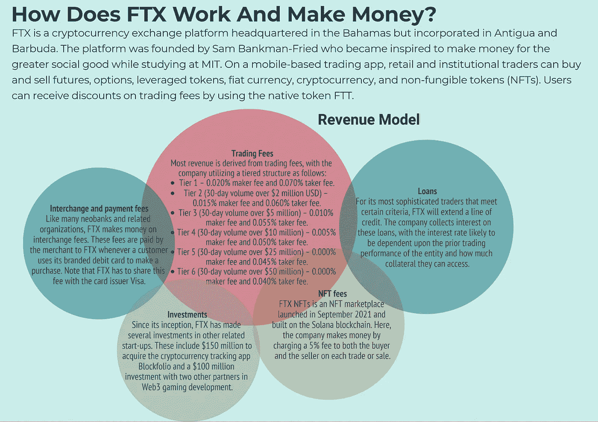
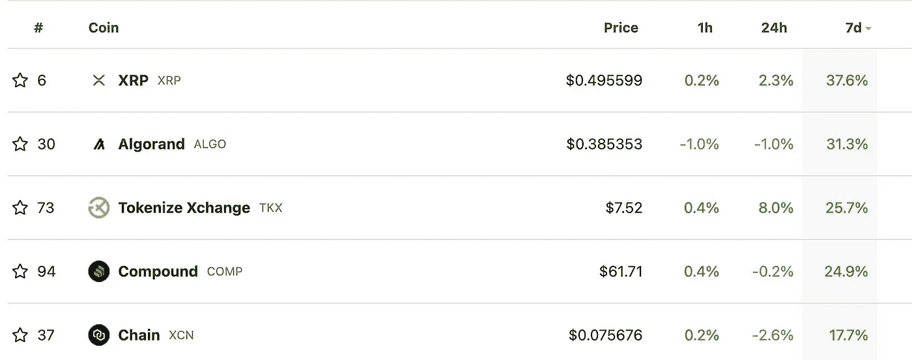

# 🤔更高的利率，FTC 的快速增长和法规。

> 原文：<https://medium.com/coinmonks/higher-interest-rates-ftc-rapid-growth-and-regulations-841fc411aa14?source=collection_archive---------47----------------------->

*   🤑更高的利率会带来什么？
*   🤔 [FTX](http://ftx.com/) 在熊市中快速成长
*   👨‍👩‍👧‍👧[startup y](https://beta.startupy.world/membership/?ref=yarocelis)——社区管理的搜索引擎
*   📈本周表现最佳的前五名
*   🎧空间音频及其元宇宙效应
*   🔏**加州州长纽瑟姆否决加密许可**
*   📰热门阅读
*   🙏🏻感激…

# 🤑更高的利率会带来什么？

FOMC 本周的会议导致联邦基金利率上调 75 个基点，使该区间的上限达到 2008 年以来的最高水平。

尽管这是意料之中的，但我们已经看到了股票和固定收益市场的抛售。

诚然，“每当美联储踩下刹车，以有意义的方式降低通胀时，经济就进入了衰退，”在我们的评估中，美联储今天面临的通胀问题是巨大的，如果经济不显著放缓，这个问题不太可能得到解决。"

没有人确切知道会发生什么，但目前，那些持有信用卡债务和/或可变利率贷款的人将会看到他们的月供增加，降低他们在其他项目上的支出能力。

有利的一面是，更少的支出将对价格上涨产生压力，从而将通胀推至较低水平。我们可能会看到的问题是顽固的通货膨胀率，这将迫使美联储做出更艰难的决定，将经济推入衰退。同样，没有人知道，我们将拭目以待 11 月 1 日至 2 日的下一次 FOMC 会议会带来什么。

Yaro on Tech、Blockchain 和 Web3 是一份读者支持的出版物。为了接收新帖子和支持我的工作，考虑成为一个免费或付费用户。

# 🤔 [FTX](http://ftx.com/) 在熊市中快速成长

据报道，Sam-Bankman Fried 的 FTX 加密交易所正在与投资者进行谈判，以筹集 10 亿美元的新资金，因为它希望在熊市期间利用额外的资本进行金融收购。

最近，FTX 收购了 robin hood7.6%的股份，它还向 BlockFi 投资了[6.8 亿美元，](https://fortune.com/2022/07/01/ftx-us-and-blockfi-in-680m-tie-up-deal-includes-option-to-acquire/)[收购了好运游戏](https://decrypt.co/95699/ftx-acquires-good-luck-games-storybook-brawl)，这些游戏将并入 FTX 博彩。该公司还在 6 月宣布收购清算平台 Embed，以增强其股票交易产品，并“提供一个涵盖所有资产类别的综合交易应用”

本月早些时候，该公司的投资部门 FTX 风险投资公司宣布将收购 Anthony Scaramucci 的资产管理公司 sky bridge Capital 30%的股份，金额未披露。

Harrison 说，去年收购衍生品平台 LedgerX“可能是我们最重要的一笔收购”，他补充说，如果 FTX。美国终于获得监管机构对保证金交易的批准“在提供比特币和以太网衍生品方面，我们将处于美国所有期货交易所中的最佳地位。

额外的 10 亿美元，如果获得批准，将会进一步加快他们的收购步伐。

# 他们为什么会成功？

根据:四周 MBA

该公司总裁布雷特·哈里森(Brett Harrison)在一次采访中分享道，他们能够制造出令人惊叹的产品，并在熊市期间继续增长，这要归功于他们以客户为中心的文化。他们非常重视客户评论以及社交媒体评论和客户需求。

他补充道:“**我认为我们是世界上唯一一家你可以提到**[**【SBF _FTX**](https://fortune.com/2022/08/01/ftx-crypto-sam-bankman-fried-interview/)**或@布雷特 _ FTX 的公司……十有八九，你可能会得到回复**——如果不是来自我们，也会来自 FTX 的其他人。”他补充说，公司的增长很大程度上可以归功于这种合作。“我们只是不停地问，‘嘿，伙计们，人们想要什么？什么在起作用？“什么没用，”仅仅是在推特或电报上得到回应，我认为这对我们来说是一个优势。"

[捐赠订阅](https://yarocelis.substack.com/subscribe?&donate=true)

[**Startupy**](https://beta.startupy.world/membership/?ref=yarocelis)

> *我很高兴地宣布，我已经成为 Startupy 的策展人和成员。一个社区管理的搜索引擎。零 SEO BS。* [***我邀请你加入这个为漫游、研究和思考而设计的知识和见解的令人愉快的图书馆。***](https://beta.startupy.world/membership/?ref=yarocelis)

# 📈本周顶级密码搬运工

[**XRP**](https://www.cryptopolitan.com/news/ripple-xrp/) **价格目前显示涨幅在 25%左右，过去一个月上涨了 41%。据辩护律师詹姆斯·k·菲兰称，预计 12 月中旬将对 XRP 是否安全做出裁决。由于围绕这一消息的兴奋情绪，投资者对 XRP 长期前景的看法可能会增强。**

证券监管机构于 2020 年 12 月对 [Ripple](https://www.cryptopolitan.com/news/ripple-xrp/) 提起诉讼，指控该公司在首次发行硬币(ICO)时向投资者发行 XRP 违反了证券规则。

# 🎧空间音频及其元宇宙效应

[空间音频](https://link.axios.com/click/29121162.66973/aHR0cHM6Ly93d3cuYXhpb3MuY29tLzIwMjIvMDYvMTEvbWV0YXZlcnNlLWF1ZGlvP3V0bV9zb3VyY2U9bmV3c2xldHRlciZ1dG1fbWVkaXVtPWVtYWlsJnV0bV9jYW1wYWlnbj1uZXdzbGV0dGVyX2F4aW9zbG9naW4mc3RyZWFtPXRvcA/61ee341f31571c04df635985Bc95c79e7)模仿自然界中听到声音的方式，提供声音有多远和来自哪个方向的感觉。

**为什么重要:**空间音频是让虚拟现实令人信服的关键，但也可以帮助从看电影到视频会议的一切事情。基本上，**空间音频就是元宇宙的配乐。**

这项技术还处于起步阶段，大型硬件和软件制造商才开始投资支持。它在许多较新的耳机上得到支持，包括苹果、谷歌和三星的型号，我们将看到许多新公司进入这个行业。

“Z 世代观众看到了空间音频的价值，并愿意投资购买体验空间音频所需的硬件。在考虑是否投资空间音频特性和功能时，这应该会给技术公司更大的信心。

# 🔏加州州长纽森否决加密许可

加州州长加文·纽瑟姆拒绝签署一项为数字资产建立许可和监管框架的法案，这增加了加密生态系统现有的监管障碍。

议会[2269 号法案](https://leginfo.legislature.ca.gov/faces/billNavClient.xhtml?bill_id=202120220AB2269)试图允许加州密码公司的营业执照的发放。9 月 1 日，[加州议会在没有人反对的情况下通过了该法案，并提交州长办公室批准。](https://cointelegraph.com/news/california-state-assembly-passes-bill-for-licensing-and-regulating-crypto-firms)

# 📰热门阅读

*   关注隐私的脸书替代方案 [MeWe 将把它的平台](https://link.axios.com/click/29121162.66973/aHR0cHM6Ly90cmliLmFsLzVmdVNOcHE_dXRtX3NvdXJjZT1uZXdzbGV0dGVyJnV0bV9tZWRpdW09ZW1haWwmdXRtX2NhbXBhaWduPW5ld3NsZXR0ZXJfYXhpb3Nsb2dpbiZzdHJlYW09dG9w/61ee341f31571c04df635985Bbbb4c4fb)迁移到位于区块链的自由网络基础设施项目
*   [苹果将允许 NFT 销售应用程序，但将收取 30%的佣金](https://bitcoinist.com/apple-will-allow-nft-sales-in-apps/)
*   [南韩称国际刑警组织发布了跆拳道红色通缉令，彭博称](https://www.theblock.co/post/172739/south-korea-says-interpol-has-issued-a-red-notice-for-do-kwon-bloomberg-says?utm_source=cryptopanic&utm_medium=rss)
*   [概括地说，NFTs:每周回顾](https://bitcoinist.com/nfts-in-a-nutshell-a-weekly-review-68/)
*   [如果比特币价格企稳，5 种可能看涨的替代币](https://cointelegraph.com/news/5-altcoins-that-could-turn-bullish-if-bitcoin-price-stabilizes)
*   [比特币背后最坏的是什么？Glassnode 联合创始人关注美联储再次加息后 BTC 的状况](https://dailyhodl.com/2022/09/25/is-the-worst-behind-bitcoin-glassnode-co-founders-look-at-state-of-btc-after-another-fed-rate-hike/)
*   [FTX。美国总统布雷特·哈里森称两件事将使加密交易量激增](https://dailyhodl.com/2022/09/25/ftx-us-president-brett-harrison-says-two-things-will-make-crypto-trading-volume-explode-report/)
*   在波尔卡多特发射的系绳(USDT)
*   [以太坊($ETH)交易成本下降——怎么回事？](https://www.cryptoglobe.com/latest/2022/09/ethereum-eth-transaction-costs-are-falling-whats-going-on/)
*   [北海巨妖新任首席执行官称加密交易所不会在美国证券交易委员会注册](https://dailyhodl.com/2022/09/25/new-kraken-ceo-says-crypto-exchange-wont-be-registering-with-the-sec-report/)

> 交易新手？试试[密码交易机器人](/coinmonks/crypto-trading-bot-c2ffce8acb2a)或[复制交易](/coinmonks/top-10-crypto-copy-trading-platforms-for-beginners-d0c37c7d698c)