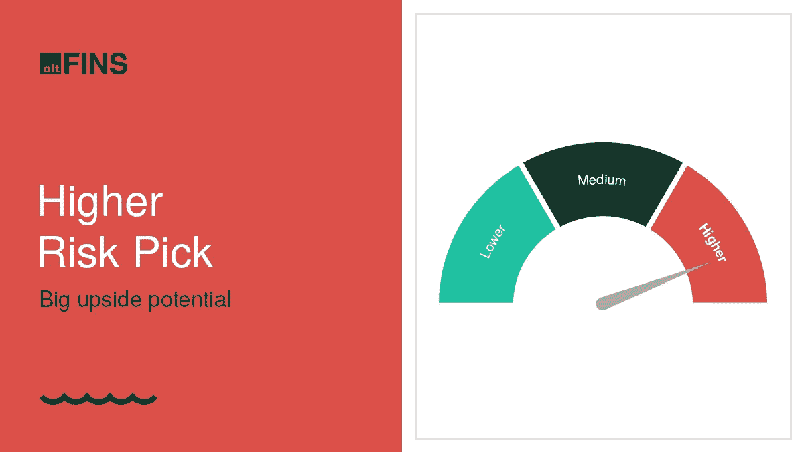
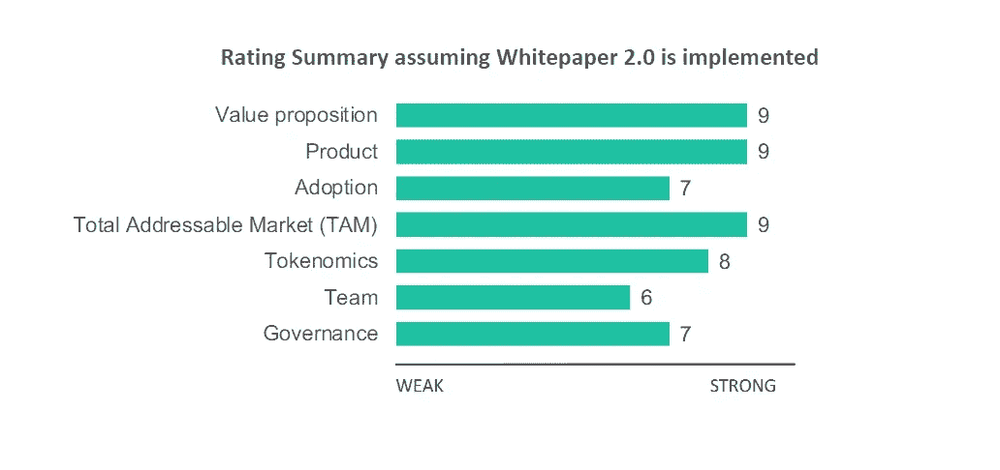

# 高风险硬币选择

> 原文：<https://medium.com/coinmonks/higher-risk-coin-pick-48f651d649d9?source=collection_archive---------35----------------------->

Source: [altFINS](https://altfins.com/research)

altFINS 发布了一份关于新的[**硬币选择**](https://altfins.com/research?utm_source=sendinblue&utm_campaign=optimism%20subscribers&utm_medium=email) **的研究报告。**

该项目是互联的 dApps 和服务的快速扩展生态系统，具有巨大的潜力。

协议类别——将互操作性视为理所当然的首批项目之一。个人用户和企业可以通过从一个区块链环境直接转移到另一个环境进行更少、更顺畅、更便宜的交易。在未来的 12 个月里，价格翻一番的可能性很大，但一些风险依然存在。

**在** [**研究枢纽**](https://altfins.com/research?utm_source=sendinblue&utm_campaign=optimism%20subscribers&utm_medium=email) **阅读研究报告全文！**

Source: [altFINS](https://altfins.com/research)

**结论:**

*   根据 DataVersity 的数据，大约有 10，000 种不同的区块链协议，其中大多数都是孤立的，并且是为特定目的定制的，因此很难在机构层面上实施它们。
*   在撰写本文时，我们的硬币选择总网络市值约为 120.6 亿美元，据报道，过去 30 天内有近 300 万笔交易和 33.2 万笔跨区块链转账。
*   该团队最近发布了一份新的白皮书，对该项目进行了彻底的改变，并有很大的潜力来增加生态系统的市场份额。
*   Coin Pick 的价格有可能在未来 12 个月翻一番，主要是如果团队实施了提议的更改，并且项目通过新的合作关系获得了更大的流动性池。

你想知道我们的硬币选择是哪个项目吗？在 altFINS [研究中心找到自己！](https://altfins.com/research)

我们的硬币选择是专为奥尔特芬订户和阿芬霍德勒。现在，当你使用[奥特莱斯奖励计划](https://altfins.com/knowledge-base/altfins-bounty-referral-program/)时，你可以免费获得奥特莱斯奖励。

Source: [altFINS](https://altfins.com/knowledge-base/altfins-bounty-referral-program/)

> 交易新手？尝试[加密交易机器人](/coinmonks/crypto-trading-bot-c2ffce8acb2a)或[复制交易](/coinmonks/top-10-crypto-copy-trading-platforms-for-beginners-d0c37c7d698c)