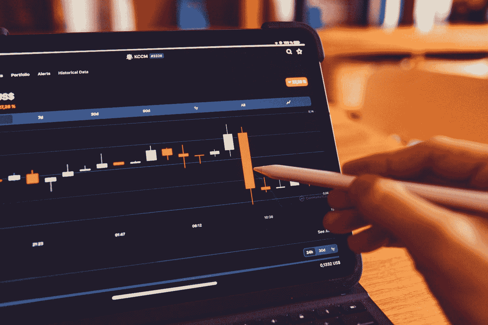

# 日本烛台的历史

> 原文：<https://medium.com/coinmonks/history-of-japanese-candlesticks-a812b5ceac2a?source=collection_archive---------6----------------------->

Image from [USOPMAN Blog](https://www.usopman.com/2020/09/warren-buffet-of-japan.html)

期货、商品和货币交易者是日本蜡烛图的主要用户。

在学习如何使用日式蜡烛图交易之前，还有几件事你应该知道。

在这篇文章中了解更多关于日本烛台的历史。

**日本烛台的起源**

与西方世界类似的东西相比，烛台在日本已经存在了很长时间。

日本人在 17 世纪开始使用海图，而在美国，第一张有记录的海图可以追溯到 19 世纪末。

日本人在 1654 年就开始了大米贸易，然后是黄金、白银和菜籽油。

在此期间，大米市场在日本占据主导地位，这种商品似乎比实物现金更重要。

18 世纪早期，一位名叫宗久本间(也叫宗急本间)的日本大米交易商是追踪价格行为的先驱之一。

凭借对供求动态的基本了解，他发现了情绪对价格结算有影响这一事实。

他对市场参与者情绪的研究为烛台分析奠定了基础。

由于受到高度尊重，他获得了武士身份。

日本人对西方人保密烛台，直到 20 世纪 80 年代，银行和金融机构突然发生了重大的交叉融合。

那是西方人第一次知道这些神秘的图表。

随着当时个人电脑的普及，一般来说，制图变得更简单了。

许多西方分析家在 20 世纪 80 年代末对烛台产生了兴趣。

迈克尔·芬尼(Michael Feeny)当时是住友商事(Sumitomo)在伦敦的技术顾问主管，他开始在日常工作中使用烛台，并与其他伦敦专家分享这一概念。

史蒂夫·尼森是美林证券的技术分析师，他在 1989 年 12 月的《期货杂志》上发表了一份报告，展示了几个蜡烛图反转模式，并描述了它们的预示趋势。

然后，他写了一本关于这个主题的书(日本烛台制图技术)，这是非常了不起的。

> 交易新手？试试[密码交易机器人](/coinmonks/crypto-trading-bot-c2ffce8acb2a)或者[复制交易](/coinmonks/top-10-crypto-copy-trading-platforms-for-beginners-d0c37c7d698c)

感谢尼森先生和芬尼先生。

从那时起，烛台变得更加普遍；今天，似乎大多数分析师都将它们作为自己的基本模板。

**为什么烛台对你的交易分析很重要**

Photo by [regularguy.eth](https://unsplash.com/@moneyphotos?utm_source=medium&utm_medium=referral) on [Unsplash](https://unsplash.com?utm_source=medium&utm_medium=referral)

烛台对交易分析至关重要，因为它们提供了市场活动的直观描述。

*   我们可以通过检查烛台来了解开盘价、最高价、最低价和收盘价的重要细节，这将有助于我们了解价格的变化。
*   烛台适应性强；可以单独使用，也可以与移动平均线和动量振荡指标等技术分析工具配合使用，还可以与道氏理论或艾略特波浪理论等策略配合使用。

> 我使用趋势线，有支撑和阻力的烛台，以及其他技术工具，你会在我的后续文章中了解更多。

*   恐惧、贪婪和希望一直支配着人类关于金钱的行为。烛台分析可以通过展示买方和卖方如何相互作用来帮助我们理解这些变化的心理方面。
*   使用烛台是一个双赢的局面，因为你可以获得所有的交易指示，条形图提供了更多的清晰度和烛台产生的额外信号。烛台比条形图提供更多的相关信息。

**结论**

*大多数专业交易者、银行和对冲基金每天交易数百万美元，通过有效地使用烛台，他们完全控制了市场。*

*如果你不知道游戏规则，他们很容易偷走你的钱。*

即使你有一个百万美元的交易账户，你也无法控制市场上发生的事情。

*烛台模式给出了市场上发生的事情的线索，将有助于指导你何时进场、出场或离场。*

*如果你喜欢这篇文章，请给它 50 个掌声，* [*关注*](/@bukz_dwriter) *我，你可以成为第一个阅读我下一篇文章的人。*

*谢谢*