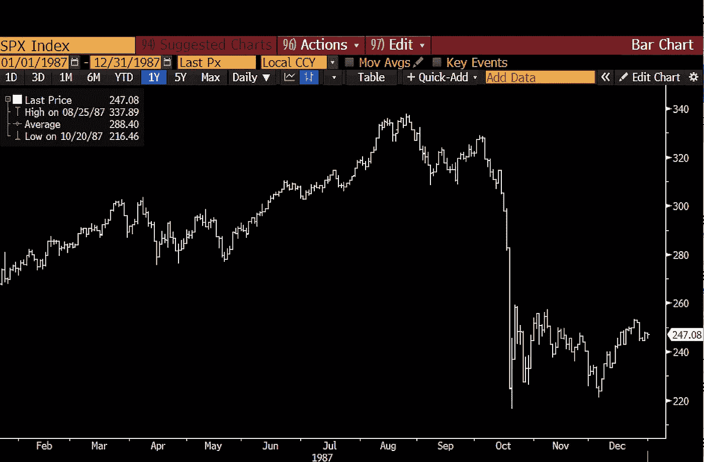
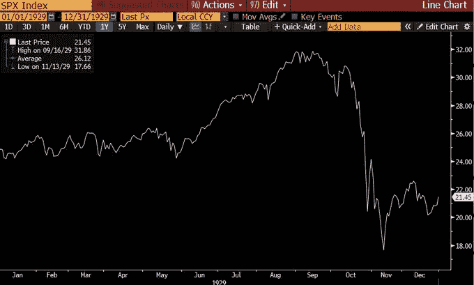
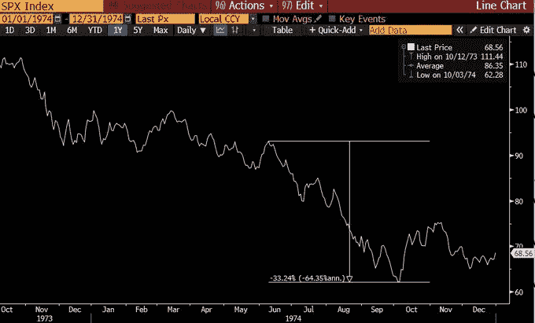
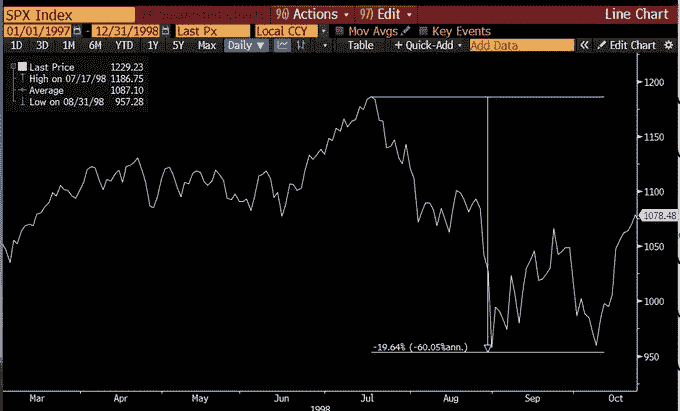
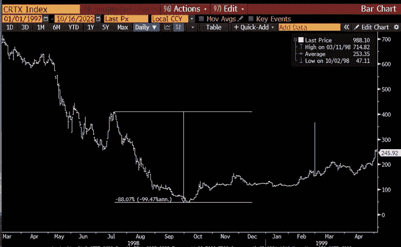
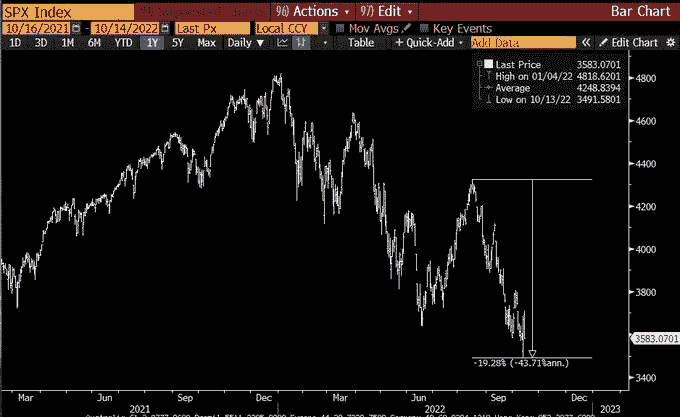
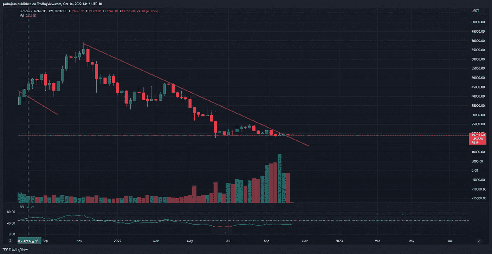
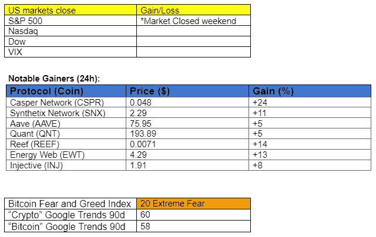

# 历史表明，熊市在 10 月见底。

> 原文：<https://medium.com/coinmonks/history-shows-us-that-bear-markets-bottom-in-october-c588160124a9?source=collection_archive---------24----------------------->

## 每日征服#105

最好的每日新闻、见解和阿尔法信息来源。

Photo by [Dan Gold](https://unsplash.com/@danielcgold?utm_source=medium&utm_medium=referral) on [Unsplash](https://unsplash.com?utm_source=medium&utm_medium=referral)

*密码市场是一个狂野、奇妙而令人生畏的地方；不要一个人跋涉！订阅加密征服者，让我们成为您的向导。*

订阅这份每日时事通讯，永不错过任何一期。

**概述**

*   劳尔·帕尔研究熊市底部。
*   比特币继续缺乏波动性。
*   要在 zkSync 上部署的 Uniswap。
*   魔幻伊甸园:最近失去知觉的 NFT 市场。

早上好，家人，

每个人心中的大问题是:熊市何时见底？很快？明年？

我们真的不太确定，但金融界最著名的一个人做了一项研究，可能会引起你的兴趣。我们来探索一下。

拉乌尔·帕尔在他最新的[推文中写道，](https://twitter.com/RaoulGMI/status/1581699971828457472?s=20&t=j43Rs2DKoxetrF_68KUt8Q)历史表明**十月是市场趋于崩溃的月份，但也是“扼杀熊市”的月份**

在这条推文中，Pal 分享了市场在 10 月份或接近 10 月份触底的五个例子:

1.  1987 年见证了历史上最大的市场崩溃之一，价格在 10 月 18 日触底。

*来源:* [*推特，拉乌尔帕尔*](https://twitter.com/RaoulGMI/status/1581699981261832195?s=20&t=j43Rs2DKoxetrF_68KUt8Q)

1.  1929 年，市场在 10 月崩盘，股票在 11 月见底。然后，美国进入大萧条，直到 1932 年。

*来源:* [*推特，拉乌尔帕尔*](https://twitter.com/RaoulGMI/status/1581699981261832195?s=20&t=j43Rs2DKoxetrF_68KUt8Q)

1.  1974 年，通货膨胀引发的熊市在 10 月触底。

*来源:* [*推特，拉乌尔帕尔*](https://twitter.com/RaoulGMI/status/1581699981261832195?s=20&t=j43Rs2DKoxetrF_68KUt8Q)

1.  “1997 年——亚洲危机冲击了所有的世界市场，美联储不得不调整政策。又一次 10 月崩盘，创下一代新低。”拉乌尔·帕尔。

*来源:* [*推特，拉乌尔 Pal*](https://twitter.com/RaoulGMI/status/1581699981261832195?s=20&t=j43Rs2DKoxetrF_68KUt8Q)

1.  1998 年，俄罗斯违约，导致了“历史上最快的崩溃”，10 月份达到了一代人以来的最低点。

*来源:* [*推特，拉乌尔帕尔*](https://twitter.com/RaoulGMI/status/1581699981261832195?s=20&t=j43Rs2DKoxetrF_68KUt8Q)

1.  拉乌尔·帕尔对今年熊市的立场是:“以美元计算，这是历史上最大的财富损失，以 GDP 计算，这是第二大损失(2008 年更糟)。”今年的图表设置与往年非常相似。

*来源:* [*推特，拉乌尔 Pal*](https://twitter.com/RaoulGMI/status/1581699981261832195?s=20&t=j43Rs2DKoxetrF_68KUt8Q)

历史往往押韵。那么这种趋势会持续下去吗？

# 市场更新🌍

**BTC/USDT 1W**

BTC 股市进入第三周的低波动，引发了一些人对底部已经探底的担忧。另一方面，多头已经连续 17 周保持了 19k 美元的支撑位。一些另类投资者如 Quant (QNT)、Frax (FXS)和 Arweave (AR)将安静的周末视为一个攀升的机会。BTC 本周收盘下跌 0.91%，至 19262 美元。

*高清* [***图表***](https://www.tradingview.com/x/x9wxjoeD/)

如果你喜欢这份报告，并且认为它值 20 分(0.01 美分)，请点击下面的鼓掌按钮来支持我的写作。(最多 50 次！)谢谢！

# 新闻观察📰

**要在 zkSync 上部署的 unis WAP**。几乎 100%的 Uniswap 社区[投票](https://twitter.com/Uniswap/status/1580996750180900865?s=20&t=Aq83ZDpv5pskUtrp9KMUNw)在专注于隐私的 zkSync 上部署最受欢迎的分散式交换(DEX ),该交换利用了一种称为 ZK Rollups 的以太坊扩展解决方案。这一进展是在 zkSync 宣布其自 2 月份进入 testnet 后进入 mainnet 的计划之后发生的。ZK 汇总技术允许增加可伸缩性、更便宜的交易和更快的速度。Uniswap 计划在四至六周内在网络上投入使用。

尽管遭到黑客攻击，温特穆特还是偿还了 9600 万美元的加密贷款。加密做市商 Wintermute 在被黑客入侵 1.6 亿美元三周后还清了其在加密平台 TrueFi 上的 9600 万美元贷款。USDT 的无抵押贷款将于 10 月 15 日到期。

**新闻花絮:**

*   中国推迟发布第三季度 GDP，没有给出原因或新的日期。
*   朝鲜黑客组织 Lazarus [瞄准日本的](https://twitter.com/coindesk/status/1581913104996519936?s=61&t=aBlKN7dVDJiqByP3Endrjw)加密公司。
*   孙正义承认[拥有](https://twitter.com/wublockchain/status/1580758945206980610?s=61&t=VmyDu3zZ5IafFJficUe9QQ)“数千万”火币。
*   [深潜](https://twitter.com/ipor_intern/status/1581567543914872834?s=20&t=KrwyTnruOxSffExHf9Lo4g)到阿夫的稳定的 GHO。
*   中国敦促公民立即离开乌克兰及周边地区。

**NFT &元宇宙更新🐵**

*   总部位于 NFT 的 Solana market place Magic Eden 通过取消其 2%的平台费过渡到可选的版税模式。

**我的五分钱……**

这是传统市场的重要一周。本周发生的一些重大事件包括:

*   主要收益(特斯拉、IBM、网飞、亚马逊、高盛、美银)。
*   成屋销售，美国东部时间周四上午 10 点。
*   每月十月期权到期。周五开市前。
*   [美联储发言人](https://www.babypips.com/economic-calendar?week=2022-W42)周三、周四和周五。

由于宏观经济继续增加不确定性，本周市场状况仍将严峻。更不用说，许多专家预测收益季节会很艰难。随着中国敦促其公民立即离开乌克兰及其周边地区，人们开始担心俄罗斯在战争中可能会加大侵略力度。

保持警惕，做好一切准备，以防拉乌尔·帕尔的历史研究是正确的，十月标志着底部。

**关注我的* [*推特*](https://twitter.com/web3_gabri) *获取每日更新！**

*订阅这份每日时事通讯，不要错过任何一期。*

> *交易新手？尝试[加密交易机器人](/coinmonks/crypto-trading-bot-c2ffce8acb2a)或[复制交易](/coinmonks/top-10-crypto-copy-trading-platforms-for-beginners-d0c37c7d698c)*