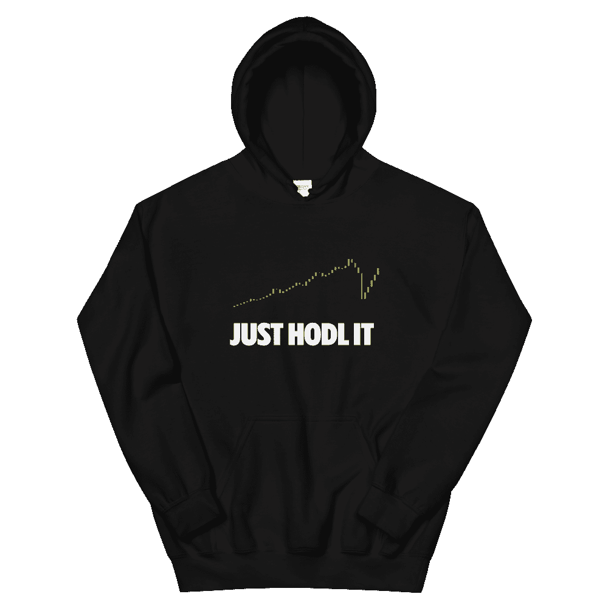

# HODL，当熊队接管时

> 原文：<https://medium.com/coinmonks/hodl-as-the-bears-take-over-f7c27e74cd6b?source=collection_archive---------34----------------------->

用更简单的话来说明当前的经济惨败，全球经济的普遍状况在 covid 之后变得更加糟糕。当形势发出事情可能会变糟的信号时，交易员和投资者拿出了他们全部财富的很大一部分。他们将其投资于更现代的方法，如加密货币。

让我们面对现实吧，加密货币的概念如此重要，以至于每当有人听到这个名字或者当有人在讨论这个概念时，第三个人可能会加入进来，因为这个想法如此诱人。毫无疑问，它已经证明了自己的实力，其可接受性、可扩展性和利润已经超过了其他任何市场。尽管这个市场遵循与其他市场相同的图表，并且拥有代币和硬币形式的资产，但它的波动性可能高于其他任何市场。如果你是一个潜在的交易者或经验丰富的专家，你可能已经知道什么是熊市和牛市。当多头和空头主宰市场时，市场会有怎样的表现？如果是这样的话，那你就认为自己不走运，但让我们来谈谈当空头接管那些刚刚进入市场的人时会发生什么。

随着空头逐渐增强他们的统治地位，加密货币也出现了价格下跌。这种情况对于刚入市的人来说格外有利。尽管如此，对于那些在下跌前已经购买资产的人，或者那些在下跌期间购买资产的人，他们相信这可能是结束，价格将反弹，或者多头将控制局面，他们的投资价值也已经下降，这产生了 HODL 的想法，或者如其名称所示，为了昂贵的生活而坚持。即使在多头控制了市场之后，交易者也会跟踪霍德林，而不仅仅是在市场走低的时候。这表明他们正在坚持一个能够让他们出售加密货币令牌的价格。尽管如此，相对于目前的市场状况，空头已经提升了霍德林。让我们进入正题，为我们的读者描述一下强制囤积是什么样的。

# 什么是强迫霍德林？

另一个与 HODL 思想相互影响的因素是 FOMO。你现在可能会问这两个概念是如何联系在一起的，不是吗？答案是，与总体趋势一致，当空头接管时，你的钱包持有量往往会下降。这里是交易者拼命坚持的地方，但偶尔也会犯像 FOMO 或害怕错过的错误。交易者犯了同样的错误，当他们注意到其他人都在努力挽救剩下的钱时，决定清算他们的钱包。FOMO 正是如此。重要的是要认识到，保持情绪控制，不让 FOMO 打败你，是从你的投资中获得最大回报的关键。

因此，如果熊市对你的项目产生了实质性的影响，那就设定一些合理的目标，并将它们保存在一个安全的账本中。如果你遵循这些步骤，你将会成为一名优秀的员工。HODL 哲学最重要的方面是向外扩展，并始终关注大局，而不是短期收益。你也将消除生活中的许多压力。

# 霍德林:你应该做吗？

每个人都有明确的最终目标。有些人认为，你应该 HODL 你的货币，直到它值一个特定的金额，在这一点上，你应该卖掉它并获利。然而，在你卖出后，总有可能价格会上涨更多，你会后悔没有坚持更长时间。

其他人建议保留你的硬币，直到它真正可以作为货币使用，并且你不担心把它卖回去。相反，你可以花掉现有的钱。这方面的问题是，只有一些货币是平等的，没有人能够预测任何加密货币的未来或作为一种成熟货币的能力。

# 免责声明:

我是一名金融分析师，分享观点仅供学习和参考。我不是你的顾问，你也不应该根据我的工作进行交易。在进行任何金融交易之前，一定要咨询你的独立财务顾问。我假设市场参与者的任何交易都没有造成损失或损害。

# 最后:

如果你喜欢我的作品，请为我鼓掌！这将有助于我接触更多的人。也会提升我的士气，我会更多的分享我的作品！非常欢迎你的评论。也欢迎你不同意我的观点！

> 交易新手？试试[加密交易机器人](/coinmonks/crypto-trading-bot-c2ffce8acb2a)或者[复制交易](/coinmonks/top-10-crypto-copy-trading-platforms-for-beginners-d0c37c7d698c)