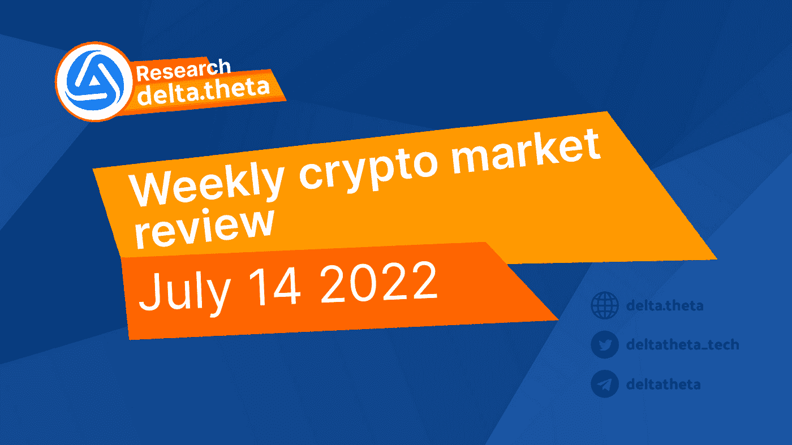
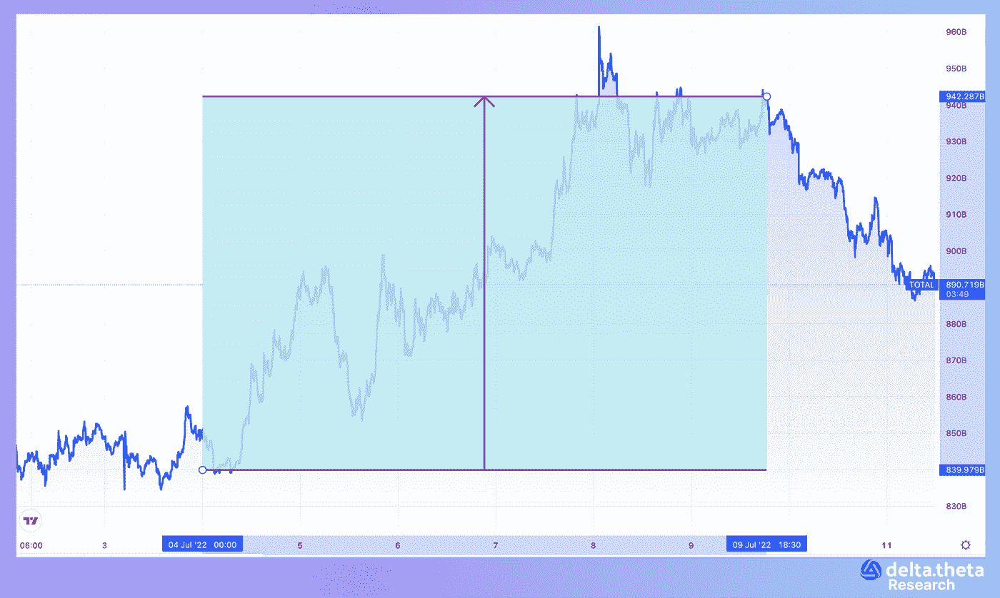
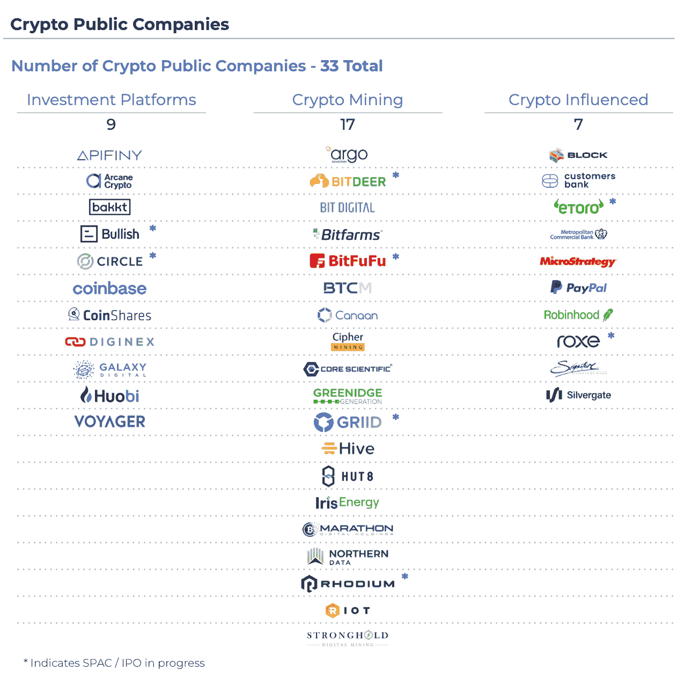
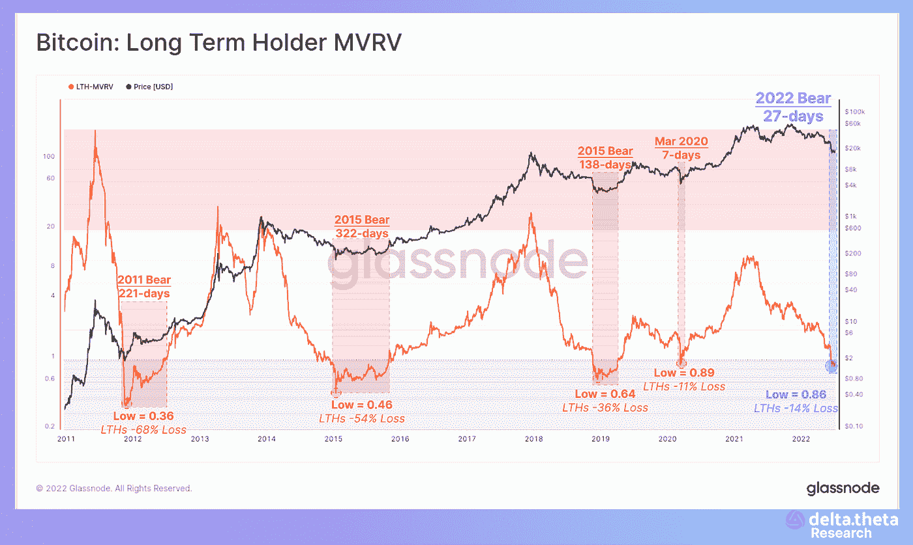
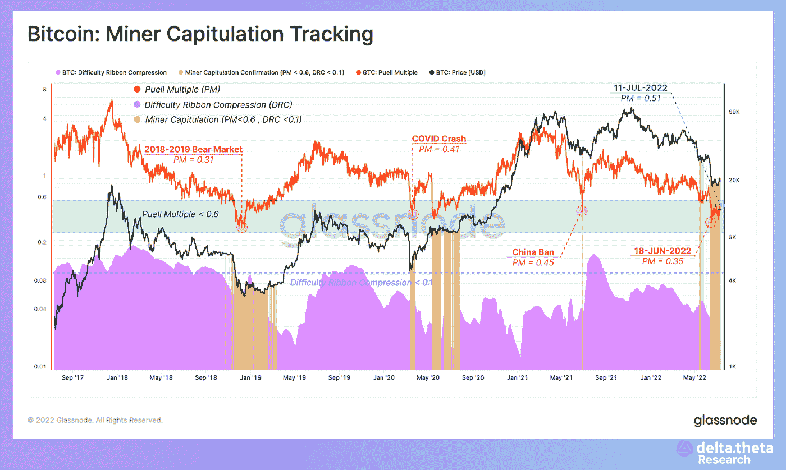
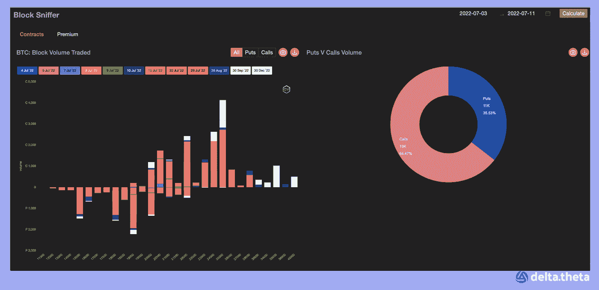
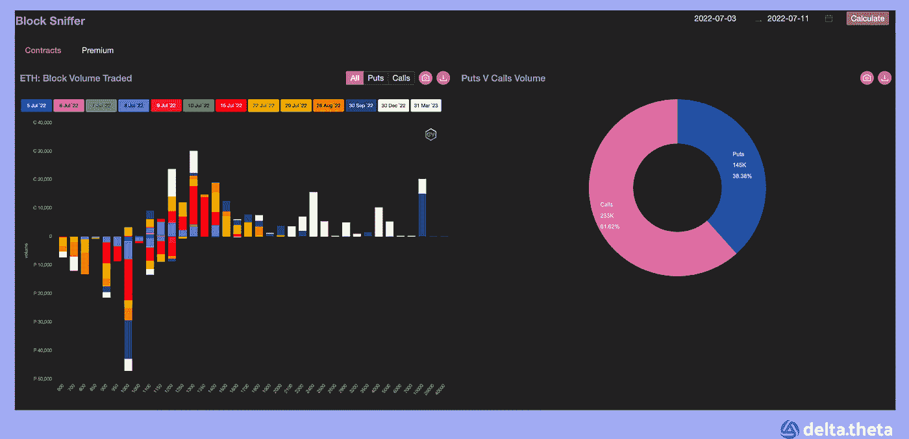

# 守住防线！—加密市场捍卫关键价格水平。

> 原文：<https://medium.com/coinmonks/hold-the-line-crypto-markets-defend-key-price-levels-49b8e24b379e?source=collection_archive---------32----------------------->

加密市场又经历了一周围绕“底部”的盘整。本周初，总市值指数为 8703 亿美元。然后，我们可以看到当地的峰值上升到 9614 亿美元。该指数随后回落至 8944 亿美元。因此，总资本化指数的最终增幅为 2.8%。

比特币的价格通常保持在 20000-22000 之间，只是偶尔会有突破。比特币的回顾期始于 19 720 年。随后上升至 22 374 点的局部峰值。到这一时期结束时，汇率降至 20 520 英镑。本报告期结束时的总增长率为 4.05%。

以太元素，在过去的一段时间里，通常表现出类似的动态。该资产从 1127 点开始，在本报告所述期间中期达到 1262 点的局部峰值。在这个时期结束时，以太下降到 1146 年的水平。到周末，增长率达到 1.68%。

新闻

一个寻求从破产的三箭资本基金(Three Arrows Capital fund)追回资金的法律团队已被批准向创始人和交易对手发出传票，以获取信息作为调查的一部分。一名法官发布了给予临时救济的命令。三箭资本基金在被债权人多次清算后面临破产。该基金在 Terra 生态系统崩溃期间遭受了重大损失，并在更广泛的市场崩溃期间面临进一步动荡。据报道，今年 6 月，该基金的创始人正在决定如何偿还债权人和其他交易对手。该公司最终在英属维尔京群岛开始了破产程序。该破产程序伴随着根据纽约南区法律进行的破产程序，该法律允许外国债务人在美国申请破产。

分散式贷款协议 Morpho [在由 Andreessen Horowitz (a16z)和 Variant](https://www.coindesk.com/business/2022/07/12/a16z-variant-lead-18m-round-for-lending-protocol-morpho-labs/) 牵头的一轮融资中筹集了 1800 万美元。这些资金是通过出售自己的代币来换取 USDC 的。本轮其他投资者包括 Nascent、Semantic Ventures、Cherry Crypto、Mechanism Capital、Spark Capital、Standard Crypto 和比特币基地风险投资公司。值得注意的是，这家创业公司的创始人是一名 21 岁的巴黎理工学院四年级学生。Morpho 是一种建立在现有协议基础上的分散化贷款协议，它将贷款从流动性池转移到一种点对点机制，为投资者提供更高的回报。

OKX 加密货币交易所[与英超联赛冠军曼城](https://www.okx.com/academy/en/manchester-city-training-kit-announcement)达成协议，将其标志放在该队 2022/2023 足球赛季训练服的前面。在市场崩溃的情况下，在相当长一段时间没有秘密体育赞助协议后，这笔交易还将使 OKX 成为自 2019 年以来首次回归的 Man City 2022 Trophy Tour 的合作伙伴。该俱乐部表示，这笔交易每个赛季的价值将超过 1000 万英镑(1200 万美元)。

> 交易新手？试试[密码交易机器人](/coinmonks/crypto-trading-bot-c2ffce8acb2a)或者[复制交易](/coinmonks/top-10-crypto-copy-trading-platforms-for-beginners-d0c37c7d698c)

索拉纳区块链最大的 NFT 市场 magic Eden[已经成立了一个投资部门来支持 web3 游戏行业](https://decrypt.co/104902/solana-nft-marketplace-magic-eden-launches-gaming-venture-arm)。新公司 Magic Ventures 将投资于 web3 游戏开发商和基础设施建设商。该公司认为，游戏行业有潜力吸引数百万用户到区块链。Magic Ventures 的推出距离 Magic Eden 以 16 亿美元的估值筹集到 1.3 亿美元的 B 轮融资不到一个月。目前还不知道 Eden 打算向其风险投资部门分配多少魔法，以及它是否已经投资了任何初创公司。Magic Eden 对游戏行业来说并不陌生:今年 3 月，它推出了一个名为 Eden Games 的托管平台。

美国加密货币领域的 M&A 活动持续增长。据 Architect Partners 称，在过去的 6 个月里，已经完成了约 92 笔交易。2021 年和 2022 年初最活跃的投资和收购者是比特币基地风险投资公司和 Animoca Brands，它们已经完成了 50 多轮投资。目前美国股票市场上大约有 30 家上市公司。尽管它们代表不同的细分市场，但在俄罗斯投资者没有完全合法的方式参与加密市场的情况下，交易高度相关的比特币股票仍然是从加密资产中赚钱的最简单、最直接的方式。

# 市场情况

根据分析服务公司 Glassnode 的数据，以长期持有收益率衡量，熊市阶段才刚刚开始。过去类似的周期从 136 天持续到 322 天，现在不超过 27 天。

另一个表明当前周期内市场价格接近底部的间接迹象是矿商继续投降。比特币矿商被迫出售持有的比特币和目前正在开采的比特币，以支付运营成本和借款费用。

美联储会议仍然是吸引交易员的主要因素。在周三美国交易时段前公布负面消费者价格指数数据后，加息阴谋达到了顶点。目前，对 7 月底加息 0.75 或 1 个百分点的预期几乎平分秋色。因此，一些交易者在比特币交易中使用 18000-20000 的看跌期权差价策略，在 ETH 交易中使用 800-1000 的策略。对较低加息的预测反映在 BTC 23000-25000 次罢工中。

总的来说，价格形势继续对市场不利，对于经济的糟糕或非常糟糕的情况将持续多久保持高度的不确定性。

> 加入 Coinmonks [电报频道](https://t.me/coincodecap)和 [Youtube 频道](https://www.youtube.com/c/coinmonks/videos)了解加密交易和投资

# 另外，阅读

*   [CoinFLEX 评论](https://coincodecap.com/coinflex-review) | [AEX 交易所评论](https://coincodecap.com/aex-exchange-review) | [UPbit 评论](https://coincodecap.com/upbit-review)
*   [AscendEx 保证金交易](https://coincodecap.com/ascendex-margin-trading) | [Bitfinex 赌注](https://coincodecap.com/bitfinex-staking) | [bitFlyer 审核](https://coincodecap.com/bitflyer-review)
*   [Bitget 回顾](https://coincodecap.com/bitget-review)|[Gemini vs block fi](https://coincodecap.com/gemini-vs-blockfi)cmd |[OKEx 期货交易](https://coincodecap.com/okex-futures-trading)
*   [AscendEx Staking](https://coincodecap.com/ascendex-staking)|[Bot Ocean Review](https://coincodecap.com/bot-ocean-review)|[最佳比特币钱包](https://coincodecap.com/bitcoin-wallets-india)
*   [霍比评论](https://coincodecap.com/huobi-review) | [OKEx 保证金交易](https://coincodecap.com/okex-margin-trading) | [期货交易](https://coincodecap.com/futures-trading)