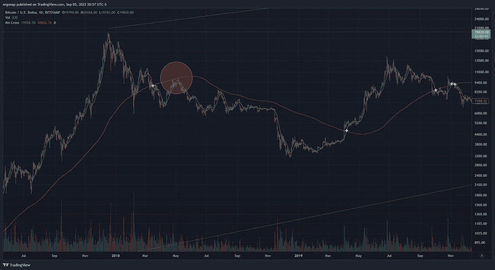

# 假期风险很大。

> 原文：<https://medium.com/coinmonks/holiday-risks-are-abundant-e7ef9fa08006?source=collection_archive---------32----------------------->

## 加密货币市场/比特币市场分析 9/5

我刚从一个美好的假期回来(耶)，所以我会保持这个简短和甜蜜。许多人认为石油将成为比特币移动的导火索，我认为这很愚蠢。

相比之下，让我们用简短的链接来总结一下发生了什么:

Russia: “Why can’t we pull out our $100b in China?” But hey you know, #BRICS ever so strong except when reality comes into play. Here’s google translate below.

> 中国通过将 17%的黄金储备投资于人民币而“劫持”了俄罗斯 1000 亿美元的储备，央行表示，事实上不可能从中国资产中撤资。要使用人民币，你需要得到中国的许可

似乎最终，金砖四国都是关于每个人的自身利益。有趣的是，这与美国+欧盟的合作有多么不同，不是吗？有点像…火鸡？我为什么要提这个？因为这会影响 DXY。俄罗斯会崩溃，DXY 会受到严重影响，因为每个人都会依赖美元，因为中国也有麻烦了。金砖四国的新货币就像我宣布我制造了新的比特币。我敢肯定，人们肯定会争先恐后地买进，因为是的…哦等等。不，他们不是因为现实。

DXY，一个提醒:倒 H&S 回到 1968 年或一个三重底部，或一个圆形底部。是啊。我们不是在谈论一些小游戏，我们是在谈论任何非美元的结束时间。

[https://www.tradingview.com/x/r3gpW2ur/](https://www.tradingview.com/x/r3gpW2ur/)

我们还有什么？BTC 今天在市场关闭后玩了一些游戏，渴望在假期后把人们骗出来。不太乐观，但无论如何。这是一些小的短期游戏。

[https://www.tradingview.com/x/VGYWOwMe/](https://www.tradingview.com/x/VGYWOwMe/)

这是来自 aggr 的同样的东西。看到发生了什么？标准液体狩猎。这不是看涨，这只是在我们下跌之前停止一些空头。

像这样追逐流动性是愚蠢的，但你可以看出人们渴望流动性，比如#币安，他说“BUSD 将会是什么样子”。

 [## 第三大稳定币发行国币安停止支持更大的竞争对手 USDC

### 杰米·克劳利是 CoinDesk 新闻驻伦敦记者。在 9 月 29 日 03:00 UTC，用户在三个…

www.coindesk.com](https://www.coindesk.com/business/2022/09/05/binance-to-convert-users-usdc-usdp-tusd-into-its-own-stablecoin-busd/) 

考虑到这里的规章制度，我不确定这是否仅仅是简化(这是可以的)或者是市场份额的尝试或者其他什么。请注意，和往常一样，他们对非美国人的交易有 BUSD 折扣。

加密市场看起来绝对准备下降，明天很难。Rip 调用和 hello puts，因为这意味着 SPY 也将下降。[https://www.binance.com/en/futures/funding-history/4](https://www.binance.com/en/futures/funding-history/4)

比特币的统治地位(BTC。d)像往常一样玩游戏，但看起来像 2018 年 5 月期间发生的事情，大约是坐在支撑上，而不是刚好在阻力之下。随着统治地位的继续流失，时间会告诉我们这一次它会如何发展。下面是 2018 年的例子:

[2018, bitstamp when BTC hit a pretty significant low . https://www.tradingview.com/x/2hjP3qs9/](https://www.tradingview.com/x/2hjP3qs9/)

这对市场来说看起来是一样的吗？不，今天看起来更糟。非常喜欢。这是我看过的所有指标中最丑陋的一个。所以请记住，2018 年 5 月是熊市结束时**真正下跌**的**开始**。

[https://www.tradingview.com/x/EBuNY4Hg/](https://www.tradingview.com/x/EBuNY4Hg/)

下面是 2018 年实测降幅。68% **低**。

68% to go when we’re already way down means either a: it’s a fakeout (exceedingly unlikely given macro) or b: it’s going to be even bigger. what’s 68% off of $20k? about $6400.

不要忘了本周是 CPI 周，有很多事情会改变你想要的方向。我预计它会像往常一样对任何非交易者充满敌意，但我没有看到任何迹象表明熊市真的结束了或类似的情况。

> 交易新手？尝试[加密交易机器人](/coinmonks/crypto-trading-bot-c2ffce8acb2a)或[复制交易](/coinmonks/top-10-crypto-copy-trading-platforms-for-beginners-d0c37c7d698c)