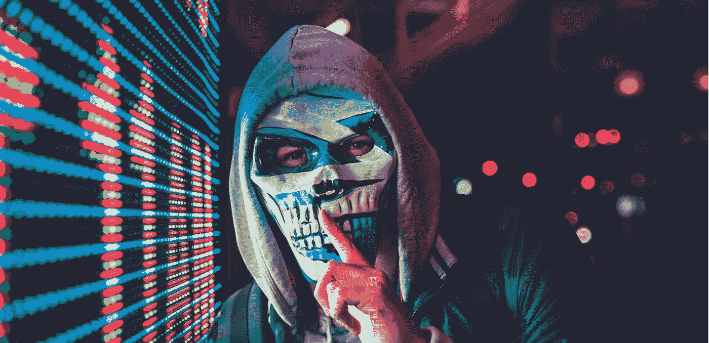

# 亲爱的，我铸造了一个 NFT！

> 原文：<https://medium.com/coinmonks/honey-i-minted-an-nft-81c772460fe5?source=collection_archive---------51----------------------->

## 第五章:抢劫

**重述** : *杰西卡向扎克解释哈希和分布式账本技术。*

 [## 亲爱的，我做了一个 NFT！

### 第 4 章:分布式总账系统

medium.com](/coinmonks/honey-i-mint-an-nft-dc7c75fdc1d2) 

"亲爱的，你的 NFT 是在公海铸造的吗？"这是扎克下班回家进门时说的第一句话。

“是的，我做到了。这是最大的市场。发生了什么事？你看起来很担心。”听到扎克的声音，艾米从厨房走了出来。

“我听说 OpenSea 遭到黑客攻击，价值约 2 亿英镑的 NFT 被盗。你受影响了吗？”扎克说。

“真的吗？”艾米回答道。“我不确定，但我不这么认为。今天早上我接到通知，我的 NFT 被卖掉了。但是我没有兑现任何东西。嗯，我还不知道怎么做。我得问问我的“师傅”，杰西卡。艾米耸耸肩。

“祝贺你完成了在 NFT 的第一笔交易！我认为尽快兑现对你有好处。让我们问问杰西卡你是如何做到这一点的。那边现在是几点？我来查一下。”扎克看了看他的手机。“对她来说是早上十点。应该是完美的时机。”

“你真的对 NFTs 很感兴趣。杰西卡是个夜猫子，记得吗？她现在可能正挣扎着起床。我准备晚餐时，你为什么不去冲个澡？我会给她发信息，请她在大约两个小时后和我们通话。爽吗？”

“好吧。我担心死了，因为我在下午读到了它。我试着给你打电话，但是你不接。你在哪里？”

"我出去在街角的咖啡馆里呆了一会儿，计划我的下一个项目，我忘记带手机了，"艾米抱歉地回答。

"你肯定你不是故意那样做来让我担心的吗？"扎克开玩笑地说，而走向主卧室。艾米带着邪恶的表情回答道。

厨房里飘出一股芳香。艾米正在为晚餐准备她的奶酪烤鸡。那是她的招牌菜。最重要的一步是将鸡块腌制过夜。艾米从她祖母那里得到了她的腌泡酱秘方。她只需要在腌好的鸡肉上盖一罐奶油玉米，再盖上切达干酪丝，放入烤箱 400 华氏度以上烘烤 30 分钟。它和米饭很配。艾米准备了香喷喷的抓饭来配鸡肉。

“闻起来真香！我爱它。”扎克洗完澡出来，把艾米裹在背上，在她的脸颊上亲了一下。

“你闻起来也很香，”艾米回答道。"好了，晚餐准备好了，杰西卡已经同意一小时后和我们一起打电话."

晚饭后，扎克把笔记本电脑放在餐桌上，准备和杰西卡通话，而艾米正在准备洗碗机。

“嗨，扎克，很高兴再次见到你，”杰西卡手里拿着一杯咖啡打着招呼。“自从我上次和你说话已经有好一会儿了。是一个月吗？或者两个？”

“已经两个月了。我应该追上你，澄清那些一直萦绕在我脑海中的问题。但是，嗯，年终让我们很忙。本月早些时候，我们飞到艾米家参加中国新年庆祝活动。”扎克正在和杰西卡聊天。艾米加入了他，并带来了 2 个苹果碎作为甜点。在他们家，没有甜点的晚餐是不完整的，即使只是一些巧克力薄荷糖。

“你好，杰斯。我今天早上卖掉了我的 NFT。”艾米眉开眼笑！

“恭喜你！我真为你高兴。”杰西卡满脸笑容地回答道。

“扎克说他读到了发生在公海的一次抢劫。你听说过吗？发生了什么事？两亿被偷了，对吧？听起来很吓人。那不是应该很安全吗？”艾米问道。

“哦，公海。我也是受害者之一，但昨晚他们退还了我的 NFTs。真是如释重负。否则我不会坐在这里和你说话。我还会躲在被窝里痛哭流涕。”杰西卡说。

“哦，亲爱的！真的吗？这是怎么发生的？他们也把你的 NFT 退回来了？他们是谁？”艾米不相信地回答。

“我不知道。我仍在调查发生了什么，目前没有太多信息。”杰西卡耸耸肩。她显然看起来没那么有活力和泄气了。"但我一定会让你们俩保持联系."

“无论如何，我很高兴你拿回了你的 NFTs，”艾米说。

“我也是。反正你找我急着谈是有原因的，对吧？”杰西卡问。

“哦，对了。我如何能兑现我收到的硬币？我需要先从外海调出来吗？”艾米问。

“你不需要把它转出，密码会直接进入你的钱包。你现在需要做的是在交易所开一个账户，把你的密码转移到交易所，然后把我们的密码变成法定货币，并把它转移到你的银行账户上。”杰西卡解释说，“你可以去比特币基地或者 Crypto.com 看看。”

"什么是法定货币？"艾米问。

“法币是政府支持的货币，例如，我们的美元，”扎克插嘴说。

“哦！”艾米点点头。“杰西，整个过程太复杂了，你能给我演示一下吗？”艾米看起来很苦恼。任何与之相关的东西对她来说都像是外星语言。杰西卡不得不手握着她的每一步，而铸造她的 NFT。

“当然可以。还记得你在铸造 NFT 时创造了一个钱包吗？现在，再次打开你的钱包。还记得密码吗？还是私钥？你还留着它，对吗？这是你资产的关键。永远不要失去它，”杰西卡说。

“私人钥匙？哦，该死的！”艾米愣住了，“我不记得我把它放在哪里了！”

 [## 亲爱的，我做了一个 NFT！

### 第六章:不是你的钥匙，也不是你的硬币

ivyfung1.medium.com](https://ivyfung1.medium.com/honey-i-mint-an-nft-4f1269a5e44c) 

*保留所有权利。*

> 交易新手？试试[密码交易机器人](/coinmonks/crypto-trading-bot-c2ffce8acb2a)或者[复制交易](/coinmonks/top-10-crypto-copy-trading-platforms-for-beginners-d0c37c7d698c)