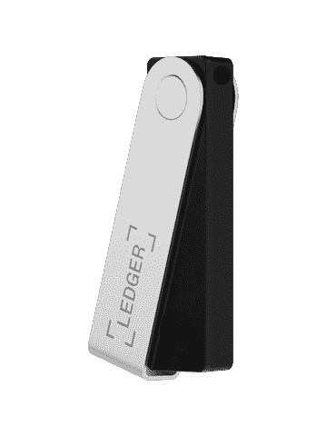

# 亲爱的，我铸造了一个 NFT！

> 原文：<https://medium.com/coinmonks/honey-i-minted-an-nft-957bf2ffe1b5?source=collection_archive---------37----------------------->

## **第七章:倒车并扣好安全带**

*概要:艾米丢失了她的私人钥匙。*

 [## 亲爱的，我做了一个 NFT！

### 第六章:不是你的钥匙，也不是你的硬币

medium.com](/coinmonks/honey-i-mint-an-nft-4f1269a5e44c) 

“取回私钥真的很容易。挑战总是在于如何保护它免受黑客攻击，”杰西卡说。

“黑客！比如你最近经历的？所有这些事情听起来都那么吓人。”艾米看起来真的很担心。

“不要太担心。只要你做得对，机会就微乎其微。让我们先解决你的私钥问题，”杰西卡说。"现在您已经登录了您的钱包，请点击右上角圆形标志下方的 3 个圆点，然后选择帐户详细信息。然后，选择导出私钥，键入您的密码，您将看到私钥。把你的私人钥匙复制到一张纸上，放在别的安全的地方。”

"请慢下来，"艾米再次惊慌失措。“我不明白。我点击这 3 个点后要做什么？”

“让我分享一下我的屏幕，给你看看。”杰西卡加载了她的元面具，并分享了她的屏幕，“这是我的虚拟钱包，里面没有硬币。在任何情况下，请不要把装有硬币的钱包的私人钥匙给任何人看。我现在做的就是一个不好的例子。我像老阿姨一样唠叨，因为这真的非常非常重要。好的，你准备好了吗？跟着我的每一步走就好了。”

艾米紧随其后，取回了自己账户的私钥，“现在怎么办？我该拿私钥怎么办？”

“把它存放在一个地方，或者几个你知道没人会发现的地方，它也不太可能被销毁。例如，你可以把它写在纸上，层压，放在防火保险箱里。”杰西卡笑了，“我在这里可能有点夸张，但就像你用来写私人钥匙的纸一样，它是因为你的手在处理它时湿了而不小心被弄脏的。但是不要对此压力太大。此时此刻，如果你把它写在纸上，放在一个自封袋里，藏在一个你认为安全的地方，那就足够了。如果你认为有必要的话，复制几份，藏在不同的地方。”

“艾米应该在家里以外的地方保存一份副本吗？万一发生火灾，你知道的。”扎克交叉手指。

“扎克，你说得很有道理。就像那些公司将数据库备份在硬盘上的日子一样，他们会在大楼外保留另一份副本，这样他们在服务器所在的大楼发生火灾时仍有一份数据副本。”杰西卡赞同扎克。

“哦，真麻烦。人们为什么要使用加密货币？现在我不得不担心丢失我的私人钥匙。我会有不眠之夜。”艾米用手掌捂住脸。"我可能会把我所有的 Eth 套现，然后忘掉所有这些加密货币."

“不要放弃，艾米，”杰西卡说。“现在你的钱包里只有 0.1 Eth，所以现在还不要为此感到压力太大。当有一天你的钱包里有了更多的密码，你可以慢慢地给你的钱包增加更多的安全性。这项技术仅仅出现了 10 年，却越来越受欢迎。尽管与许多其他深层技术相比，它还相对年轻，但它会一直存在下去，因为它解决了一些严重的问题。就像我们的钱一样，我们需要学会处理我们钱包里的钱，银行账户里的钱，作为投资等等。当我们第一次处理它的时候，我们可能会发现它很难，但是过一段时间我们就会掌握它的窍门了。我们在处理这件事上没有任何问题，因为我们已经做了很长时间了。总有一天，处理加密货币会像处理纸币一样简单。”

“是的，夫人。我会照我说的去做。”艾米做了一个敬礼的手势。

"还有什么保存私钥的方法？"扎克问道。

Ledger Nano X hardware wallet

“方法之一是使用冷钱包，或者硬件钱包。让我给你看看我的。给我几分钟，”杰西卡走出屏幕，手里拿着一个看起来像 USB 驱动器的东西回来了，“这是我的硬件钱包。这个牌子是莱杰。这不是一个 USB 驱动器，即使它看起来像一个。它存储你的私人密钥。这比在你的计算机中存储私钥要安全得多，因为恶意软件可以在你的计算机上运行，并从中窃取信息。恶意软件无法在此设备上运行。所以，你的私钥是安全的。”

“亲爱的，也许我们应该买一个，”艾米问扎克。

“你最终会的，”杰西卡说，“市场上还有其他品牌。在决定你喜欢的之前，你可以做一些调查。目前，像你现在使用的 MetaMask 这样的热门钱包已经绰绰有余了。”

“非常感谢你提供的信息。一段时间以来，我一直听到有关加密货币的零星消息，但不敢接触它，部分原因是我对处理它没有信心。我甚至在我的 Chrome 上安装了 MetaMask 扩展，仅此而已。没有更进一步，”扎克说。

“你比许多人都强，”杰西卡说。

“嘿，杰西卡。你能告诉我为什么有人去发明加密货币吗？”扎克问道，“我在哪里读到过比特币的发明者是日本人，但没人知道他到底是谁。是真的吗？”

 [## 亲爱的，我铸造了一个 NFT！

### 第八章:谁是聪？

ivyfung1.medium.com](https://ivyfung1.medium.com/honey-i-minted-an-nft-b06c613a2c7c) 

*保留所有权利。*

*参考文献:*

1.  [设置元掩码的步骤](https://www.youtube.com/watch?v=_q3QyRu3Ss4&list=PLGrHYSUO2a9oNennlIBgVdNq4MdFaOE7R&index=1)。

> 交易新手？尝试[加密交易机器人](/coinmonks/crypto-trading-bot-c2ffce8acb2a)或[复制交易](/coinmonks/top-10-crypto-copy-trading-platforms-for-beginners-d0c37c7d698c)