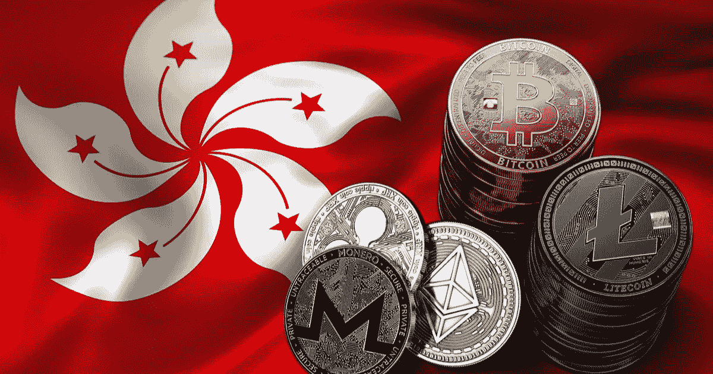

# 香港计划继续成为加密中心

> 原文：<https://medium.com/coinmonks/hong-kong-plans-to-stay-hub-now-for-crypto-bae8189bec8c?source=collection_archive---------40----------------------->

香港将放弃之前提出的将加密交易限制于专业投资者的提议，现在将考虑允许个人在加密交易所运营。这些步骤应该有助于实现成为国际加密中心的目标。

根据[彭博的消息来源](https://www.bloomberg.com/news/articles/2022-10-27/hong-kong-plans-to-legalize-retail-crypto-trading-to-become-hub)，我们将在明年三月看到一个允许零售交易的加密平台许可计划。然而，他们的内部人士指出，比特币或以太不太可能用于交易。

*Hong Kong and crypto. Source:* [*blockchain.news*](https://blockchain.news/news/hong-kong-is-a-step-closer-to-legalizing-retail-crypto-trading-report)

据报道，政府还在研究数字资产监管的其他领域，如令牌化资产和智能合同，以发展数字贸易。

> “我们希望向全球市场表明我们的政策立场，展示我们与全球虚拟资产界共同探索金融科技的决心，”——*英国财政大臣保罗·陈表示。*

尽管如此，一些人认为这一步骤可能不足以吸引当地的密码交易员，他们已经找到了一种利用全球交易所买卖数字资产的方法。

> “我听到的那种对话是，人们仍然担心会有非常严格的许可制度。即使他们能够直接与零售用户打交道，他们也不会像海外平台那样有吸引力或有竞争力。” *—香港比特币协会联合创始人莱昂哈德·威斯(Leonhard Weese)。*

最近，许多国家已经开始朝着这个方向发展，试图在加密交易方面处于全球领先地位。例如，我们最近观察到[格鲁吉亚朝着同样的目标迈进](https://www.observers.com/will-georgia-become-a-crypto-hub/)。然而，香港的情况有所不同，因为它曾经是 crypto 的中心，后来由于严格的监管而失去了它。一些加密业务已经转移到新加坡，所以现在这种加密法规的明显转变可能是为了扭转业务流失到其竞争对手金融中心的局面。

在 mainland China，所有加密货币操作都被视为非法，包括离岸交易所的加密货币操作。香港证券及期货事务监察委员会(Securities and Futures Commission)高级官员伊丽莎白黄(Elizabeth Wong)认为，内地全面禁止加密不会影响香港的政策，她提到了“一国两制”的宪法原则。

> *💡“一国两制”原则是赋予香港特殊地位的法律。它允许香港作为特别行政区，拥有自己的自由市场经济、货币和政治制度。*

在传统金融中心的列表中，你可以找到纽约、伦敦、香港和其他你肯定听说过的大城市。加密中心会设在同一个地方吗？或者说，新的后起之秀会有很大的机会吗？可能两者都有。我们来观察一下。

> 交易新手？试试[加密交易机器人](/coinmonks/crypto-trading-bot-c2ffce8acb2a)或者[复制交易](/coinmonks/top-10-crypto-copy-trading-platforms-for-beginners-d0c37c7d698c)