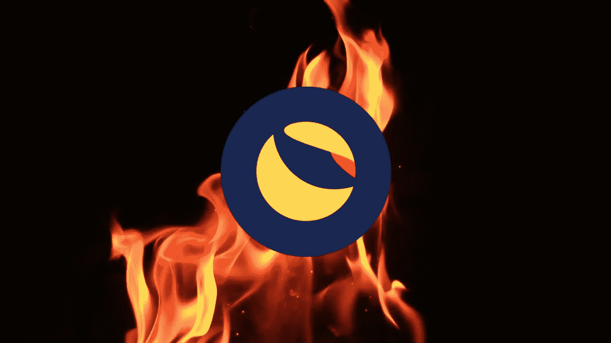

# 伦敦大学燃烧税的希望还是失望

> 原文：<https://medium.com/coinmonks/hope-or-disappointment-at-the-start-of-burn-tax-at-lunc-b67b20ec0f15?source=collection_archive---------10----------------------->

期待已久的 Terra Luna Classic 1.2%的燃烧税自 2022 年 9 月 21 日 09:00 左右开始征收，随之而来的是关于发射是成功、有希望还是令人失望的第一批结论已经开始。

在实施 1.2%的焚烧税的第一天半时间里，超过 3.5 亿伦奇被“焚烧”，区块链上的硬币总量降至 6.9 万亿。

**Terra Luna Classic 社区的目标是将 LUNC 的数量减少到 100 亿。**当硬币达到这个数量时，1.2%的燃烧税将被停止，以稳定 LUNC 的数量。

据了解，如果该社区实现了将 LUNC 降至 100 亿的目标，**我们正在谈论的是一项伟大的成就，将为当前的硬币持有者带来难以想象的利润**。

开始实施 1.2%的燃油税是一件好事还是坏事？双方都有拥护者。

# 乐观的人

那些持肯定态度的人认为，这一原则**将鼓励用户和投资者，因此随着时间的推移，越来越多的 LUNCs 将被“烧毁”**。

此外，支持者指出，随着硬币数量的减少，该链将变得更有吸引力，dApps 将逐渐开始建立在其上，这将增加其实用性，从而增加在其上进行的交易数量，从而增加每天“燃烧”的 LUNCs 的数量。

然而，乐观主义者隐藏的底牌是大型交易所，因为他们认为，如果他们也对交易所内部交易征收“税”，那么每天“烧毁”的 LUNCs 数量将会激增。

# 悲观者

那些不相信 Terra Luna Classic 未来的人说，每天“烧毁”的 lunc 数量很少。

他们举了以下例子来支持他们的立场:如果每天销毁 180，000，000 个 LUNCs，这意味着一个月内将销毁约 50 亿个，一年内将销毁 600 亿个。

因此，直到近 7 万亿个 LUNCs 被销毁，这将需要大量的时间，这将使用户沮丧和沮丧，并使他们远离 Terra Luna Classic。

此外，悲观主义者认为，1.2%的“税”将阻止许多人在 Terra Luna Classic 连锁店内交易，因为他们不想支付这笔额外的交易金额。

# 现在还为时尚早…

每个人都可以对这件事得出自己的结论。我们认为现在断定 Terra Luna Classic 的发展方向还为时过早。毕竟，在加密货币行业，事实可能会从一个时刻转向下一个时刻，所以在这种情况下保持一个小篮子是很好的。

# 社区和中央交易所

目前，Terra Luna Classic 社区正全力与之抗争。此外，这也给主要的中央交易所施加了巨大的压力，要求它们将 1.2%的消费税也适用于交易所内部的交易，而不仅仅是区块链内部的交易(毕竟它们必须适用这一税率)。因此，可以说 Terra Luna Classic 的命运也取决于大型中央交易所。

Bitnewsbot 将监控此事的发展，如果出现任何重大变化或消息，我们将回来重新评估数据。

*原载于 2022 年 9 月 23 日*[*【https://bitnewsbot.com】*](https://bitnewsbot.com/hope-or-disappointment-at-the-start-of-burn-tax-at-lunc/)*。*

> *加入 Coinmonks* [*电报频道*](https://t.me/coincodecap) *和* [*Youtube 频道*](https://www.youtube.com/c/coinmonks/videos) *了解加密交易和投资*

# 另外，阅读

*   [Bookmap 评论](https://coincodecap.com/bookmap-review-2021-best-trading-software) | [美国 5 大最佳加密交易所](https://coincodecap.com/crypto-exchange-usa)
*   [加密交易机器人](/coinmonks/crypto-trading-bot-c2ffce8acb2a) | [造币评论](https://coincodecap.com/coingate-review)
*   最佳加密[硬件钱包](/coinmonks/hardware-wallets-dfa1211730c6) | [Bitbns 评论](/coinmonks/bitbns-review-38256a07e161)
*   [新加坡十大最佳加密交易所](https://coincodecap.com/crypto-exchange-in-singapore) | [购买 AXS](https://coincodecap.com/buy-axs-token)
*   [红狗赌场评论](https://coincodecap.com/red-dog-casino-review) | [Swyftx 评论](https://coincodecap.com/swyftx-review)