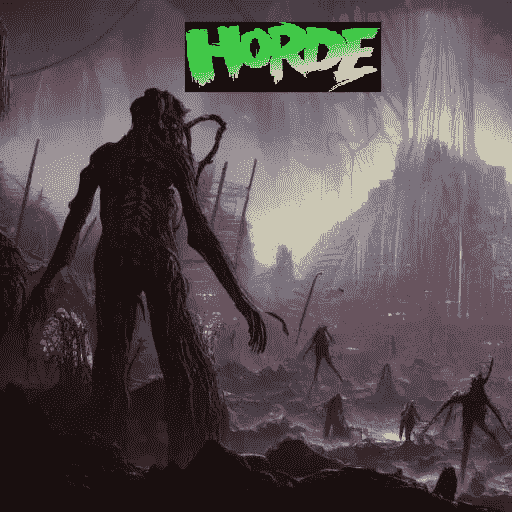
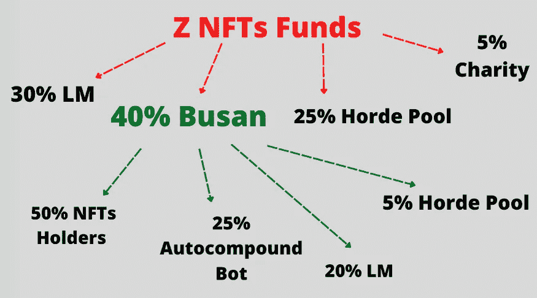
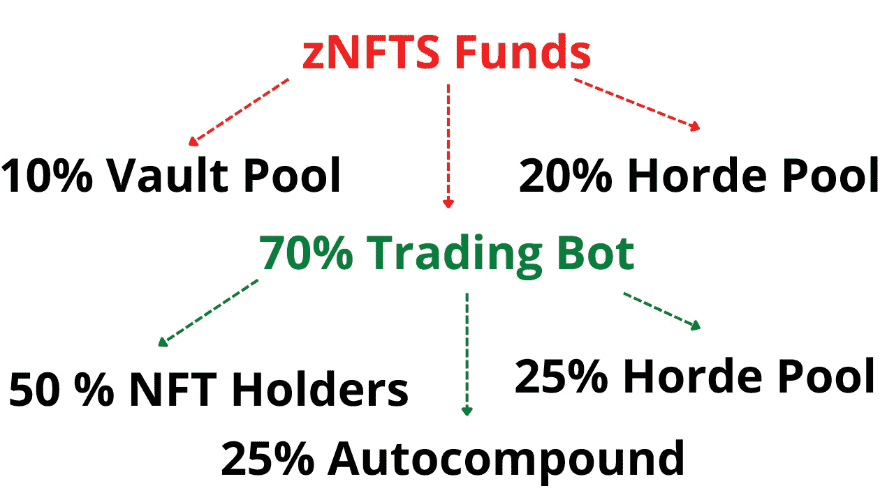

# 部落死了，部落万岁？

> 原文：<https://medium.com/coinmonks/horde-is-dead-long-live-horde-8a9142f8fb11?source=collection_archive---------1----------------------->

*声明:我投资了 Horde，我明显有偏见。这不是财务建议，DYOR。*

I think the AI did a good job on this one

# 概述

几周前，部落失败了，取消了阴谋，并向社区提供了两个选择。经过一周的投票，Horde 将采用我在[之前的一篇文章](/@cryptodefi2048/horde-fails-what-now-ad605d43e223)中提到的收入分成模式系统。

基本上，你们每个人目前的$Horde 代币(在钱包里或可申领的)和未来的代币价值约为$2.40。如果你只是制作了一个情节，还没有兑现任何东西，这个情节会给你在它的生命周期结束时总共 30 $部落(为 10 $部落投资)。因此，一块“未动过的”(他们称之为“满的”)土地现在价值 72 美元，低于 1000 美元的投资。这并不是基于人们是否盈亏平衡，它通常会让年长的投资者受益。

2.40 美元的数字是由总流动资金(170 万美元)除以要求索赔的总额(可通过未来排放量索赔)得出的。尽管如此，在我的书中，~**50 万仍然下落不明**，而且我不期待任何关于他们的交易机器人资金下落不明的答案。

在这篇文章中，我将分解部落团队最近给出的细节以及它们所包含的内容。

# 套现选择权

从[官方文章](/horde/horde-evolution-the-final-frontier-5b11c5cae123)中得知，一旦新平台以每$Horde 或 Vault Token 2.40 美元的“公平价格”推出，投资者将能够立即全部或部分套现。

我不会谈论如何分配剩余资金的公平性，因为我在以前的文章中已经讨论过这个问题(提示:我不认为这对处于亏损状态的人是公平的)。不过，我仍然有两个问题，如何兑现系统是怎么做的。

1.  为什么要 10%的税？最初对出售$Horde 征收 10%的税是为了阻止人们交易代币，因为 LMS 设定的价格范围不允许超过 10%的涨幅，这相当于征收的出售税。所以交易$Hordde 毫无意义，它确保了部落市场的参与者将会是制造阴谋、符文或石头的人。既然这一体系已经失灵，税收还有什么用？套现选项意味着人们可以拿回他们应得的份额。目前，没有部落的部分精度，我们只能想象这些资金回到团队。
    **这种税收很不公平**也不透明。
2.  我曾在他们的分歧中谈到过这一点:如果在未来，人们可以选择套现来拿回他们(据称)不断增长的本金。我被告知这将在团队内部讨论，事实证明，这似乎不是一个选项。你只能在协议内与新投资者交易你的头寸，但你不能从系统中取回你的资金。部落不会让你在未来兑现，你的资金将永远留在他们的掌握之中。
    对于留在协议中的用户来说，这不会改变任何事情。他们仍将获得基于其本金的利润百分比(如果有的话)。
    对于该协议来说，允许机器人平仓并把钱还给人们需要一些工作和时间。否则，就目前的情况来看，这对 it 来说是个利好，因为管理的资产不会缩水。
    **对团队**来说，这意味着他们的**支出金额不会减少**，因为它是基于总利润(如果有的话，更多的数量=更多的利润)。
    再一次，**几乎不公平**而且为了拿回自己的钱，寻找新投资者的负担正在加重。

# 新 zNFT 表征组学

下图显示了之前的记号组学。

把事情说清楚，部落池=团队。他们自己决定保留一些，花一些用于营销、开发等。

下面是新的令牌组学。

从一开始，在造币方面，我们可以看到更多的资金被分配给交易机器人，这是理所当然的，因为 30%的额外资金来自不再存在的 LM 份额。虽然，最初 LM 30%的份额很大一部分已经被吃掉了。因此，我不知道这是否只涉及新的薄荷或所有新的和旧的 zNFTs 不管。

LM 代表流动性管理器，它是协议中的一个钱包，以稳定的价格保存$Horde。这是人们在购买时留出的钱，以确保其效果。

现在，如果我们转向事情的**分布**方面，**故事完全变了**。是的，NFT 持有者仍然直接获得 50%的利润，但是最初回到 LM，人们的钱，现在被重新导向…部落池(团队的钱包)。

再次，**几乎不公平**(感觉自己在重复)。为什么这部分没有进入土地所有者的金库或作为 zNFT 持有者的自动补偿？它原本是给土地所有者的，这样他们就可以以稳定的价格套现，现在不再是这样了。

# **跳马表演**

快速更新我最初的计算，我已经比 16.39%的预期更保守了。

该小组已将其修订为更保守和现实的回报率。文章说的是月息 6/9 左右(利润要每 21 天分配一次)。

因此，我将 [21 天的收益向上舍入到 5%](https://docs.google.com/spreadsheets/d/1y4ODqZYD5KKgB7-BTWcI49x1gFRDk2VVUthteM7oaZM/edit#gid=1208803469) ，在这种情况下(相当慷慨的估计)，对于一个完整的地块(任何没有兑现任何东西的地块)，仅来自利润的盈亏平衡点将是 2875 天(7.88 年)。如果你能卖出你的本金，那么假设协议仍在运行，盈亏平衡时间将缩短到 2290 天(6.27 年)。

# 最后的话

只是我个人的看法。

我很失望，但我预料到了这一点，因为当这个最终支点被提出时，我感觉语气发生了巨大的变化，我谈论了几天釜山失踪的资金，直到最后发表了一篇关于此事的[文章](/@cryptodefi2048/horde-fails-what-now-ad605d43e223)。曾经被认为是部落品质之一的**公平，现在已经消失了。我想，就像往常一样，当事情到了紧要关头，那就是我们看清自己真面目的时候。**

不是你的钥匙，不是你的硬币。在任何钱到达你的钱包之前，你应该认为它是协议的钱。

不管团队能说什么，行动比语言更响亮。通过分解官方数字，我们可以看到，每次需要在投资者和团队之间进行套利(决策)时，都选择后者:
-出境税？对我来说只有对球队有利
-未来兑现的可能性？不，目前不在路线图中。给球队更多的钱。
- zNFT tokenomics？LM 利润的初始分成归用户还是团队？团队。

我可能会尝试在他们的 discord 服务器中讨论某些要点，以试图获得更清晰的画面，如退出税，但我觉得这不值得我花时间，团队也不会做出回应，因为他们尚未披露他们的储备证明(总未清偿流动性仍有 50 万英镑的差距)，他们说他们将在投票过程中发布。截至发稿时，还没有。

我希望你们都有一个愉快的阅读。如果是，请点击👏按钮，这样这篇文章可以到达更多的人。