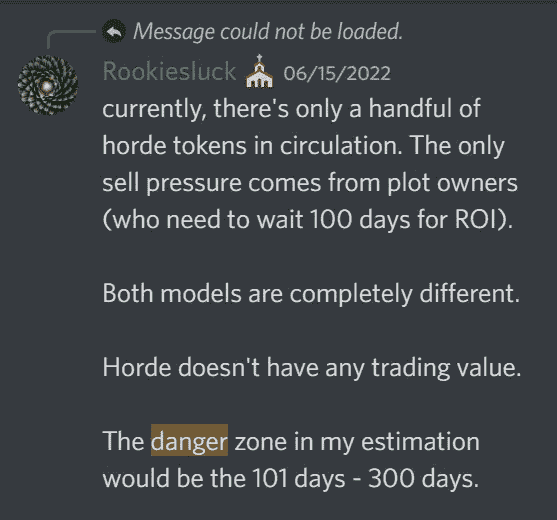

# 部落的最新变化是巨大和突然的:在深度审查

> 原文：<https://medium.com/coinmonks/horde-latest-changes-are-big-and-sudden-in-depth-review-18ba808c55ac?source=collection_archive---------0----------------------->

免责声明:我投资了 Horde，我肯定有些偏见。这不是财务建议，总是 DYOR。

AI generated image for “Zombie Pivot”

这篇文章对我来说有点难写，因为 Horde 是我的主要目标，因此很难将我自己的情绪从试图提供数据焦点分析中分离出来。我会在文章的最后给你我个人的简短情感，这是迄今为止最不重要的。**情绪让人高买低卖**，他们应该永远被排除在金融决策之外。

目前的 DaaS/NaaS 标准已由部落设定:
-1%/天的奖励率
-稳定价格行为的工具(LM 或另一个)
- 300 天衰减

这是全新的实验。这是目前的狂野西部。没有人知道它是否是可持续的，参数已经被 Horde 或其他协议调整过了。

# 概述

所有的地块都被感染了，直到有人声称:一切都保持不变，他们仍将每天分发 1%。一旦提出要求:地块将发生变异，并且“仅”提供 0.5%/天的剩余寿命翻倍= >最终给出相同数量的奖励(价值是初始沉没成本的 3 倍)。

优步情节，情节有一个场景 NFT 附加到他们将保持免疫变异，总是给 1%/天，不管你是否声称。

新的部落销售税系统:
-价格低于 100 美元:20%
-价格在 100 美元到 104 美元之间:10%
-价格高于 104 美元:0%

本质上，如果你制作了 LM 作品，你将会为它付出更多。我怀疑 10%的卖价行动应该是最活跃的。为了减轻部分用户的压力，未来几周将会发布限购令。

# **支点前部落状态**

LM 下降的速度是迄今为止最快的，从 10 月 11 日到 14 日下降了大约**100k/天**，尽管在不到一周的时间里(从 10 月 5 日到 11 日)从 zNFTs 销售中获得了**328158****美元的外部注入**。

不管任何人的意见，官方沟通的团队包括加上 LM 机器人被删除，因为一些恐慌发生在投资者和理所当然的，数字表明狗屎即将击中球迷。

数字不会说谎，尽管人们可以随心所欲地解读它们。下面是这些数字(我准备了这些数字，因为这篇文章最初是为了评估 Horde 以前的可持续性而发表的):
——大约**——500 万美元**的资产给予或拿走
——最少**——10 万美元/天**，这个数字会随着更多恐慌的出现而上升(逐渐少买多卖)

最好的情况是什么？该协议将在 **50 天**左右(如果不是更早的话)内变为 0(在第一个地块于 2023 年 1 月 16 日衰变之前，在撰写本文时还有 93 天)。

让这成为一个教训，相信数字而不是任何人，包括我的话。

如果没有支点，这将成为一场底部竞赛。首先，我做好了充分的准备，每天只套现，我确信，这将是默认的行为，因为越来越多的人看到一艘正在下沉的船。这是今天这篇文章的原始内容，但重点发生了变化，现在一切都变了(在被动收入市场等利基市场，这种变化是如此之快，甚至更快)。

如果这个支点或另一个支点发生在后来，它会更激烈，因为到那时，这艘船可能会沉得更深，可能会到无法挽救的地步。

# 好人

Everyone loves this show, right ?

毫无疑问，奖励象征经济学的变化给了团队更多的时间去做他们应该做的事情(将 zNFTs 的资金投入釜山，建立他们的 DEX 并完成他们的 P2E 游戏)。只有当团队能够交付他们所承诺的东西时，这才行得通。

当然，变化可能以另一种方式发生。每月声称一次，不影响突变状态。虽然这可能会偶尔造成一个高峰，也许在平静的时候，它会允许更多的买入。
我们还可以想象一个系统，在该系统中，直到实现 ROI，报酬率才降低。这将使那些能够更快复利的大钱包受益更多。

这些变化可以追溯到 Horde 早期，当时令牌组学和协议更加直接。更容易理解，更容易管理(更少的变量，更少的调整错误的机会),不像 zNFTs 稀有分数(它可以提供一些其他的未来实用程序与之相关联),否则为什么要为整个 rs 系统费心呢？会值得吗？只有时间会证明)。

我并不是说这些改变是最好的，其他的不会更好。很难估计。**谁知道？在这一点上一切都是博弈论。**我还是要重复一遍:**这些变化是最简单、最直接的**。

# 坏事

支点已经完成**没有任何警告**，我们作为投资者，现在必须与他们合作，不管我们认为它是否适合我们。

现在，虽然我仍然相信团队能够实现承诺，但单方面的改变只会在社区和团队之间造成更大的差距。尤其是在情绪高涨的开始:“这是一种背叛”，“哦，但你已经警告鲸鱼”，“先是屈服节点，现在是部落，巧合吗？”、“下个月 0.25%”等等……我不理会这些评论，就像我不理会一切都很好时得到的高度赞扬一样:“到月亮上去”、“它将永远持续下去”等等……在这两种情况下，情绪决定反应，而**现实在两个极端之间有无限层灰色**。

只有时间和成功的协议才能治愈这些创伤，帮助团队重建社区曾经拥有的信任。我相信，几个月后，如果情况看起来好得多，人们会再次过度炒作。然而，试着**让你的眼睛一直盯着球**。这是我几个月前在部落不和服务器上发表的评论(这两段引文可以追溯到 6 月)。

# 不是丑陋，而是真实

让我向你解释 DeFi 的现实。分散金融是高度集中的(除了跨越多个指数的配对，这也是可以争论的)。DeFi 协议最重要的组成部分之一是它的团队(没有比这更集中的了)。通常情况下，智能合同不会被放弃。即便如此，也远非成功的保证。

尽管“去中心化”这个词备受推崇(不要误解我，从哲学上来说，我喜欢去中心化)，但 crypto 是高度集中的。超过 90%的交易量发生在 CEX 境内。以太坊最近向 PoS 的转移使其更加集中，以至于 SEC 认为 Eth 应该被重新归类为美国证券(并不是说他有观点)。几乎 94%的 BTC 人只被 2.1%的钱包持有。

从盈利的角度来看一下过去几十年最成功的故事(尽管有些故事现在正经历严重的失败) :亚马逊、特斯拉或脸书。买入这些公司的最佳时机是什么时候？当他们高度集中的时候。如果杰夫·贝索斯听取了董事会、观众或媒体的意见，他就不会在几十年的红色生涯中前进。他做到了，现在亚马逊是一个巨人。

从盈利的角度来看，分权被高估了。这并不意味着权力下放是一件坏事，远非如此。我之所以喜欢它，主要是因为它将权力分散到集中的人手里，但它并不总是最有利于获取高额利润。

倒回去一点，想象一下如果团队咨询了观众:首先是多长时间(不要忘记协议规定的负 10 万美元/天)，其次我们会有更好的结果吗？

仅从我的经验来看，这可能有很大的缺陷。这些是我期望机构群体强烈表达的主张:

1.  **更多的营销**:从本质上增加协议的 ponzinomics，这样当前的投资者可以确保完全套现。最有可能导致协议的死亡，就像我上面说的。例如，我会继续套现以获得更多资金。
2.  只影响新的剧情。要知道，是**当前的剧情**通过买入或者通过复合的方式被**扼杀了协议**。它很可能会更早地扼杀该协议，因为新的条目会更没有吸引力，而人们很可能会继续兑现。

这个支点伤害最大:鲸鱼(兑现率减半)和小钱包，它们不能像老钱包那样快速复利(如果你等 100/110 天才索赔，投资回报时间保持不变)。

# 部落的未来

降低奖励率，增加新税:有些人听起来很熟悉，不是吗？毕竟，所有的 DaaS/NaaS 协议在最终失败之前都是如此(斯特朗、托尔、CRN、极地等等)。尽管很少有人立即实施真正的可持续特性，但大多数情况下，这是在下沉阶段很久之后**才发生的。**

**最大的区别就是这些不同项目的核心**。Horde 的建立考虑到了可持续性:
-稳定的价格行为确保了受控的兑现率。否则，如果价格波动是自由浮动的，早期投资者在价格波动上升时套现，将获得更高比例的国债，同时损害协议和新投资者
——衰退，不再有终身奖励。这听起来没那么吸引人，但从长远来看却好得多。

奖励金额目前保持不变，团队赢得了一些时间来推出一些关键功能。只有时间会告诉我们这是否足够，但唯一可以肯定的是，部落已经增加了它的可持续性。所做的调整不像其他协议那样激烈，因为从一开始，该协议就有更好的基础，并且支点发生得更早。

当然，买入也在放缓，但许多基金已经进入协议，致力于一些有希望的额外收入流，如釜山行、P2E 游戏和 DEX。这使得该协议较少依赖庞氏组学。这就够了吗？老样子，我不知道。

我们将不得不在几天后观察数据告诉我们什么，以看到新的“正常”(买入和卖出)，但在支点之前， **Horde 接近达到 300 天大关**，并增加了另一层衰退地块的可持续性。现在又增加了一个**，确保前者可以发生**。

# 个人情感

对协议和大多数部落(以及未来的部落)来说，这些剧烈的变化对大多数人来说还是相当公平的。这很苛刻，但远没有其他类似的协议苛刻。

**我真的不喜欢被暗算**，我解释了上面关于车队可能会这么做的原因，我也可能会这么做。但是在个人层面上还是很糟糕**，这并不重要**。

好的一面:我昨天很害怕，我打算每天兑现。现在，情况已经完全改变了。对于打算长期使用 Horde 的人来说(我仍然不知道它会不会)，这是一个**加**的整体。

我希望你们都有一个愉快的阅读，我不确定，因为我可以告诉你，我感觉到我自己的内心冲突。然而，如果是这种情况，请点击👏按钮，这样这篇文章就可以接触到更多的人。

我的推特账户:[https://twitter.com/CryptoDeFi2048](https://twitter.com/CryptoDeFi2048)