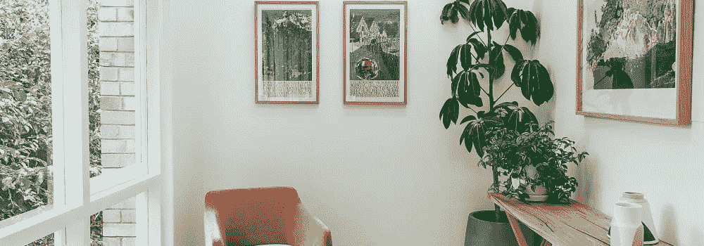

# 黑客入侵

> 原文：<https://medium.com/coinmonks/house-hacking-a79f1a12589?source=collection_archive---------57----------------------->

# 什么是黑客入侵？

术语“房屋黑客”指的是购买一处房产并将其用作主要住所，同时将卧室、地下室或该房产的附加单元出租给其他人的策略。从本质上来说，房屋黑客是一种方式，让房主过上几乎免费的生活，或者用他们从租户那里收到的钱来支付部分抵押贷款。租户可能是短期或长期租户。

有许多不同的方式来进行黑客攻击。房主出租房屋的一种方式是购买一栋独栋房屋，住在里面，然后出租多余的卧室或房屋的地下室。房主出租房屋的另一种方式是购买多户租赁房产，住在其中一个单元，然后将其他单元出租给付费租户。

获得的租金将有助于支付房产的每月抵押贷款和任何额外的房屋费用。此外，看看 house hacking 为投资者提供的其他一些关键好处。

*   房子黑客是伟大的从租金中获得增加的现金流，可以用来支付抵押贷款的财产或投资于其他财产。
*   House hacking 是一个获得房东经验的绝佳机会，同时学习租户筛选、租户管理、租赁合同、处理意外的住房问题和维修、谈判等。
*   房子黑客是有用的建立一份简历，强调成功管理出租物业的能力，使获得未来出租物业的额外融资更容易。
*   房子黑客服务作为一个伟大的起点，新的房地产投资者寻求建立自己的财富，知识和房地产投资组合。

# 房屋黑客案例研究

下面的例子是对黑客行为的案例研究。

*   场景 1:投资者购买了一套独栋出租房产。投资者决定住在家里，同时出租地下室。然后，投资者用该房产的租金来支付该房产的每月抵押贷款。
*   场景 2:一个投资者买了一套复式公寓。投资者住在复式公寓的一边，然后将另一边出租给一个家庭。然后，投资者用该房产的租金来支付每月的抵押贷款和公用事业费用。

# 底线

当谈到房屋黑客时，底线是这种策略围绕出租主要住宅的一部分，目的是产生收入，以抵消房产抵押贷款和额外费用的成本。当房子黑客被正确执行时，它允许投资者几乎免费地住在他们的家里，尽管不一定没有麻烦。

> 交易新手？试试[加密交易机器人](/coinmonks/crypto-trading-bot-c2ffce8acb2a)或者[复制交易](/coinmonks/top-10-crypto-copy-trading-platforms-for-beginners-d0c37c7d698c)