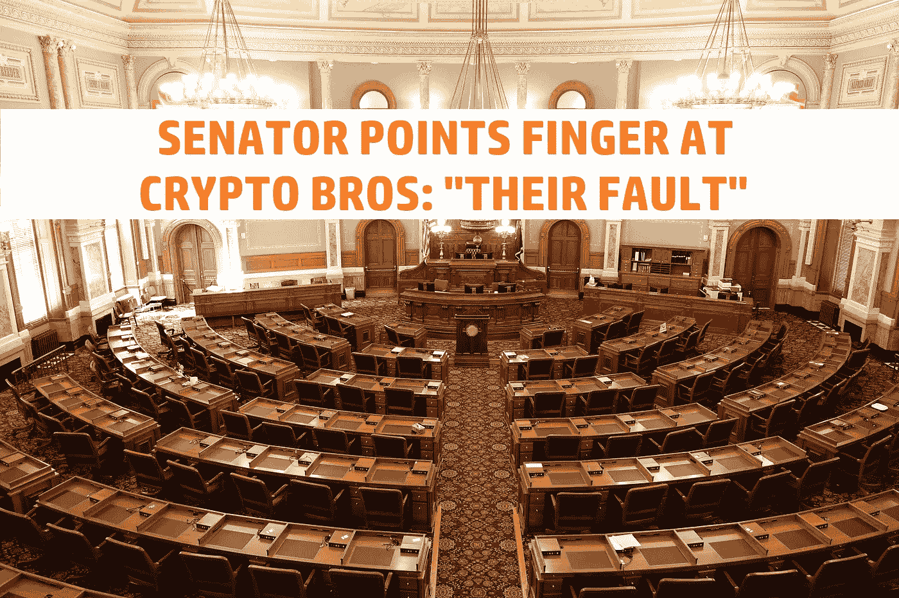
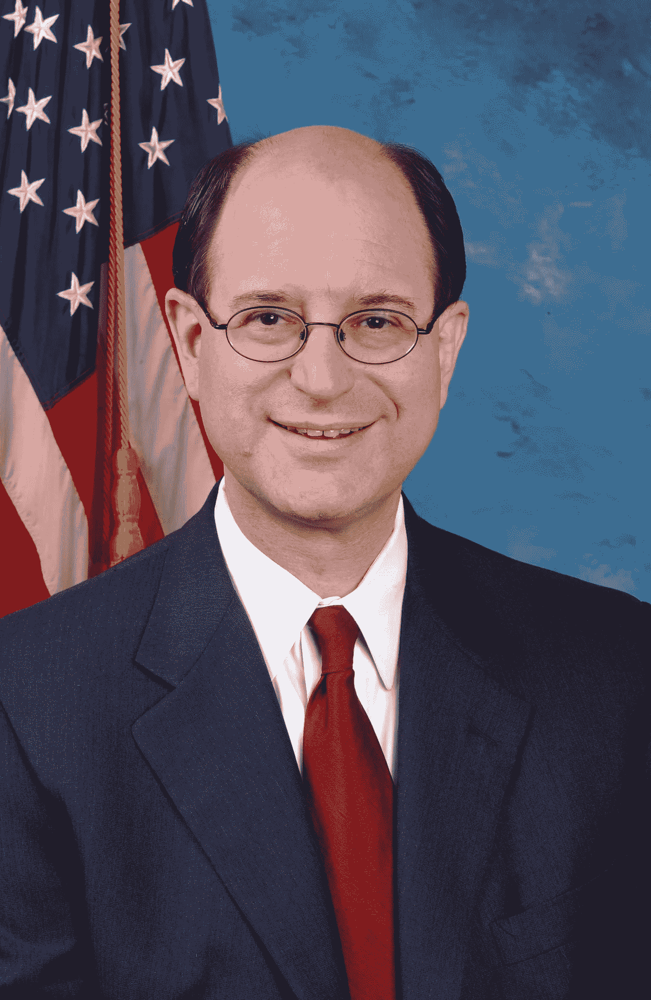

# 众议院议员指责加密亿万富翁拖延加密立法

> 原文：<https://medium.com/coinmonks/house-of-representatives-member-blames-crypto-billionaires-for-delaying-crypto-legislation-642cc020b4eb?source=collection_archive---------25----------------------->

一名众议院议员指责“亿万富翁加密兄弟”阻碍和拖延加密立法。你可能会问，他们是怎么做到的？一个很好的问题，是通过向…参议员和众议员支付数百万的游说资金。

# 锅笑壶黑

我不能容忍那些被选举出来治理国家的人，他们抱怨人们在使用他们所属的系统。对我来说，这听起来像是布拉德·谢尔曼试图通过追随 FTX 崩盘的潮流来获得一些印象分。指着他的手指说“坏密码，坏密码”。

但他这样做的唯一结果是让自己看起来像一个完全无能和不称职的政客。最糟糕的一种。我为什么这么说？让我们来看看。善良的布拉德·谢尔曼曾在公开声明中说过如下的话:

> 迄今为止，亿万富翁 crypto bros 通过向华盛顿注入数百万美元的竞选捐款和游说支出来阻止有意义的立法的努力是有效的。

对我来说，要么他完全不知道这种游说活动正在美国进行。或者他因为没有得到一份钱而生气。或者，他实际上对游说者基本上是在“贿赂”政客，让他们听命于自己感到不安。这是枪支、烟草、石油、制药或密码游说。那么，为什么挑出“亿万富翁加密兄弟”作为某种邪恶的演员呢？

布拉德·谢尔曼有一个反加密的立场，也就是严格的监管。所以这可能是一种可能性。或者他可能只是想讨好华盛顿的其他反加密政客。看起来，每个人都在寻找密码。不管是环保主义者，总统，还是任何介于两者之间的人。

*Rep.* House of Representatives Member *Brad Sherman*

不管怎样，我认为一个政治家抱怨一些人使用富人和公司已经使用了几十年的同样的系统是完全没有意义的。“加密兄弟”是否不够好或不够适合像石油公司那样游说政客？那时他在哪里？我要说的是布拉德·谢尔曼闭上你的臭嘴，好好做你的工作，而不是让你自己看起来比你希望的更蠢。如果你想指责某人，那就开始指责你在互联网上贪婪腐败的朋友吧。

我希望你能原谅我的粗话。和恶劣的情绪。当我遇到这样的人时，我觉得很沮丧。如果他不喜欢华盛顿的游说，他完全可以采取行动。这是他的工作职责。你对善良的布拉德·谢尔曼有什么看法，你同意他吗？请在下面的评论区发表意见。

如果你真的想关注我，或者阅读我的其他帖子，为什么不两者都做呢？

网络上见！

图片提供:[https://www.pexels.com/](https://www.pexels.com/)

资源

1.  [https://Sherman . house . gov/media-center/press-releases/国会议员布拉德-谢尔曼-关于 ftx 崩溃的声明](https://sherman.house.gov/media-center/press-releases/congressman-brad-sherman-statement-on-collapse-of-ftx)

> 交易新手？试试[密码交易机器人](/coinmonks/crypto-trading-bot-c2ffce8acb2a)或[复制交易](/coinmonks/top-10-crypto-copy-trading-platforms-for-beginners-d0c37c7d698c)