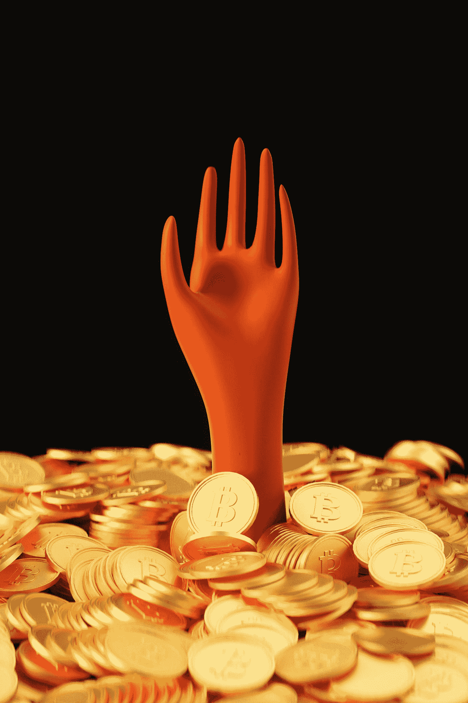

# 一个 320 亿美元的加密交易所如何破产——留下 80 亿美元的漏洞！

> 原文：<https://medium.com/coinmonks/how-a-32bn-crypto-exchange-ended-with-collapse-and-an-8bn-hole-93fa82294b24?source=collection_archive---------36----------------------->

Photo by [Jay Argame](https://unsplash.com/es/@jaygame?utm_source=medium&utm_medium=referral) on [Unsplash](https://unsplash.com?utm_source=medium&utm_medium=referral)

似乎 2022 年的熊市需要变得更糟，最大的加密交易所之一设法破产了。

从富有的风投和普通人身上抹去数十亿美元。

让我们看看 FTX 的爆炸。

SBF(甚至他名字的缩写都让他听起来像一个真正酷的科技兄弟)是如何愚弄投资者的？

首先，他毛茸茸的鬃毛、t 恤和运动鞋足以让投资者去——是的，他懂技术。

因为穿着笔挺西装的人(或者任何穿着得体的人)不可能懂技术，对吗？！

## 讽刺无处不在

自从 FTX 上个月破产以来，非常明显的是，权力集中在高层以及严重缺乏监督导致了巨大的客户损失。为什么？

顾客的钱(存款)被毫无责任地四处发放。这正是 crypto 的初衷。

FTX 的魅力在于它不仅仅是一个经纪人。

它还发行自己的货币，托管客户的资产，并且(非常方便地)与贸易公司 Alameda 挂钩。这种中央集权(少数人拥有很大的权力)是对所有事物的巨大矛盾。

## 80 亿美元是如何失踪的？

你可能会问，FTX 的资产负债表上怎么会出现 80 亿美元的窟窿，但我们应该问的问题是，这一点怎么没有被更早发现？！

答案是:我们热爱神奇的事物。

我们喜欢认为新的想法(技术、密码等)会立刻改变一切。

不管我们是否理解它。我们让自己被迷住了。

我们还有一个习惯，那就是忽略会对此产生怀疑的信息。

Photo by [愚木混株 cdd20](https://unsplash.com/@cdd20?utm_source=medium&utm_medium=referral) on [Unsplash](https://unsplash.com?utm_source=medium&utm_medium=referral)

## 如果它好得令人难以置信，它很可能就是真的！

这整个爆炸尖叫类似于 08 年发生的事情。在崩盘之前，一群自作聪明的家伙想出了一个东西:CDO。也称为债务抵押债券。

他们所做的是将债务捆绑在一起(比如抵押贷款)成为可以在二级市场交易的新事物。

> 最大的卖点？这些东西将是流动的——也更安全，因为你将分散风险。

你也知道故事的结局。大多数人都上当了。却发现 CDO 复杂得愚蠢，根本就没有流动性。最终，它不但没有降低风险，反而将风险放大了 100 倍。把整个金融系统拖下水。

FTX 的崩溃(直到 11 月份)曾成功营造出一种形象，即它是数字资产最安全的地方之一，这导致人们担心，其他人可能会因其在 FTX 的敞口而面临风险。

*瞧，信心被摧毁了。就这样。*

在我们的故事中，将加密热与 FOMO 和贪婪结合起来，你会看到投资者被愚弄的场景，因为他们认为 SBF 是下一个大事件。

能让他们净赚数十亿的东西。哈。他们错得多离谱。如果某件事听起来好得不像真的，那是因为它很可能就是真的。SBF 不是秘密英雄。他不会让任何人成为亿万富翁。

他是个彻头彻尾的骗子，最终诈骗了他们的客户。大多数都是勤劳的普通人。那种没有大把口袋可以赌掉几千块的人。

> 至于投资者——是时候做一些实际的尽职调查了！

## 很难与众不同

FTX 的客户包括交易加密货币的大型金融集团，如对冲基金。贝莱德(BlackRock)、老虎环球(Tiger Global)、Inside Partners(以及更多)等公司都是这位 SBF 诈骗犯的投资者和支持者。

问题是，当我们处于牛市顶峰时，很难看清(或想清楚)。你看到的都是那些浮动的$$$你可能最终会相信谎言。(阅读[此处](https://kneadyourdough.uk/2022/12/02/%F0%9F%93%B8it-feels-strangely-like-2000-or-does-it-heres-why-it-can-be-dangerous-to-ignore-history-or-think-the-present-is-just-like-the-past/)如果这是互联网泡沫破裂第二部分？).

Photo by [Andriyko Podilnyk](https://unsplash.com/@andriyko?utm_source=medium&utm_medium=referral) on [Unsplash](https://unsplash.com?utm_source=medium&utm_medium=referral)

> 如果你认为这很难，那么当你周围的每个人似乎都在做相反的事情时，与大众背道而驰而不支持某件事就难上十倍。

人类心理是一种强大的东西。不要小看它。

一位投资科技初创企业的基金经理，我本来打算在 2020 年夏天和他一起实习，但多亏了 covid，这一切都没有发生。

不管怎样，他说他是如何遇到 SBF(呃，这是首字母缩写)并决定不投资他的。

他不喜欢自己位置的反复无常。SBF 从香港搬到新加坡，又搬到巴哈马。有些东西闻起来有鱼腥味。

但是很多人被他的“魅力”所迷惑。我打赌你在想一群白痴。那永远不会是我。然而，看看那些被他的谎言所欺骗的投资者——或者愿意相信他们的投资者吧！

> 如果某件事听起来好得难以置信，那是因为它很可能就是真的！

利率升至 2008 年以来的最高水平，暴露了金融体系的缺陷。他们也在冲洗垃圾。

> 让利率像口香糖一样顽固地粘在地上的问题意味着，废话会比它们应该存在的时间长得多。

在黑暗的一面，由于 SBF 和他的小丑表演，crypto 后退了无数步。多年的进步在一天之内化为乌有。监管会加强，收拾残局需要时间。

但是不要被那个傻瓜骗了。这项技术会一直存在下去。

或许是时候我们重新定义密码的真正含义了。

*免责声明:这不是投资或财务建议。这只是我的意见。这不是买卖任何证券或采取任何此类投资策略的个人建议。在你承诺任何投资之前，一定要做好自己的研究* **。**

> *交易新手？试试* [*密码交易机器人*](/coinmonks/crypto-trading-bot-c2ffce8acb2a) *或* [*复制交易*](/coinmonks/top-10-crypto-copy-trading-platforms-for-beginners-d0c37c7d698c)
> 
> *分散密码持有量，了解* [*币安替代品*](https://coincodecap.com/binance-alternatives)
> 
> *加入 Coinmonks* [*电报频道*](https://t.me/coincodecap) *和* [*Youtube 频道*](https://www.youtube.com/c/coinmonks/videos) *获取每日* [*加密新闻*](http://coincodecap.com/)

# 另外，阅读

*   [复制交易](/coinmonks/top-10-crypto-copy-trading-platforms-for-beginners-d0c37c7d698c) | [加密税务软件](/coinmonks/crypto-tax-software-ed4b4810e338)
*   [网格交易](https://coincodecap.com/grid-trading) | [加密硬件钱包](/coinmonks/the-best-cryptocurrency-hardware-wallets-of-2020-e28b1c124069)
*   [密码电报信号](/coinmonks/top-3-telegram-channels-for-crypto-traders-in-2021-8385f4411ff4) | [密码交易机器人](/coinmonks/crypto-trading-bot-c2ffce8acb2a)
*   [最佳加密交易所](/coinmonks/crypto-exchange-dd2f9d6f3769) | [印度最佳加密交易所](/coinmonks/bitcoin-exchange-in-india-7f1fe79715c9)
*   [面向开发者的最佳加密 API](/coinmonks/best-crypto-apis-for-developers-5efe3a597a9f)
*   最佳[密码借贷平台](/coinmonks/top-5-crypto-lending-platforms-in-2020-that-you-need-to-know-a1b675cec3fa)
*   [免费加密信号](/coinmonks/free-crypto-signals-48b25e61a8da) | [加密交易机器人](/coinmonks/crypto-trading-bot-c2ffce8acb2a)
*   杠杆代币的终极指南