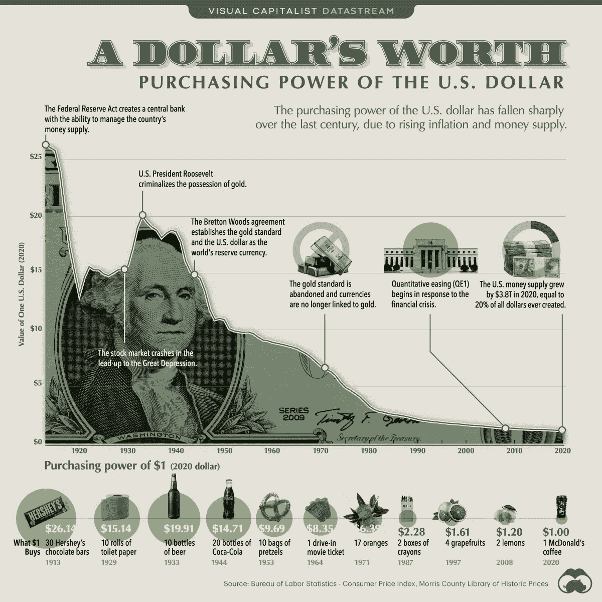

# 1932 年，一个奥地利小村庄如何解决“玩即赚”的游戏经济学

> 原文：<https://medium.com/coinmonks/how-a-tiny-austrian-village-solved-play-to-earn-gaming-economics-in-1932-5af0a166e409?source=collection_archive---------3----------------------->

这是 1932 年夏天。我们在奥地利的沃尔格，一个美丽的山谷村庄。在我们靠近德国边境的群山环绕的小村庄里，大约有 4200 人。

这是一个可爱的地方…但我们生活在可怕的时代。

我们在大萧条的中心，宝贝。没人有工作。没人有钱。我们太饿了，晚餐要吃一只该死的山羊。

我们完蛋了。

但是我们勇敢的新市长有一个疯狂的想法:他要发明区块链技术！开玩笑的。(虽然，那会有多恶心？)

不，你看，迈克尔·安特古根伯格才当了一年的沃尔格市长，但是他已经想尝试一个实验了:

他想让我们创造自己的货币，使用他在一个早已被遗忘的德国商人的文件中发现的框架。他认为这是我们度过经济萧条的唯一方法。

这很冒险，而且他不知道这是否可行。但是他必须尝试一些东西，否则我们的小村庄可能无法生存。

Unterguggenberger 市长将于 1932 年 7 月 31 日实施新货币。在接下来的 13 个月里——在世界各地的城镇纷纷崩溃、物价飞涨、公共工程项目停滞不前的时候——沃尔格将会蓬勃发展。

*   我们将建造一个新的城镇排水系统
*   我们会修复我们的街道
*   我们将用灯来更新我们的铁路
*   我们最终会修好镇上的磨坊
*   我们要建一个该死的滑雪跳台，如果你相信的话
*   商品价格将会稳定

实验获得了巨大的成功。直到奥地利政府介入并于 1933 年 9 月将其关闭。

Mayor Michael Unterguggenberger. Doesn’t he look like the kind of guy who would rip a nasty fart then blame it on you??

这种新货币到底是如何拯救这座城市的？

我们如何利用它的机制来拯救游戏？

# **P2E 博彩业一团糟**

从玩到赚的游戏被打破了。目前为止。

什么是玩即赚(P2E)游戏？

理论上，这是一种基于区块链的游戏形式，你可以通过玩游戏获得一种加密货币。

它是这样工作的:

你买了一个 NFT 的角色。你玩一个游戏。你将获得游戏的加密货币奖励。你为菲亚特卖密码。你从此过着幸福的生活。

听起来好得难以置信？确实是。

以下是 P2E 游戏在当前迭代中的问题:

## **1。游戏设计**

当你想到现代电子游戏时，你会想到像 Skyrim 或 Red Dead Redemption 这样的开放世界。画面如此逼真，故事如此引人入胜，以至于你对角色产生了深深的情感依恋。我是说，去 YouTube 上看游戏视频。当 Arthur 在 RDR2 结尾死去时，人们哭了。

在 P2E 奥运会上就没有这样的运气了。P2E 游戏中的角色是 8 位披萨厨师、卡通青蛙或傻傻的螃蟹。除了“哦，这真可爱”之外，这些角色很少引起任何情感反应这让我想到了下一点…

The left side is Red Dead Redemption 2, a popular console game. The right is Axie Infinity, a popular P2E game.

设计是草率的，因为大多数开发者不关心制作高质量的游戏。他们只关心赚钱。

玩家不要求更好的图形，因为他们也不关心游戏设计。他们只关心赚钱。

没有人会承认这一点。但这是真的。

## **2。S2E 不是 P2E**

玩赢游戏甚至还不存在。“游戏”是更简单的赌注赚取(S2E)游戏。经济学是这样运作的:

*   你买了一辆 NFT
*   你把 NFT 押在游戏上了
*   你赢得游戏的原生代币来交换赌注
*   有一个游戏中的奖励来燃烧或赌注的令牌，但除此之外，你在公开市场上出售菲亚特的令牌
*   硬币慢慢地(或不太慢地)变为零，因为每个人都被激励去卖，而没有人被激励去买硬币

没有人喜欢“玩”这些“游戏”充其量，你只是为了获得加密奖励，一次又一次地在 NFT 上下赌注。

它们大多是庞氏骗局:早早进入(购买造币厂)，等待游戏开始(通常是在发布后一周[)，然后离开。作为一名 P2E 游戏玩家，这就是你赚钱的方式。](https://thegreglarson.medium.com/the-1-week-pump-theory-and-how-to-use-it-to-make-money-in-crypto-a743b54b00f4)

开始明白了吗？

## **3。令牌组学**

没有一个游戏已经找到了可持续的游戏赚钱的经济学。很多人认为他们有。但他们的“经济”结构只不过是一个聪明的燃烧机制:开发团队以某种方式激励玩家花费他们的游戏内硬币，由开发人员燃烧。他们这样做是为了减少供应，制造通货紧缩。

然而，燃烧机制≠通缩的象征性经济学。

甚至不要让我开始在游戏中使用无限的硬币作为他们的游戏货币。

关键是，每个项目都认为自己是第一个想出先玩后赚象征经济学的人。剧透:他们没有。

甚至像 Axe Infinity 和 Crabada 这样成功的游戏也在低迷的市场中苦苦挣扎。为什么？因为没有玩家(或投资者)有任何动机购买游戏中的加密货币。

The all-time chart for $CRA, the in-game coin for Crabada, a popular P2E game on the Avalanche blockchain.

如果我玩游戏是为了赚钱，我会把我的加密奖励卖给菲亚特。这对任何货币来说都是巨大的抛售压力。

但是购买压力在哪里呢？它不存在。

世界上所有的烧钱机制都不能解释购买压力的缺乏。

我有一个问题要问 P2E 开发者:

“任何人购买你的游戏内加密货币的动机是什么？”

如果答案是“我不知道”，那么硬币将总是(**总是)**趋向于零。

## **4。P2E 游戏一点都不好玩**

这就是一切归结为:

唯一有效的购买激励是一个有趣的游戏。

没有一款 P2E 游戏如此有趣，以至于人们愿意免费玩。而且肯定没有足够有趣的东西让你花钱去玩，就像玩家购买《红色死亡救赎》或《侠盗猎车手》这样的主机游戏一样。

*这就是*P2E 博彩业崩溃的原因(现在还不存在)。

所以何必呢？为什么不称之为洗一洗，继续我们的生活呢？

因为 P2E 游戏有如此多的潜力。这项技术的存在是为了创造令人上瘾的有趣的电子游戏。要是我们能把记号经济学搞对就好了。

这就把我们带回了奥地利的沃尔格。

# **弗赖格德的教训**

沃尔格勒货币被称为自由货币。这大概就是免费的钱。不是免费的，比如“你可以免费得到它”但是“自由”就像自由一样——就像空气是自由的一样。尽管自由货币给人一种自由的感觉，但它仍然是奥地利先令的补充货币。

弗赖格尔德有 4 个主要的成功机制。让我们看看这些机制，看看我们如何利用它们来修复 P2E 经济学。

## **1。有效印花税**

我一直以为印花税只是指 1765 年的印花税法案，该法案(部分)导致了美国革命。我原以为这些人只是在征收印花税。

结果，从经济学角度来看，这是完全不同的东西。

以自由税为例，印花税是每个自由税持有者每月必须支付的 1%的税。这是用货币上的邮票表示的。

One Schilling’s worth of Freigeld, with the stamps on the right side to denote paid taxes.

这创造了花钱的动机，因为害怕由于印花税而失去你的消费能力。这种支出压力刺激个人和企业购买商品，并支付他们的税款。

但是，既然先令没有 1%的印花税，为什么不把弗赖格德换成先令呢？

他们有一个聪明的机制来解释这一点…

## **2。禁止兑换附加费**

将法郎兑换成先令要加收 2%的附加费。这激励人们继续使用弗赖格尔德，而不是立即兑换先令(就像 P2E 玩家立即将游戏中的密码兑换成菲亚特一样)。

有了这两种机制，支撑弗赖格尔德就有了双重压力:

*每月 1%的印花税造成了支出压力。

* 2%的外汇附加费造成了继续使用 Fregeld 的压力。

但这留下了一个问题，为什么要把弗赖格尔德放在首位。

我们如何给经济注入一种比当前货币限制更多的货币？

## **3。巧妙的市场进入**

Unterguggenberger 市长通过向市政工人支付 50%的 Freigeld 工资，将 Freigeld 注入市场。他们最终将这一比例提高到了 75%。

这使得货币可以自然地流入市场，而不用强迫私营公司支付他们在弗赖格尔德的员工。

## **4。宝贵的后盾**

现在，我们需要明确一些事情:

弗赖格德之所以有效，只是因为它是一种可以兑换成主要货币的次要货币。在这种情况下，先令。

为了让一种二级货币保值，它必须能够兑换成一种一级货币，一种一级货币可以兑换成一篮子商品。

换句话说，弗赖格尔德不可能独自工作。

这就引出了下一点…

## **5。精明投资的后盾**

沃尔格并不只是将自由税注入经济，并抱以最好的希望。

他们用奥地利先令支持它。

不同的估计，但该镇持有约 12，000 先令作为支持弗赖格尔德，并投入流通约 8，000 弗赖格尔德。

他们没有让这些先令腐烂，他们也没有用他们的支持进行危险的投资。不，他们做出了节俭的投资选择，将 12，000 先令存入一家国家银行，获得 6%的利率。

这个利率不会创造或破坏自由。但这一选择是精明的金融策略的一个完美例子，让自由税发挥了作用。

那么，我们该如何利用这种 20 世纪 30 年代鲜为人知的货币来拯救 P2E 博彩业呢？

# 去他妈的黄金标准——开始一个有趣的标准

我怀疑 20 世纪 30 年代的欧洲是一个有趣的地方。只是猜测。

他们的经济不是依靠娱乐来生存的。

从游戏到赚钱的经济确实如此。

因此，如果没有一个有趣的游戏，我建议的任何事情都不会起作用。没有象征性的结构，没有风险投资的资助，没有[的精通](/coinmonks/shitposting-101-a-web3-storytelling-masterclass-3c2d6e12609f)将补偿一个无聊的游戏。

美元过去常与金本位制挂钩。这意味着你可以随时将美元兑换成等值的金条，联邦政府必须兑现你的兑换。

理查德·尼克松在 1971 年终结了金本位制。

Definitely a top 40 president.

自那以后，美元一直是法定货币，仅仅是受到我们对其价值的看法的支撑。结果发生了什么？

通货膨胀。

Goddamn it, I would’ve bought so many pretzels in 1953.

从玩到赚游戏币没有金本位制。你不能把它们直接换成黄金。事实上，它们通常由美元支持，而美元也不能再兑换成黄金。因此，P2E 硬币是双面的，这就是为什么它们都为零。

因此，游戏开发者不应该把他们的硬币放在金本位上。他们应该在一个有趣的标准上。

> 唯一支撑 P2E 货币价值的是一个有趣的游戏。

# 比特币和有效的双币结构

使用 Freigeld 作为我们的灵感，让我们想象一个可能的令牌组学结构。我们将使用两枚硬币:

*   当地游戏中的硬币，相当于弗赖格尔德。
*   相当于先令的“金本位”硬币。

我将带我们浏览一个名为 Cloud Striker 的假想游戏的可能有效的令牌组学结构。它的游戏内币会是$SKY，金本位币会是比特币。

## 为什么是比特币？

目前的情况是，在 2022 年夏天，比特币是唯一通过与先令相同的“一篮子商品”测试的密码。我不能在杂货店使用比特币，所以它不能完全兑换，但有许多私人农场和牧场主接受比特币作为直接支付。

虽然比特币比稳定币更不稳定，但稳定币通不过“一篮子商品”测试:

比起用稳定的硬币换一篮子商品，我更容易用比特币换一篮子商品。

(不过，像 Data Mynt T1 这样的公司可能会很快改变这种情况。)

## 建立国家支持

为了启动我们的游戏经济，我们首先需要储备一些金本位货币来支持我们的$天空硬币。

我们会像大多数项目那样做:在 NFT 销售。

但是大多数项目都把这部分搞砸了。以下是许多 P2E 项目误导 NFT 销售的地方:

**1。他们将 NFT 的销售(和 ICO)作为主要的资金来源**。这导致了巨大的时间问题。大多数 P2E 开发者出售他们的 NFT，从他们的用户那里获得金钱，然后意识到“天哪，我们咬的比我们能咀嚼的还多，这将花费我们比预期更长的时间。”参见:[星图](https://www.youtube.com/watch?v=PWT8MkXZUJk)。

**2。他们卖了太多的 NFT**。各种各样的 NFT 项目都选择出售 10，000 只 NFT，因为这是这个领域最成功的项目 Bored Ape Yacht Club 所做的，并且对他们有效。卖太多 NFT 只是抢钱。

**3。他们出售不同级别的 NFT。大多数开发者试图通过在游戏发布前销售不同等级的 NFT*来制造虚假的稀缺。他们甚至没有意识到这会毁掉他们的游戏性，从而毁掉他们的游戏经济。***

比如说，你可以用 400 美元买一艘 5 级飞船，但你可以用 800 美元买一艘 10 级飞船。这是个大问题。

为什么？

因为钱多的人可以买更贵更强大的船。这就把游戏变成了付费游戏，而不是为了赚钱而玩。(帝国帝国将会遇到这个问题。)我不认为大多数开发者会这样考虑他们的 NFT 销售，因为他们只是想通过销售不同等级的 NFT 角色来赚钱。

为什么？

因为 P2E 的游戏开发者如此渴望资金，以至于他们让资金蒙蔽了他们的选择。因此，我们需要足够的风险投资资金，在 NFT 发售之前创作游戏。这使得 NFT 拍卖会从一场筹款活动变成了一场买入活动，这是理所应当的。

我们离这成为现实还有很长的路要走，但是在 NFT 发售之前创作游戏是 P2E 游戏唯一可行的方法之一。

对于云射手来说，NFT 的角色只能通过游戏性和游戏经济中的其他行为来升级。

想象一下，你可以创造不同类型的人物，他们有不同的优点和缺点:

智力高但战斗能力低的僧侣。

智力低但战斗能力高的战士。

拥有魔法力量但行动缓慢的巫师。

高强度，低机动性的矮人

诸如此类。

不同的职业有不同的能力，但总的来说他们都有相似的能力等级。

因此，以下是我们 NFT 角色的一些规则:

*   如果你有一个 NFT 角色，你只能玩云射手。
*   你只能用我们的黄金标准货币比特币创造一个角色。
*   当然，你可以在二级市场上买卖你的 NFT 角色，但是我们会加一笔高得吓人的创作费:10%。这不是为了攫取现金——这是为了激励使用我们的内部市场，在那里你必须使用比特币(BTC)进行交易，我们只收取 1%的费用。
*   我们将把最初的 NFT 造币厂的字数限制在 6000 字。也就是说一开始最多只有 6000 人可以玩云射手。如果我们只有这些球员，那就这样吧。然而，我们也有一个机制，允许更多的玩家进入游戏，但只与需求相称(稍后会有更多的介绍)。
*   就像沃尔格勒为了 6%的回报而存入先令一样，我们在 NFT 出售的比特币收益将被保存在一个加密交易所的收益账户中。

# 我们对抗庞氏经济学的高风险解决方案

现在，我们没有像沃尔格勒对弗赖格尔德那样向我们的经济注入美元的类似手段:他们用新货币补偿市政雇员。

我们将尝试类似的东西，但风险更大:

> 每位玩家开始时将获得相当于他们在 BTC 为 NFT 角色支付的金额的 SKY coin。

这将做几件事:

*   它为＄SKY 创造了一个最初的人工提升，因为玩家基本上是用他们的 BTC 来交换＄SKY 硬币(+一个 NFT)。
*   它消除了任何庞兹经济学，因为玩家的投资会立即返还给他们。
*   它把$天空硬币推进了游戏内经济。

现在，我们无法预测$SKY 的价格会对这些选择做出怎样的反应。

随着时间的推移，每个新玩家获得的$SKY 的数量会有所波动。但该金额将始终与他们最初投资的 BTC 金额相匹配。

# 没有 SKY 团队补偿

我们将做出另一个不同寻常的选择:

> $SKY 只会用于游戏内奖励和其他游戏内经济需求，不会用于团队补偿。

大多数项目将+50%的资金分配给团队薪酬、市场营销和其他无意义的事情。

This is the token allocation for a P2E game called PIZZA. Fully 25% of the coins went straight into the dev team’s pockets, with another 31% going to operations — aka salaries?

这给团队创造了一个不利的激励，他们先扔硬币，然后再扔，从而破坏了游戏中的经济。

去他妈的。所有 Cloud Striker 运营必须是:

*   风险投资基金，或
*   玩家 BTC 资助

这激励团队发展项目和游戏经济，而不是抛弃它。

# 硬币分配

在我们开始讨论印花税和转换附加费之前，让我们先来看看一些假设的数学来说明我们目前的情况。

只有 6，000，000 美元的天空硬币将永远存在。

它是这样分配的:

*   2，000，000 美元的天价奖金属于最初创建 NFTs 的 6，000 名玩家
*   2，000，000 美元的天空是留给未来的球员(一分钟后会有更多)
*   2，000，000 美元的天空是为游戏内奖励/经济预留的

同样，我们最初有 6000 个可玩的 NFT 角色。

假设比特币在铸币的时候是 50000 美元。

我们向每个可玩的 NFT 角色收取 0.001 BTC 铸造费，相当于 50 美元的菲亚特。这大致相当于一款主机游戏的成本。

以每 NFT 0.001 BTC 的价格卖出 6000 只相当于 300，000 美元，我们将这笔钱加入我们的金本位支持体系(相当于我们的先令)。从理论上讲，BTC 是为了匹配 2000000 美元的天空预留给我们的第一批 6000 名球员谁铸币 NFT。

然后，我们的团队将为剩余的 4，000，000 美元 SKY 提供相应的投资，在 BTC 为我们的金库增加 600，000 美元。

**这使我们在 BTC 的资金总额达到了 90 万美元。**

*(还是那句话，这种东西只适用于初始风险投资。)*

我们在 BTC 的 900，000 美元也是我们为 SKY coin 设定的初始价格:

如果我们给我们的玩家分配 200 万美元天空，有 6000 个初始玩家，总共 600 万美元天空，这意味着:

**$天空起价 0.15 美元。**

**每个玩家从 333.33 美元的天空开始**

这就是我们的处境:

*   售出 6000 辆 NFT
*   玩家手中的 200 万美元天空
*   200 万美元的天空等待分配游戏中的奖励
*   200 万美元的天空等待着未来的玩家
*   在 BTC，玩家以约 5%的利息赚取 30 万美元
*   团队投资在 BTC 获得 600，000 美元，同样获得约 5%的利息

# 新玩家+价格波动

没有游戏或经济存在于真空中。比特币价格会变。$天空价格将会改变。玩家会想要离开。玩家会想要加入。奥地利政府可能想让我们关门大吉。

我们如何处理这些波动？

*   如果玩家想出售他们的 NFT 角色，并因此离开游戏，他们当然可以在二级市场上出售(可能是 OpenSea，因为我们的 NFT 在以太坊上)。但是我们会加 10%的费用。再说一次，这不是抢现金。这是为了抑制二级市场的使用，并鼓励使用我们的内部市场。所有内部市场交易都在 BTC 完成，我们收取 2%的版税，所得收入将加入我们的 90 万美元有息 BTC。
*   由于这样或那样的原因，$SKY 的价格会在某个时候下跌，即使只是暂时的。比如说 0.007 美元。这对我们的新玩家$SKY 分配有什么影响？

我们仍然有 200 万美元的天空预留分配给新玩家进入。

有可能游戏很烂。这可能会导致前 6000 名玩家在市场上出售他们的 NFT，而没有人愿意玩。因此，没有动力进行第二轮造币。很公平。我们将关闭商店，继续前进。

但是假设有更多的玩家想要加入。经过一段时间后，我们会在最初的 6000 英镑后进行二次造币。这个造币厂将是 100%基于需求的，并且只会根据想要加入的新玩家的数量而发生。

二次造币是如何运作的？

嗯，如果$SKY 是 0.007 美元，我们在 BTC 铸造新角色收取相当于 50 美元的费用，这意味着每个铸造新 NFT 的玩家将被分配:

**7142 美元天空开始游戏。**

这意味着，只要$SKY 价格低(表明需求较低)，只有 280 名新玩家可以进入游戏。我们怎么知道？2，000，000 美元的天空是留给新玩家的。如果一开始每个人得到 7142 美元的补偿，那就只有 280 美元了。

这是一个低数量的新球员，以配合较低的需求。它完美地工作。

*但是如果更多的玩家想要加入呢？如果$SKY 价格上涨怎么办？*

可玩角色 NFT 的数量将满足这一需求。

怎么会？

假设$SKY 涨到了$0.50，我们在 BTC 对新玩家铸造一个可玩角色收取相当于$50 的费用。

这意味着每个玩家从 100 美元开始。

有了 200 万美元的天空预留给新玩家分配，这意味着我们可以容纳 20，000 名新玩家。

更高的$SKY 价格隐含着对玩家更高的要求，自然给玩家创造了更大的空间。

Degens entering the battlefield like —

在我们讨论游戏中的效用之前，怎样才能让玩家们不立即放弃这笔$SKY 分配给菲亚特的钱呢？

# 转换附加费

弗赖格尔德简单而高明的一面是，如果人们想把它兑换成先令，要收取 2%的附加费。

同样，我们将向玩家收取 5%的费用来将他们的$SKY 兑换给 BTC。而不是作为获取更多收入的手段。但是，类似于我们将在二级 NFT 市场收取的高额版税，这反而成为说服人们不要用$SKY 换回他们的 BTC 的抑制因素。

现在，因为游戏中的硬币将是一个可替换的令牌，我们无法控制人们在游戏之外用它做什么——如果他们去 DEX 用它交换以太，将不会有 5%的交换费。

然而，为了玩这个游戏，玩家需要下注他们的$SKY。他们可以想玩多久就玩多久，想赚多少就赚多少，但是如果他们想把他们的$SKY 拿到公开市场上，他们必须直接从 Cloud Striker 上拆下来。当他们这么做的时候，他们不会直接得到＄SKY——我们会给他们相当于 BTC 的金额，减去 5%的汇率。

虽然我们对那些想在游戏开始前卖掉他们的$SKY 的玩家无能为力，但是这项附加费至少会阻止现在的玩家用他们的$SKY 去交换 BTC。

但是如果他们做出了那个选择，我们将把那个玩家的$SKY 硬币放回我们新的玩家分配中。

# 没有烧伤机制

现在，这里是大多数 GameFi 项目引入烧录机制的地方。

他们会说，“每次有人用他们的美元天空从我们的国库换 BTC，我们就烧掉他们的美元天空。”

他们称之为“通货紧缩的象征经济学”，这是胡说八道。我们在 Cloud Striker 不烧任何东西。

> 烧掉你的硬币是一种极度不安全的行为。

**如果你的硬币真的是一个有用的工具，为什么你会希望世界上的硬币越来越少呢？**

燃烧表明你不相信你最初的分配，你肯定也不相信它的效用。

所以我们什么也不烧。

# 我们的印花税

自由税的主要天才在于印花税:

自由税持有者每月必须缴纳 1%的税。

因为我们不能因为$SKY 存在于区块链上而强行对其征税，所以游戏的机制将是这样的，玩家必须每月向游戏经济支付他们持有的$SKY 的 1%,以便继续玩下去。

这些“收益”将被添加到分配给游戏内奖励的$SKY 池中。

类似于弗赖格尔德，这将刺激玩家花费他们的$天空，而不是囤积它，从而促进游戏内的经济。

这就把我们带到了 SKY utility。

# 游戏中的$天空工具

想象一下像《红色死亡救赎 2》或者《侠盗猎车手》这样的开放世界游戏。

有一个故事情节，和一个大的，美丽的开放世界，有大量的细节。

细节让游戏变得有趣。关于 RDR2 中的细节，有完整的 YouTube 编译。

*   如果你在镇上杀了一个人，然后再出现，他们会为死者举行葬礼。
*   如果你射杀一只动物，你可以追踪它们的血液。
*   如果你留下一只死去的动物，你可以看到它们的尸体随着时间的推移而腐烂。

相比之下，目前的区块链游戏如[分散游戏](https://decentraland.org/)。

分散土地是一个开放的元宇宙，你可以在那里购买虚拟土地，创建一个商店来出售数字资产(NFTs 和其他)，并在虚拟现实中与朋友互动。

A bunch of nerds shopping in the Decentraland metaverse.

与 RDR2 这样的主机游戏相比，它没有故事情节，没有相同级别的图形细节，也没有那么有趣。

但分散王国拥有的是一个游戏内经济，由$MANA 硬币驱动，以及建立自己的虚拟商店的能力。

现在想象一下两者的结合:

> 想象一下开放世界主机 RPG 的电影故事情节，结合像《分散之地》这样的元宇宙的游戏内经济。

## 游戏模式

云射手将有两种游戏模式:

*   你有战役模式，在这种模式下你可以像玩游戏机一样玩故事情节。在这种游戏模式下，你通过完成任务和完成其他游戏内任务来赚取$SKY。
*   然后在游戏中有不同的入口，在那里你可以传送到与区块链相连的元宇宙，类似于分散之地。在这里，您可以进入其他玩家创建的商店，或者自己建造商店，在那里您可以买卖在战役模式中可以使用的配件，所有这些都使用$SKY 作为货币。

元宇宙地区的所有交易都要缴纳 3%的税，这是对我们游戏内奖励$SKY pool 的补充。

# 谁知道什么会起作用

一些历史学家认为，当奥地利政府于 1933 年 9 月介入时，弗赖格尔德的时代即将结束。

我们不知道如果他们坚持到底会发生什么。

我不知道我设计的框架是否适用于“玩即赚”游戏。但至少是不同的东西。至少我知道我不知道。

tanks Web3 的大部分内容都是傲慢。我们开发出新东西的傲慢。我们已经想通了一切的傲慢。傲慢地认为这一定会成功。我们可以预测人类行为的傲慢。

我们不能。我们不知道。我在这里展示的愿景可能会彻底失败。

我没意见。

只要我们不断尝试新事物，就没有人知道 GameFi 会变成什么样。可悲的是，在 Web3 的世界里，我们被视为一群骗子。在游戏世界里，我们被视为没人要求的不必要的功能。在现实世界中，没有人知道我们的存在。

他们会认识我们的。他们会的。但前提是我们承认我们他妈的不知道自己在做什么，但我们还是继续努力。

***

如果你想和我一起工作，我为 Web3 项目写内容、文章、游戏知识等等。在 greg@greg-larson.com 给我发电子邮件，在推特上关注我。

> 交易新手？试试[密码交易机器人](/coinmonks/crypto-trading-bot-c2ffce8acb2a)或[复制交易](/coinmonks/top-10-crypto-copy-trading-platforms-for-beginners-d0c37c7d698c)