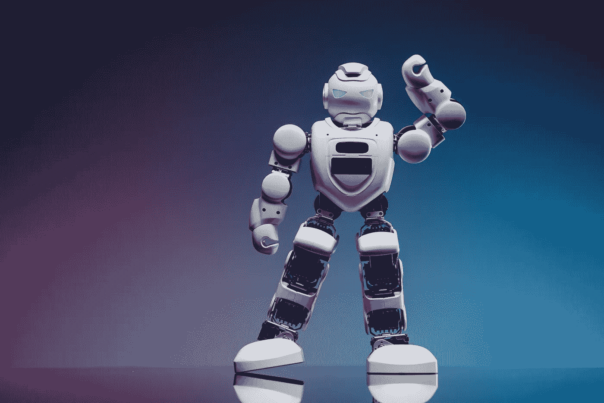

# AI 和区块链将如何很快统治世界！

> 原文：<https://medium.com/coinmonks/how-ai-and-blockchain-will-soon-dominate-the-world-ae91a5804c46?source=collection_archive---------18----------------------->

2023 年将是人工智能的一年，这可能会让一些人感到害怕，但对我们所有人来说也是一个很好的机会，不管你在哪个行业工作或打算进入哪个行业。在解释人工智能和区块链之间的关系之前，我想分享一些我最近看到的统计数据。

> 交易新手？在[最佳加密交易](/coinmonks/crypto-exchange-dd2f9d6f3769)上尝试[加密交易机器人](/coinmonks/crypto-trading-bot-c2ffce8acb2a)或[复制交易](/coinmonks/top-10-crypto-copy-trading-platforms-for-beginners-d0c37c7d698c)

1.根据埃森哲的一项调查，72%的商业领袖认为人工智能对他们的商业成功至关重要。

2.普华永道的一份报告发现，使用人工智能的企业收入平均增长了 38%。

3.根据麦肯锡的一项调查， **39%使用人工智能的公司在实施一年内就看到了投资回报**。

4.全国零售联盟的一项调查发现，70%的零售商计划在未来三年内使用人工智能为客户服务。

5.麻省理工学院斯隆管理评论和波士顿咨询集团的一项研究发现，使用人工智能的公司比竞争对手有 10-15%的成本优势。

6.德勤的一项调查发现，63%的公司认为人工智能将帮助他们创造新的产品和服务。

7.全球企业中心的一项研究发现，到 2030 年，人工智能有可能为全球经济增加 13 万亿美元。

8.美国全国制造商协会的一项调查发现，85%的制造商**计划在未来三年内使用 AI。**

9.世界经济论坛的一份报告发现，到 2022 年，人工智能有潜力创造 5800 万个新工作岗位。

10.德勤的一项调查发现，60%使用人工智能的公司的效率因此得到了提高。

## 人工智能与区块链的关系

人工智能(AI)和区块链技术是 21 世纪最具变革性的两项技术，它们有可能彻底改变广泛的行业和应用。虽然这些技术乍看起来似乎毫无关联，但它们实际上有着紧密的联系，并且可以在许多方面相互补充。

人工智能是计算机科学的一个领域，致力于开发无需明确的人类指令就能执行任务的智能系统。这包括识别模式、做出决策和从数据中学习等任务。人工智能正被用于各种应用，包括聊天机器人、图像和语音识别以及自动驾驶汽车。

另一方面，**区块链是一种分布式账本技术，允许安全透明地记录交易。**它最常与加密货币联系在一起，但它有潜力用于广泛的应用，包括供应链管理、投票系统和金融服务。

人工智能和区块链技术可以一起用于提高各种系统和流程的准确性、效率、安全性和透明度。

这里有几种方法可以将人工智能(AI)与区块链技术结合使用，以增强业务流程和运营。这里有几个例子:

1.  **供应链管理**:人工智能算法可用于优化供应链流程，如需求预测和库存管理，而区块链技术可用于创建交易和供应链事件的不可变记录。这种结合有助于提高效率，降低成本，增加供应链的透明度。
2.  **欺诈检测**:人工智能算法可用于分析交易模式，并检测可能表明欺诈活动的异常情况。区块链技术可以提供安全透明的交易记录，实现更准确的欺诈检测和预防。
3.  **客户服务:**人工智能聊天机器人可用于快速准确地回复客户查询，而区块链技术可用于安全地存储和管理客户数据。
4.  **预测性维护:**人工智能算法可以分析来自传感器和其他来源的数据，预测设备何时可能发生故障，从而提前安排维护。区块链技术可用于存储和管理用于预测性维护的数据，以及跟踪维护活动和时间表。
5.  **贸易融资:**人工智能算法可用于自动处理贸易融资文件，而区块链技术可用于创建安全透明的贸易交易记录。这有助于简化贸易融资流程，降低欺诈或错误风险。
6.  [**人工智能营销(AI Marketing):**](https://geekmarketing.org/blog-english/ai-marketing-tools/) 人工智能(AI)营销是指利用 AI 技术辅助完成营销任务和策略。这可以包括使用人工智能来分析客户数据和行为，优化营销活动，以及个性化营销工作。

## 区块链如何成为人工智能发展的控制机制？

如今，人们可以用人工智能创造出令人难以置信的东西，随着快节奏的发展，预计在未来几年内将呈指数级增长。毫无疑问，风险管理人员已经可以预见到一些会让我们陷入风险的主要风险。

与人工智能相关的主要风险之一是它被用于恶意目的的可能性。这可能包括开发自主武器系统，使用人工智能进行网络攻击，或操纵人工智能驱动的系统以获取个人利益。

例如，人工智能机器人可以用来传播虚假信息或操纵在线对话和选举。为了减轻这些风险，政府、企业和其他组织必须围绕人工智能的使用建立明确的指导方针和法规，并确保人工智能系统以道德和负责任的方式开发和部署。

这就是区块链可以用来控制人工智能发展所产生的风险的地方。

1.  **数据来源:**为了让人工智能算法有效，了解用于训练它们的数据的来源和来源是很重要的。区块链技术可以用于追踪数据的来源，并确保其值得信赖和可靠。
2.  **数据隐私:**AI 的使用往往需要收集和处理大量的个人数据，这引发了人们对隐私的担忧。区块链技术可以通过提供安全透明的数据管理系统来保护个人隐私。
3.  **数据互操作性:**为了让 AI 算法有效，它们通常需要访问来自多个来源的数据。区块链技术可以用来促进不同系统之间的数据交换，使 AI 算法能够访问更广泛的数据。

总之，人工智能(AI)和区块链技术是两种强大的技术，有潜力改变广泛的行业和应用。它们可以以多种方式结合使用，创建更加安全高效的环境，包括数据管理、身份验证、供应链管理和网络安全。

但是，需要注意的是，这些技术的集成也带来了许多挑战和问题。例如，人工智能和区块链技术的使用可能会引发对数据隐私和安全的担忧，确保这些技术以道德和负责任的方式使用非常重要。此外，这些技术的集成可能需要在基础设施和培训方面进行大量投资，组织可能需要一段时间才能充分认识到采用这些技术的好处。

总体而言，人工智能和区块链技术的结合有可能推动创新并创造新的机遇，但重要的是要在清楚了解潜在风险和挑战的情况下实现它们的集成。

> 加入 Coinmonks [电报频道](https://t.me/coincodecap)和 [Youtube 频道](https://www.youtube.com/c/coinmonks/videos)了解加密交易和投资

# 另外，阅读

*   最好的比特币[硬件钱包](/coinmonks/hardware-wallets-dfa1211730c6) | [BitBox02 回顾](/coinmonks/bitbox02-review-your-swiss-bitcoin-hardware-wallet-c36c88fff29)
*   [block fi vs Celsius](/coinmonks/blockfi-vs-celsius-vs-hodlnaut-8a1cc8c26630)|[Hodlnaut 审核](/coinmonks/hodlnaut-review-best-way-to-hodl-is-to-earn-interest-on-your-bitcoin-6658a8c19edf) | [KuCoin 审核](https://coincodecap.com/kucoin-review)
*   [Bitsgap 审查](/coinmonks/bitsgap-review-a-crypto-trading-bot-that-makes-easy-money-a5d88a336df2) | [Quadency 审查](/coinmonks/quadency-review-a-crypto-trading-automation-platform-3068eaa374e1) | [Bitbns 审查](/coinmonks/bitbns-review-38256a07e161)
*   [加密复制交易平台](/coinmonks/top-10-crypto-copy-trading-platforms-for-beginners-d0c37c7d698c) | [Coinmama 评论](/coinmonks/coinmama-review-ace5641bde6e)
*   [印度的加密交易所](/coinmonks/bitcoin-exchange-in-india-7f1fe79715c9) | [比特币储蓄账户](/coinmonks/bitcoin-savings-account-e65b13f92451)