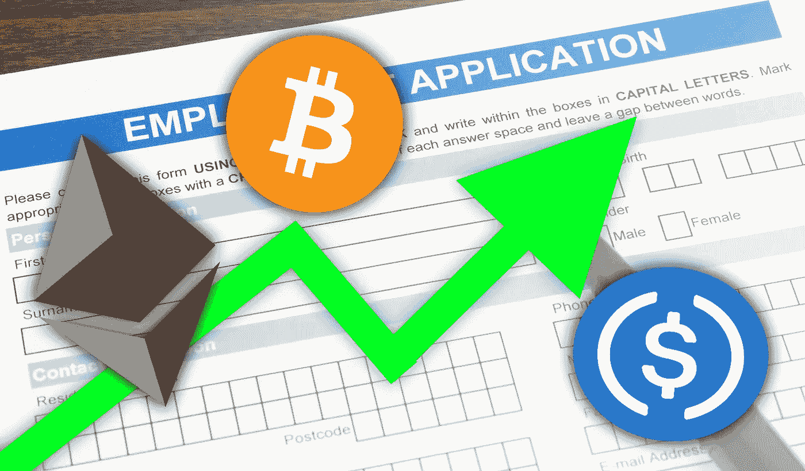
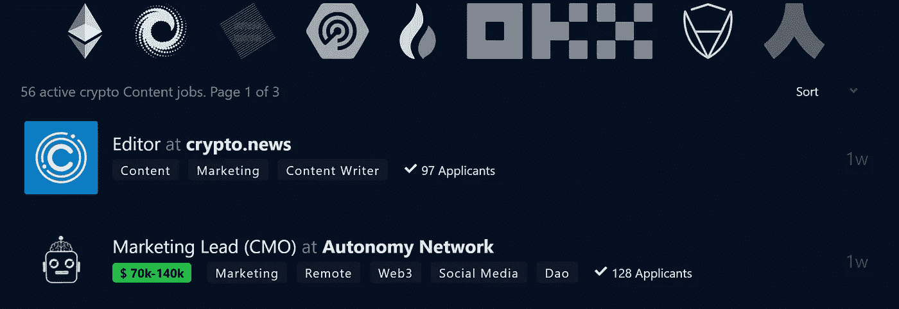
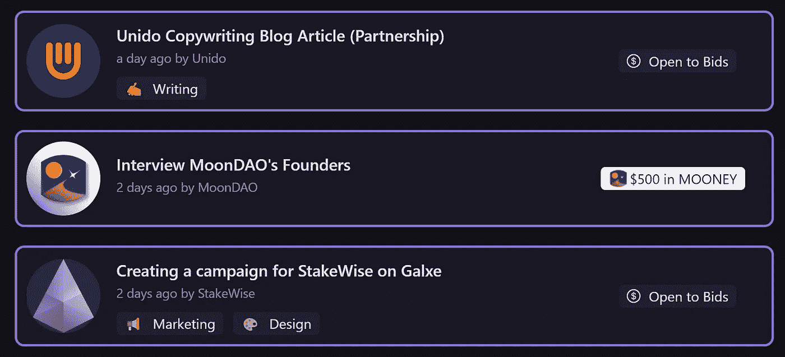
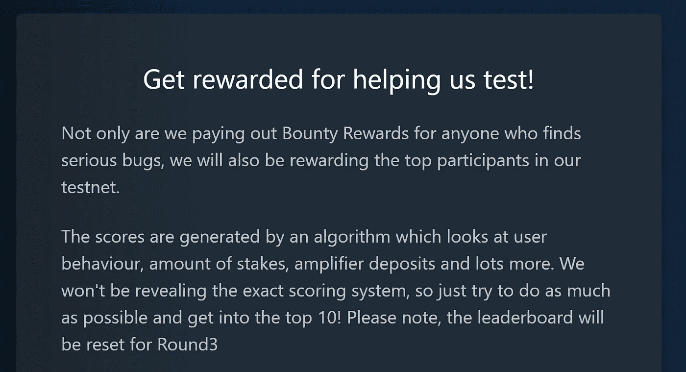

# 任何人都可以通过投资时间获得密码的 3 种方法！

> 原文：<https://medium.com/coinmonks/how-anyone-can-earn-crypto-by-investing-their-time-48c15fe4db22?source=collection_archive---------2----------------------->

## 以及如何不用投资就能谋生！

# 介绍

随着加密技术的大撤退和中央化组织的左右摇摆，我们可以说加密技术真的不在最佳位置。许多投资者(包括我在内)已经损失了他们投资组合的大部分价值，你看到的大多数人的热情也消失了，就像它从一开始就不存在一样。

尽管大多数加密资产的价值不值一提，但区块链的发展仍然蒸蒸日上！随着许多协议、初创公司、金融科技公司和组织在区块链上推出他们的应用，对于那些想在加密领域投入时间和精力并获得回报的人来说，有很多机会可以利用！

**让我们看看通过投资你的时间和技能，你可以开始赚取下一个密码的 3 种方法！**

# 加密中的作业

随着区块链带来的活动，它注定也会带来很多就业机会。加密初创公司、组织和 Dao 每天都在寻找希望为他们的愿景做出贡献的人，无论是人力资源、市场营销、开发还是设计，大多数建立在区块链上的组织都在快速扩张，并一直在寻找新的人才。

Cryptojobslist applications.

像 [Cryptojobslist](https://cryptojobslist.com/) 或 [Crypocurrencyjobs](https://cryptocurrencyjobs.co/) 这样的网站提供了各种不同组织和技能领域的大量职位空缺。他们的名单包括 solidity 程序员、法律实体负责人、unity 工程师和社交媒体经理。这些工作中的大多数都很偏远，这使得它成为世界上任何地方的任何人开始他们的秘密工作之旅的好地方！

# 道供稿

随着分散自治组织(Dao)在区块链生态系统中变得越来越突出，其社区必须完成的工作量也越来越大。价值数百万美元的 Dao 正在为去中心化、开源工作设立标准，你也能够为他们的回报愿景做出贡献！

Dework bounties available right now!

像 [Dework](https://app.dework.xyz/bounties) 和 [Layer3](https://beta.layer3.xyz/bounties) 这样的网站会发布用硬加密货币奖励你的演出和奖金！发一篇 Twitter 帖子，获得 10 美元。将文档翻译成你的母语，得到 0.01 ETH。修复前端的一个 bug，得到 100 MATIC。几乎每个人都有适合自己的东西，从简单的 Twitter 帖子到薪酬超过 1000 美元的 crypto 工作。你说出它的名字，你就能在某个地方找到它！

# 测试新的 Dapps

每个月都有大量的协议、dApps 和 DAOs 推出，它们在被推送到 mainnet 之前通常需要大量的测试。这些测试阶段通常是激励性的！通过投入您的时间和探索平台，并向团队报告错误和 UI 问题，您可以帮助他们改进您的应用程序，同时在他们发布时获得他们的本机令牌奖励！

最近一个使用这种策略的项目是 [MAXX.finance](https://maxx.finance/r/matthijs) ，一旦协议生效，就奖励他们的早期测试者一些 MAXX 令牌。这里的问题是，你通常并不真正知道你得到了多少，以及这些代币将来会值多少钱。这真的取决于协议有多慷慨，你帮了他们多少忙！

# 最后…

随着加密技术的下滑，你必须变得有创造力。我发现最有趣和最有回报的三个选择是在 crypto 中找一份工作，做 Web3 和 DAO 奖金，以及参加几个 dApps 的测试网。钱不多，但是很多人都离开了菲亚特(像我一样)，这是我进入 crypto 的一个很好的方式，为下一轮牛市做准备。LFG！🔥🔥

# 链接>

*   *想阅读 medium 上的每一篇文章，甚至是高级文章？使用我的链接在 medium 上注册，每月 5 美元！*medium.com/@Igor.MD/membership
*   为了让我的故事对每个人都免费，请给我买杯咖啡吧！[ko-fi.com/igormd](https://ko-fi.com/igormd)
*   如果你想开始交易，可以考虑用我推荐的库币！[www.kucoin.com/r/rf/1de5d](https://www.kucoin.com/r/rf/1de5d)
*   想成为页面上的特色吗？给我发邮件！

> 交易新手？尝试[加密交易机器人](/coinmonks/crypto-trading-bot-c2ffce8acb2a)或[复制交易](/coinmonks/top-10-crypto-copy-trading-platforms-for-beginners-d0c37c7d698c)