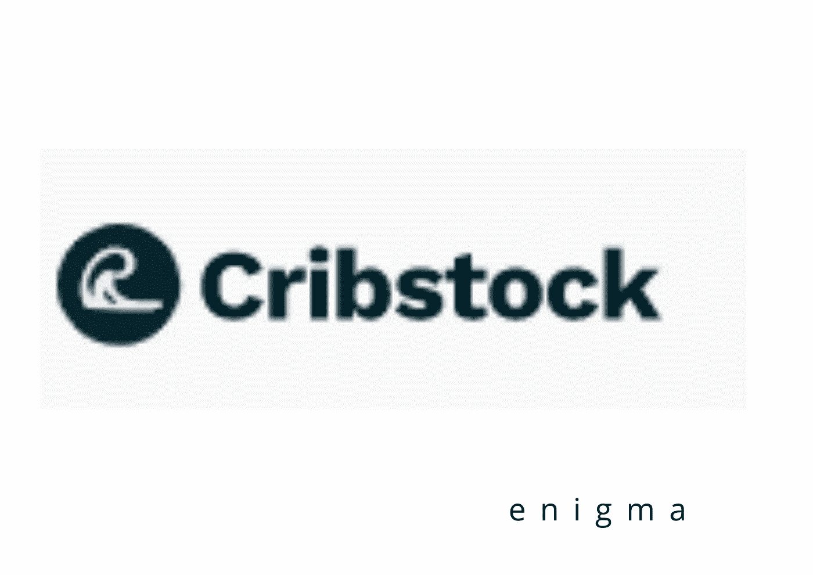

# 没有巨额资本，任何人如何投资房地产

> 原文：<https://medium.com/coinmonks/how-anyone-can-invest-invest-in-real-estate-without-heavy-capital-91329633720c?source=collection_archive---------12----------------------->

# **cristock！**

对任何人来说，建立可靠收入来源的最常见方式之一就是投资房地产。虽然尼日利亚的房地产投资提供了无数增加财富和金融安全的机会，但大多数人对此一无所知，

房地产投资是指购买财产作为提高收入的投资，而不是将其作为主要的居住用途。这有助于投资者避免犯昂贵的错误。它可以简单地定义为任何一块土地、建筑、基础设施或任何有形资产，这些资产通常是不可移动的，但可以转让。

> **我的名字是艾曼纽，一名学生和互联网的孩子..我喜欢阅读、研究和写作..如果你是新来的，请跟随！为这篇文章鼓掌，看看你的电池如何开始充电**

房地产包括房屋、办公场所、农场、商业地产等等。传统上，它被视为一种安全的投资选择。房地产投资是一项长期战略，风险极小，但潜在回报巨大。

长期结果表明这是有利的。如果做得仔细，它可以产生巨大的回报。

以下是投资房地产的一些好处。

*   稳定收入:它可以被视为产生被动收入的最重要来源之一。投资者可以出租他们的财产，以确保定期和稳定的现金流入
*   对冲通货膨胀:房地产不像其他资产那样受到通货膨胀的负面影响。相反，当经济增长时，它的价值和收入就会上升。
*   税收优势:在一定金额内，房地产投资者享有租金收入免税。然而，当这种投资是长期投资时，税率相当低。
*   自我决策:就像经营任何其他类型的业务，房地产投资者可以自由地做出自己的决定。换句话说，投资者是他们的雇主。
*   财务安全:众所周知，将资金投入房地产是一项长期投资。投资者拥有实物资产，从而为该人提供财务保障。
*   价值增值:购买在长期内经历资本增值的财产。

房地产在尼日利亚的重要性怎么强调都不为过。这是使这个国家繁荣的主要经济力量。尽管它是非洲的一个重要产业，但多年来面临着一些重大挑战。如果得不到解决，这些担忧可能会吓退潜在的房地产投资者，降低美国房地产市场的前景。

房地产这么好，为什么大家都不投资？既然房地产长期以来被认为是经济成功的关键，为什么没有更多的人投资房地产呢？因为它需要很高的信用评分和大量的初始投资，几乎没有人投资房地产。房地产所有权和管理也需要许多额外的技能，大多数人缺乏。房地产在某些领域可能根本就不是一个合适的投资。不幸的是，这是一个事实，投资房地产需要大量的钱，一些个人无法支付，阻止他们进入这个行业。

> 交易新手？试试[加密交易机器人](/coinmonks/crypto-trading-bot-c2ffce8acb2a)或者[复制交易](/coinmonks/top-10-crypto-copy-trading-platforms-for-beginners-d0c37c7d698c)

当谈到如何支付你的第一个家时，你可能会跳出框框思考，但即使这样也要花费相当多的现金。信用等级如此之低且负债累累的人将很难投资房地产。对于那些没有多少钱的人来说，购买出租房产可能很难。想想一个人，他正试图买一套房子出租，因为他们没有自己的房子。在非洲，拥有房地产的平均年龄是 45 岁，由于房地产在四五十岁的个人中更为普遍，长期以来人们一直认为投资房地产只适合更年长的公民。

嘿！好吧，所以写这篇文章的主要目的是证明投资房地产是可以实现的，即使你没有一个庞大的银行账户或财产继承，因为我们从来没有提出没有解决方案的问题。让我们向您介绍一项新业务，任何人都可以利用它开始进行房地产投资，即使他们没有足够的资金开始投资房地产，特别是在尼日利亚这样的国家。现在任何人都可以通过使用网站[cristock 购买房地产，并获得与这些骄傲的莱基大地主相同的福利。](https://www.cribstock.com?referrer=enigma78)

通过这种方式， [Cribstock](https://www.cribstock.com?referrer=enigma78) 更像是一个社区，任何人都可以参与房地产所有权，作为创造财富的一种方式，并通过这种方式为社会基础设施的建设做出贡献。房地产无疑仍将是最受欢迎的奢侈品之一，因为尼日利亚预计到 2050 年将成为世界上人口最多的国家之一。

有了 Cribstock，任何人都可以共同拥有自己的房子，并在五分钟内成为房东，每月向一个或多个租户收取租金。

当你进行精明的房地产投资时，你会得到基于房产升值的每日利息支付。

使用该物业的租户也将向您支付租金。根据不同类型的财产，股息支付每月或每季度从租金的股票，你的财产应该提供。

你可以持有股票以获取利润，也可以通过保证金出售，因为市场预计会随着整个房地产的价值而上涨。

自从我们用 Cribstock 使学习、研究、验证、记录、收购、盈利、管理和清算的过程比以往任何时候都更容易，房地产投资现在对所有性别和种族开放。因此，将有比以往更多的年轻人拥有房地产。

Cribstock 的美妙之处在于，当你购买股票时，你不是为了任何结果而众包，而是真正拥有资产的一部分。但是，请注意，持有一只或多只股票并不意味着你有能力利用这些资产为自己谋利。

此外，平台上列出的房产是那些用于商业目的并从租金中产生足够收入的房产，用于向股票所有者支付股息，并在首次购买股票后保持房产正常运营，而无需向股东收取任何额外费用。

如果你担心你的财产将如何维护，你不需要担心，因为 Cribstock 已经选择了一个企业来处理所有的维护，并产生一个完整的月度，季度，年度或半年度报告。

该公司努力为网站上的所有特性提供准确、及时和公正的数据，这是 Cribstock 的另一个积极方面。他们积极考虑用户的建议和要求，以提高网站数据的质量。

每处房产的每日升值数据都很精确，并与不同地区房产的市场年度升值统计数据一致。

同样，拉各斯的某些房产平均每年升值 20%，或每天上涨 0.055%。

每个季度，我们都会对不同地点的物业进行评估，通常由多个组织进行，以便为我们的用户提供比支持网络交易所需更多的数据。

**要开始使用 Cribstock**
首先，您将创建一个免费账户，该账户附带一个免费钱包和一个免费银行账户，用于提供资金。

设置您钱包的密码或激活您的钱包。

点击基金钱包按钮，显示您的唯一账号。

将 Naira 发送到唯一的帐户号码，以成功地为钱包注资。

点击账户上的**投资标签**开始投资。

从列表中选择一个属性。

查看价格，找到你能买到的最便宜的股票。

滚动浏览主页以获取更多信息并购买股票。

购买股票时，选择数量(可以拥有多只股票)。

这就是全部，确保你通过查看你的投资组合来查看你的每日增长。

记住，更多的股票所有权可能会增加你的收入。

你可以一次投资多处房产。

要在任何时候撤回投资，使用买入/卖出股票。

此外，你的钱包里应该有现金，以便从任何奈拉银行提款。

**总之，**

一直相信，把钱存在银行里，将来就能救我们。你会听到这样的话，“上学前工作并存钱，基本上，存钱完全是一个坏主意，但如果你从 2017 年开始在银行里存 5000 英镑，到现在为止，这笔钱将因为通货膨胀而短缺 40%以上，更不用说银行收费和费用了，只有当你有迫切需要时，在银行存钱才是真正必要的， 与此同时，投资更像是让你的钱为你服务，就像为三到四个月后到期的房租或学费存钱一样。 你把钱投资在一个可靠的地方，让它为你积累，投资最大的好处是它给你时间和自由去关注其他事情

房地产是创造财富的最古老和最安全的方式之一，Cribstock 让你轻松拥有它..今天就通过 [**查看他们的网站**](https://www.cribstock.com?referrer=enigma78) 开始你的房地产投资之旅。
[**在 Twitter 上关注他们。**](https://twitter.com/cribstocks)