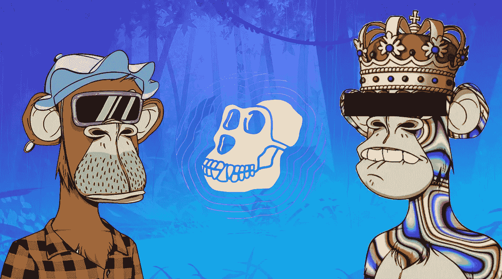
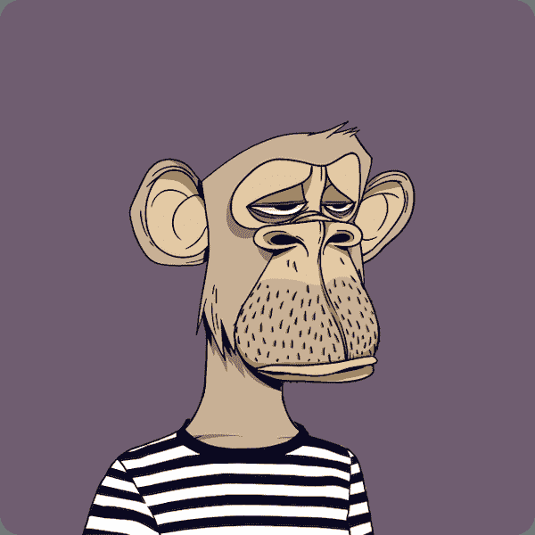
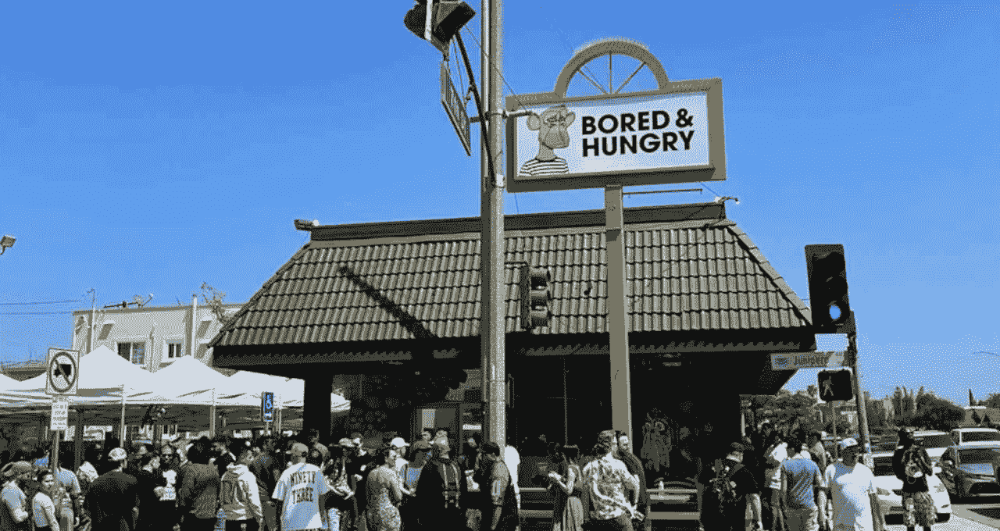

# 猿类如何改变网络 3！

> 原文：<https://medium.com/coinmonks/how-apes-are-changing-web3-83a7d58aa6a4?source=collection_archive---------4----------------------->

# ApeCoin 简介

区块链的世界正开始超越投资或投机。随着 Web3、元宇宙和 NFTs 的到来，你现在能够完全基于你对区块链技术的兴趣来创建一个在线存在。随着新区块链文化聚焦于艺术、音乐、游戏、活动和娱乐，全新的社区已经完全聚焦于这些区块链创新的新类型。

**参与这场革命的最著名的社区之一是**[**【ape coin DAO】**](https://apecoin.com/)**，在这次深度潜水中，你将读到你需要了解的关于他们的一切！**

 [## 硬币

### 一个支持艺术、游戏、娱乐、数字和物理事件、讲故事和…

apecoin.com](https://apecoin.com/) 

# **APE coin(猿)是什么？**

ApeCoin (APE)是 APE 生态系统的治理和效用表征。ApeCoin 是以太坊区块链上的 ERC-20 令牌，用于控制和管理 ApeCoin DAO 和生态系统。它目前是第二大 DAO，市值约为 47 亿美元，目前的象征性价格为 4.67 美元(1–9–22)。ApeCoin DAO 是一个分散化的组织，允许所有 APE 持有人就与令牌和组织相关的治理决策进行投票。在 DAO 中，社区决定关于事件、商品、推广以及 DAO 本身如何运行的事情。猿猴代币也用于支付无聊猿猴( [BAYC](https://opensea.io/collection/boredapeyachtclub) )和变异猿猴([MAYC](https://opensea.io/collection/mutant-ape-yacht-club))NFT 的持有者。

## **那么，是什么赋予 ApeCoin 价值呢？**

无聊猿和突变猿 NFT 属于目前最知名的藏品之一，底价分别为 80 和 14 ETH。由于 ApeCoin 是这个备受尊重的项目的货币，它受到了很多关注，因此获得了很大的价值。除了拥有 APE 令牌赋予你的治理和投票权之外，该令牌还授予你访问基于 ApeCoin 并建立在 APE coin 之上的整个生态系统的权限。项目正在将 APE 融入游戏、商品和活动中，以增加令牌的曝光率和价值。

## **现实世界事件**

是的，你没听错。ApeCoin 大到甚至开始流入现实世界！最近，阿姆和史努比·道格在 [MTV VMA 奖](https://tvline.com/2022/08/28/eminem-snoop-dogg-vmas-2022-performance-video/)上表演，用他们无聊的猿 NFTs 作为主要的视频剪辑角色。更疯狂的是 2022 年 4 月开业的百无聊赖猿 Yach 俱乐部餐厅“[百无聊赖&饥饿](https://hypebeast.com/2022/4/bored-hungry-first-bored-ape-yacht-club-restaurant-officially-opened-info)”，位于加州。这家餐厅出售以[无聊猿#6184](https://opensea.io/assets/ethereum/0xbc4ca0eda7647a8ab7c2061c2e118a18a936f13d/6184) 为主题的快餐，接受猿付款！

This is a 80ETH copy-paste right here…

# 【ApeCoin 是如何运作的？

ApeCoin 社区通过 ApeCoin DAO 管理自己。DAO 遵循提案流程，就 APE 基金会如何分配 APE 资金进行投票，目标是促进多样化和自我维持的生态系统。参与者参与道的治理的唯一要求是持有猿令牌。DAO 旁边还有 APE 基金会，负责管理 DAO 及其社区，还有一个委员会负责管理提案。好奇这一切是如何一起工作的吗？请继续阅读！

## **ape coin 基金会**

猿基金会是 ApeCoin 的管理者。它不是监工，而是 ApeCoin 刀中 ApeCoin 持有者可以建造的基础层。该基金会促进以社区为主导的分权治理，同时还管理在"一体行动"中运行的社区和项目。这涉及项目管理、行政、簿记和其他任务，以确保"一体行动"发挥应有的作用。基金会负责支付和管理通过 APE 改进提案( [AIP](https://apecoin.com/governance#proposal-process) )接受的项目和激励，使用 Multsig 钱包帮助 Ape 生态系统的增长和发展。

## **宇迦实验室的作用**

[宇迦实验室](https://www.yuga.com/)是一家网络 3 公司，因创建了 BAYC 和 MAYC·NFT 系列而闻名。ApeCoins 的部分流通供应量(约 16%)正流向宇迦实验室，以支持他们的业务和发展。部分藏品将捐赠给珍·古道尔遗产基金会，作为为更美好的世界而奋斗的慈善激励。宇迦实验室也是活跃在 ApeCoin DAO 的社区成员。

## **董事会的作用**

ApeCoins DAO 中的委员会负责管理社区提交的改进提案。如果提交了一份建议书，董事会将检查它是否符合要求，是否有歧义。他们确保不执行任何可能损害道的提议。每年社区都会投票决定谁可以进入董事会，所以如果你有野心，你可能会想竞选一个席位！

# **刀的作用是什么？**

要参与 DAO，您需要积极提出 Ape 改进建议( [AIP](https://apecoin.com/governance#proposal-process) )并对积极的建议进行投票。每周四，基金会都会发布一批新的 AIP 供社区投票。分享的主要来源是他们的网站，以及他们的推特。如果你也想开始贡献，请继续阅读！

## **Ape 改进建议**

任何时候你有一个有益于猿类社区的想法，你都需要创建一个 AIP。这可以是从创建新的业务、改变 DAO 的结构甚至与合作伙伴协作的任何事情。你需要通过创建一个草稿并向社区的其他人提出这个想法。一旦版主批准了 AIP 草案，基金会将对其进行审核，然后公布给社区进行投票。如果在评审或起草过程中，AIP 不符合创建提案或提案含义的要求，它将被返回给提交者进行改进。您可以在 [ApeCoin 治理页面](https://apecoin.com/governance#ape-coin-dao-governance)找到提交成功 AIP 的所有规则！

## **投票**

ApeCoin DAO 的共识机制旨在实现投票的公平、透明和低成本。为了实现这一点，ApeCoin 采用了由 [Snapshot](https://snapshot.org/) 构建的无气体投票技术。虽然没有汽油，快照仍然确保透明度。[投票流程](https://apecoin.com/governance#voting)要求所有活跃的机构群体成员对 AIP 进行投票。AIP 开放 6 天，在它被接受后，机构群体将按照最初提案中的规定开始工作。DAO 成员还可以将他们的投票权委托给其他人。

The Bored and hungry restaurant.

# **最后……**

从 NFT 时代开始，ApeCoin，它的刀和它们的 NFT 就一直在革新这个空间，而且它们已经成为头条新闻有一段时间了。他们的 DAO 遵循的核心理念是运行一个去中心化的组织，让整个社区有公平的机会为 APE 生态系统做出贡献。像阿姆和史努比·道格这样的大牌在他们的音乐中宣传他们无聊的猿类，使得 ApeCoin DAO 比以往任何时候都更有活力，这最终赋予了生态系统其价值。如果你想成为一个活跃的大社区的一部分，ApeCoin 绝对值得一试，而且它肯定会在未来成为更多的头条新闻！

***注****；本文是为 DAOHQ 撰写的，是他们的 DAO 深入研究计划的一部分。我没有从我自己的博客上赚到任何东西。:)*

# 链接>

*   *想阅读 medium 上的每一篇文章，甚至是高级文章？使用我的链接在 medium 上注册，每月 5 美元！*medium.com/@Igor.MD/membership
*   为了让我的故事对每个人都免费，请给我买杯咖啡吧！[ko-fi.com/igormd](https://ko-fi.com/igormd)
*   如果你想开始交易，可以考虑用我推荐的库币！[www.kucoin.com/r/rf/1de5d](https://www.kucoin.com/r/rf/1de5d)
*   想成为页面上的特色吗？给我发邮件！

> 交易新手？尝试[加密交易机器人](/coinmonks/crypto-trading-bot-c2ffce8acb2a)或[复制交易](/coinmonks/top-10-crypto-copy-trading-platforms-for-beginners-d0c37c7d698c)