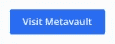
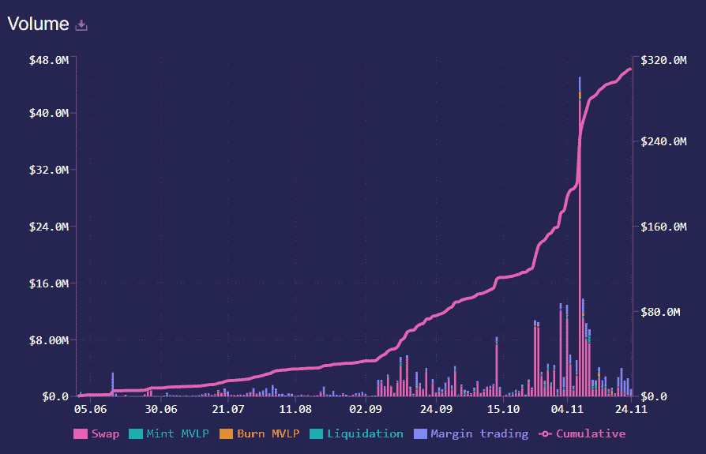

# 像 Metavault 这样的永久协议。贸易

> 原文：<https://medium.com/coinmonks/how-are-perpetual-protocols-like-metavault-trade-b88eed1891a0?source=collection_archive---------8----------------------->

## 当 CEXes 失败时，dex 提供保证

我们都听说过一个常见的密码谚语，即**不是你的钥匙，不是你的密码**。用户最近因为 [FTX 剧](https://coincodecap.com/sam-bankman-fried-apologizes-for-the-collapse-of-ftx)吃了不少苦头。人们开始对集中交易失去信任。我们都知道 Web3 的未来在于 [DEXes](https://coincodecap.com/what-are-decentralized-exchanges) 和 [DeFi](https://coincodecap.com/the-ultimate-guide-to-defi-decentralized-finance) 。南森团队最近的一份报告[显示](https://twitter.com/nansen_ai/status/1565308599378710528)gmx . io 的 GMX 令牌，即分散式永久交易所，尽管处于熊市，但表现良好。在本文中，我们将了解像 Metavault 这样的永久协议。贸易，即一个友好的分支 [GMX.io](https://coincodecap.com/gmx-review) 可以在 CEXes 和熊市的戏剧性事件中为加密社区提供保证。

> *使用代码* ***免费*** *获得交易费用特别优惠。*

## 摘要

1.  元金库。Trade 是掉期和永久交易的指数，Polygon 的杠杆高达 30 倍。
2.  由[元跳马刀](https://metavault.org/)团队打造。
3.  它的代码是 GMX.io 的友好分叉。
4.  Metavault 拥有[集成的](/@metavault.trade/metavault-trade-dd19f8d2a1ec) [链链价格馈送](https://chain.link/data-feeds)和[链链保持器](https://chain.link/keepers)来帮助安全和自动化永久交易。
5.  Metavault 拥有[集成的](/@metavault.trade/metavault-trade-integrates-socket-infrastructure-for-a-seamless-bridging-journey-tutorial-fb1ce714e38b)插座基础设施，可实现无缝桥接。
6.  MVX 是元金库。行业治理与效用表征。
7.  MVX 的最大供应量是 1000 万。
8.  MVLP 是[元金库。交易](https://metavault.trade/)的流动性提供者令牌。
9.  MVLP 持有者以 MATIC 和 esMVX 代币的形式获得奖励。
10.  已经过 tech rate[审核](https://github.com/metavaultorg/trade-contracts/blob/main/Metavault.Trade_Full_Smart_Contract_Security_Audit.pdf)。

> 也可阅读: [Metavault 交易评论](/coinmonks/metavault-trade-review-decentralized-perpetual-trading-30b5018bcf1e)

## CEXes 怎么了&为什么 DeFi 是 Web3 的未来？

很长一段时间以来，集中式交易所一直主导着 Web3 领域。但是最近的 FTX 事件证明了 DeFi 是唯一的解决方案。因此，密码交换的未来正缓慢但逐渐地转向分散交换。

以下是人们转向[分散交易所](https://coincodecap.com/what-are-decentralized-exchanges)的几个原因:

1.  匿名性:所有的交易中心都需要注册，这需要用户向交易提供商提供他们的数据，如 KYC 验证、地址证明等。，以及更多大多数人不习惯的东西。德克斯不会这么做。由于没有中央机构维护它们，KYC 标准是没有必要的。
2.  最近集中交易所的破产事件粉碎并严重损害了公众的信任。[Crypto.com](https://crypto.com/)**10 月 21 日意外** [将用户存款](https://coincodecap.com/crypto-com-accidentally-transfers-320k-eth-to-gate-io-likely-to-be-insolvent) 32 万 ETH 转入 [Gate.io](https://www.gate.io/) 。但是，[Crypto.com](https://crypto.com/)一再声明，与硬件钱包提供商 Ledger 合作，100%的用户所有的密码都离线保存在冷存储中。因此，人们开始对集中交易失去信任。
3.  **激励:**很少有交易所向用户提供通过赌注、增加流动性等方式将他们持有的密码变现的选项。，而我们可以在几乎所有指数中看到这些选项的高 APR。

我们目前正在见证一个熊市，每个人都在密码上赔钱，BTC 的价格已经达到 17K 美元左右。但如果我们谈论 GMX.io 的 GMX 令牌，即分散的即期和永久交换，它的价格大幅上涨，许多加密用户从中受益。这是南森团队完整的分析报告。这背后的主要原因是 GMX.io 等永久交易所的激励计划。现在，我们将讨论更多关于 Metavault 的内容。像 GMX 一样走上类似道路的贸易。

## 什么是 Metavault。贸易&为什么它很重要？

元金库。Trade 是掉期和永久交易的指数，Polygon 的杠杆高达 30 倍。它旨在成为交易者的首选解决方案，这些交易者希望在不共享数据的情况下随时控制自己的资金。交易者可以通过两种方式使用它:

*   有掉期和限价单的现货交易。
*   永续期货交易，对空头和多头头寸的杠杆高达 30 倍。

元金库。Trade 提供了一个没有 KYC 或 2FA 的平台，所以用户可以快速开始交易，没有麻烦和注册。此外，用户只需要一个加密钱包就可以在 Metavault 上开始交易。现在，用户有三个钱包选项，即**元掩码、钱包连接、比特币基地钱包和 Exodus 钱包**。此外，正如我们所知，MetaVault 是建立在 Polygon 之上的，我们必须将我们的默认 MetaMask 网络从 Ethereum Mainnet 更改为 Polygon Mainnet。

它的代号是 [GMX.io](https://coincodecap.com/gmx-review) 的友军叉。在仔细研究了 [GMX 的令牌组学](https://coincodecap.com/gmx-review#GMXio_Token_Distribution)之后，Metavault DAO 团队选择为 Metavault.Trade 从头开始重新设计它。

*   它将更大比例的代币用于奖励农业。因此，激励计划更具实质性。
*   元库道团队推出了 MVX 令牌，没有私人或种子轮。

现在，我们将了解 Metavault.Trade 的一些高级功能。

1.  **建立在多边形上:**交易快速便宜。
    Chainlink 还提供了大量多边形上的价格 feeds。
2.  **多资产池**:它允许平台在其支持的所有资产之间共享流动性。假设资产池包括五项资产，即、ETH、MATIC、和 DAI，它们的美元价值相等，即各占 20%。交易者可以以平台上显示的准确价格立即购买 50%的 USDC BTC 供应量，而不会对价格产生任何影响。排序后，BTC 是 10%，USDC 是 30%，其余保持不变。结果，平台上 BTC 的价格在互换前后是一样的，尽管一半的供应量已经被买光了。为了重新平衡资金池，流动性提供者受到激励去存放需求资产，而不愿意存放过剩资产。
3.  [**元金库。交易**](https://metavault.trade/)**x**[**chain link**](https://chain.link/):meta vault 有[集成的](/@metavault.trade/metavault-trade-dd19f8d2a1ec) [Chainlink 价格馈送](https://chain.link/data-feeds)和 [Chainlink Keepers](https://chain.link/keepers) 帮助安全和自动化永久交易。

元金库。Trade x MM Finance: Metavault 近日宣布与 MM Finance 合作。因此，Metavault 重新平衡机器人现在可以使用 Madmex 和 MMF 池。MM Finance 将把 MVX 再平衡机器人产生的一小部分费用返还给 Metavault。MM 财务团队将使用产生的费用添加回 MLP 池，增加 MLP 加班的价值。此外，这些协议费用的 65%将用于回购 MMF，以支持其本地令牌的价格。另一方面，Metavault 将把获得的返利用于投资，以增加其 [PoL](https://twitter.com/MetavaultTRADE/status/1581732267122364416) ，即协议拥有的流动性，这也随后推动了飞轮效应理念，并增加了单机容量。

元金库。贸易 x [插座](https://socket.tech/) : Metavault 集成了[插座基础设施，实现无缝桥接。Socket 是一种互操作性协议，用于跨链的安全高效的数据和资产传输。它不是一个桥梁或跨链应用程序，而是一个基础架构，允许开发人员构建具有互操作性的应用程序，作为应用程序基础架构的核心部分。](/@metavault.trade/metavault-trade-integrates-socket-infrastructure-for-a-seamless-bridging-journey-tutorial-fb1ce714e38b)

> *使用代码***获得交易费用特别优惠。**

## *Metavault 如何激励流动性提供者？贸易？*

*MVX 是超级金库。贸易的治理和效用令牌。MVX 的最大供应量是 1000 万。超过这一最大供应量的铸造由 28 天的时间锁控制，只有在需要增加供应量时才会考虑。下面是令牌分发的快速概述:*

**

*MVX 持有者有强烈的动机去赌他们的代币。因此，他们会获得三种不同类型的奖励。*

1.  *平台费用分成:MVX 赌注者以 MATIC 的形式获得整个平台所收费用的 30%。*

**

1.  *esMVX: MVX 赌注者将获得一个新的代币，即托管 MVX。它是不可转让的，只有两种使用方式:
    (i) esMVX 可以被归属为 MVX 进行转换和分发。(ii) esMVX 可以下注，并获得与下注 MVX 相同的奖励。*
2.  *乘数点(MPs): MVX 赌注者获得点数奖励。MP 的奖励是 100% APR。每个 MP 都可以下注来赚取与 MVX 代币相同数量的 MATIC。*

*以下是奖励结构的简要总结:*

1.  *MVX 赢得了 MATIC，esMVX 和 MPs。*
2.  *赌注 esMVX 赢得 MATIC、esMVX 和 MPs。*
3.  *议员被判死刑时可获得奖金*
4.  *MVLP 赢得了钱包中的 MATIC 和 esMVX。*

**

*MVLP 是[元金库。交易](https://metavault.trade/)的流动性提供者令牌。它由平台上用于互换和杠杆交易的资产指数组成。用户可以通过将任何指数资产添加到流动性池来铸造 MVLP，而每当用户从流动性池中移除任何指数资产时，MVLP 就会被烧毁。此外，MVLP 持有者还可以获得 MATIC 和 esMVX 代币形式的奖励。*

*DEXes 最好的一点是它们是开源的，用户可以验证他们的数据。现在，我们将从 [Metavault 中获得一些见解。交易](https://metavault.trade/)数据。这些数据每天都在他们的网站上更新。*

1.  ***交易量:**如果我们分析 2022 年 6 月 1 日到 2022 年 11 月 24 日的数据，那么 [Metavault 上的交易量。T21 的贸易额呈指数增长，即将达到 3 . 2 亿美元。我们应该记得所有这一切都发生在我们还处于熊市的时候，以及所有 FTX 的戏剧。](https://metavault.trade/)*

**

***2。总费用:**如果我们分析 2022 年 6 月 1 日至 2022 年 11 月 24 日的数据，那么 [Metavault 上的总费用。交易量也有所增加，即将达到 100 万美元。](https://metavault.trade/)*

**

***3。Pool:** 正如我们已经讨论过的[元库。Trade](https://metavault.trade/) 有一个多资产池，允许平台在其支持的所有资产之间共享流动性。如果我们分析 2022 年 6 月 1 日至 2022 年 11 月 24 日的数据，则该池的总容量约为 750 万美元，包括:
(一):63022.42028
(二):479326.0226
(三)单:63380.60595
(四)戴:478881.6049
(五)韦:1407248.805
(六)::1560839.303
(四)*

**

***4。独立用户:**如果我们分析 2022 年 6 月 1 日至 2022 年 11 月 24 日的数据，那么 [Metavault 上的独立用户总数。贸易](https://metavault.trade/)平台现在每天增加 250-350 个独立用户。*

**

***5。新增用户:**如果我们分析 2022 年 6 月 1 日到 2022 年 11 月 24 日的数据， [Metavault 上的新增用户总数。Trade](https://metavault.trade/) 平台现在每天增加 100-200 个新用户，这个数字即将达到 4500。*

**

*6。用户操作:在下面给出的数据中，读者可以看到用户在 [Metavault 上执行的操作份额，即掉期、保证金交易、铸币和 MVLP。交易](https://metavault.trade/)平台。如果我们分析上一周的数据，即 2022 年 11 月 16 日至 2022 年 11 月 22 日，那么；
(i)掉期交易数量= 1，986 {平均每天约 300 笔}
(ii)保证金交易= 1，358 {平均每天约 200 笔}
(iii)造币厂&MVLP = 1，002 {平均每天约 150 笔}*

**

*我们的读者可以在 [stats.metavault.trade](https://stats.metavault.trade/) 上查看和分析更多数据。*

## *结论*

*如果说上周 Metavault 上交易员的报酬分布。交易，那么$MVX 的回报是 84.58%，而$MVLP 的回报是 173.65%。尽管经历了整个 FTX 事件、CEXes 的崩溃和熊市，交易仍在盈利。元金库。交易团队完全[致力于](/@metavault.trade/month-in-review-at-metavault-trade-october-6ac7bee64d59)新交易所上市、平台升级、AMAs、新推荐竞争的启动等项目。还有更多。此处使用的所有图片和信息的版权归 Metavault.Trade 所有。*

> **使用代码* ***免费*** *获得交易费用特别优惠。**
> 
> **加入 Coinmonks* [*电报频道*](https://t.me/coincodecap) *和* [*Youtube 频道*](https://www.youtube.com/c/coinmonks/videos) *了解加密交易和投资**

# *另外，阅读*

*   *[3 商业评论](/coinmonks/3commas-review-an-excellent-crypto-trading-bot-2020-1313a58bec92) | [Pionex 评论](https://coincodecap.com/pionex-review-exchange-with-crypto-trading-bot) | [Coinrule 评论](/coinmonks/coinrule-review-2021-a-beginner-friendly-crypto-trading-bot-daf0504848ba)*
*   *[莱杰 vs n rave](/coinmonks/ledger-vs-ngrave-zero-7e40f0c1d694)|[莱杰 nano s vs x](/coinmonks/ledger-nano-s-vs-x-battery-hardware-price-storage-59a6663fe3b0) | [币安评论](/coinmonks/binance-review-ee10d3bf3b6e)*
*   *[加密交易机器人](/coinmonks/crypto-trading-bot-c2ffce8acb2a) | [Bingbon 评论](https://coincodecap.com/bingbon-review)*
*   *[Bybit Exchange 评论](/coinmonks/bybit-exchange-review-dbd570019b71) | [Bityard 评论](https://coincodecap.com/bityard-reivew) | [Jet-Bot 评论](https://coincodecap.com/jet-bot-review)*
*   *[3 commas vs crypto hopper](/coinmonks/3commas-vs-pionex-vs-cryptohopper-best-crypto-bot-6a98d2baa203)|[赚取加密利息](/coinmonks/earn-crypto-interest-b10b810fdda3)*
*   *最好的比特币[硬件钱包](/coinmonks/hardware-wallets-dfa1211730c6) | [BitBox02 回顾](/coinmonks/bitbox02-review-your-swiss-bitcoin-hardware-wallet-c36c88fff29)*