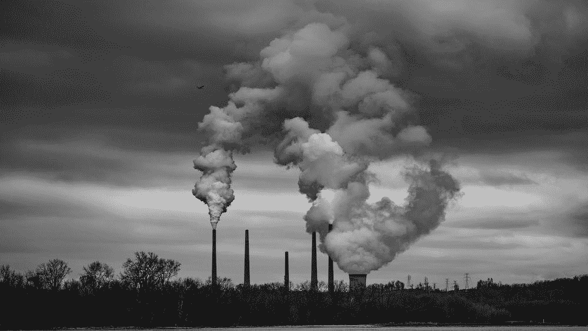

# 比特币如何破坏我们的气候和环境

> 原文：<https://medium.com/coinmonks/how-bitcoin-is-destroying-our-climate-and-environment-d8ac139e3d36?source=collection_archive---------37----------------------->

依赖工作证明技术的比特币因采矿消耗的电量而受到批评。然而，许多人认为，为了确保网络安全和防止欺诈，这是一种必要的邪恶。不管你的观点是什么，不可否认的是，比特币对我们的环境有负面影响。

# 比特币的能源消耗