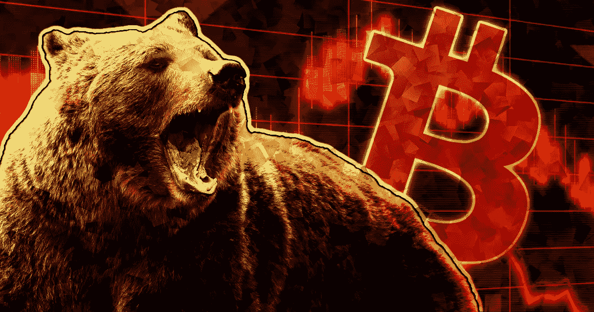

# 比特币期权如何在熊市中帮助生存

> 原文：<https://medium.com/coinmonks/how-bitcoin-options-might-help-survival-amid-the-bear-market-579fe18fe11?source=collection_archive---------58----------------------->

美联储正以近 30 年来最激进的速度提高利率。随着通货膨胀达到历史最高水平，经济衰退迫在眉睫，保护资本是每个投资者心中的首要问题。

在熊市期间，现金和政府债券一度是安全的资产，但随着通货膨胀肆虐，各国央行努力稳定债券收益率曲线，这些传统的避风港正在动摇。

期权合约是对冲你的一些风险的好方法，因为它们给你权利，而不是义务，在未来以预定的价格交易资产。看涨期权是买入的权利，看跌期权是卖出的权利。

期权合约有两种类型。使用美式期权的交易者可以在合同有效期内的任何时候执行他或她的合同，而欧式期权只能在到期日执行。

如果在到期日行使看跌期权或看涨期权无利可图，你可以让它到期，不采取任何行动。在这种情况下，你的成本仅限于你购买期权合约时支付的金额。

多重交易策略使用期权合约。但在这篇文章中，我想分享一些平易近人的策略，允许一定程度的保护，而不需要出售你的资产。

我们就以比特币为底层资产吧。如果你以等于或高于当前价格的执行价格购买看跌期权，它会随着比特币的下跌而增值。

所以，如果你的比特币是红色的，你的期权合约将是绿色的。而且，如果市场趋势更高，使你的期权无效，那么比特币将会升值，弥补合约的部分成本。

这种策略最适合那些将比特币作为长期投资、不愿出售的交易员。这让他们避免了最糟糕的情况:级联清算导致比特币大幅下跌。购买看跌期权就像购买下跌风险的保险。

因此，如果你怀疑市场即将进一步下跌，你可以购买看跌期权作为一种保险，在市场下跌时支付。时机至关重要，尤其是在熊市期间。

例如，如果你认为市场将在接下来的几天内迅速走低，那么买入看跌期权很可能是值得的初始投资，但如果市场下跌缓慢。你可能无法收回购买看跌期权所支付的溢价。同样的原则也适用于看涨期权。

期权合约的另一个普遍用途是在持有基础资产的同时卖出看涨期权。你可以通过向另一方出售看涨期权立即获得报酬，如果价格上涨或超过一定金额，他们有权购买你的比特币。

例如，如果你卖出一个看涨期权，同意以 30，000 美元的价格卖出 1 BTC，你马上就可以获得该合约的价格——溢价，这是对下跌的对冲。你唯一的风险将是错过任何超出履约价格的收益，这些收益将由期权的买方所有。

如果比特币没有触及执行价，那么期权就到期了，你保留溢价。这种策略的主要风险是比特币的基础价格会在此期间下跌。

影响加密和其他资本市场的熊市是保护资本的时候，所以当好时光回来时，将有大量的机会重新分配。在困难时期，比特币的价格可能会让交易者大吃一惊。通过使用期权对冲，你可以创建一个更稳健的投资组合，同时仍然持有你的比特币。

点击这里关注我们了解更多故事[。](http://t.me/etellworld)

> 交易新手？试试[密码交易机器人](/coinmonks/crypto-trading-bot-c2ffce8acb2a)或者[复制交易](/coinmonks/top-10-crypto-copy-trading-platforms-for-beginners-d0c37c7d698c)