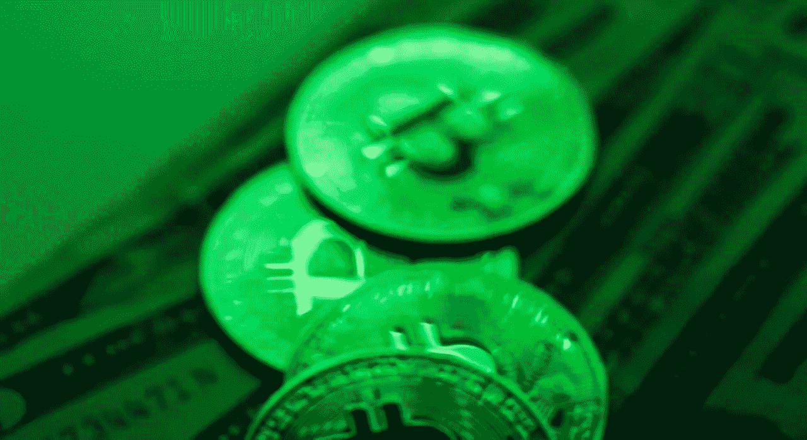

# 比特币将如何脱离传统市场

> 原文：<https://medium.com/coinmonks/how-bitcoin-will-disengage-from-traditional-markets-b833d7eda6df?source=collection_archive---------27----------------------->

一段时间以来，比特币一直试图与其他风险资产分道扬镳，尽管迄今为止……不太成功。

根据目前的数据，它与华尔街纳斯达克技术指数在过去三十天的相关性上周跌至 0.26，这是自 1 月初以来的最低水平。

相关性显示了这两种资产在 30 天内的同步程度，今年大部分时间都在 0.75 以上徘徊，有时接近“完美”的 1:1(5 月和 9 月分别为 0.96 和 0.93)。

对于加密货币爱好者来说，大科技对比特币的“拆分”是实力的标志。

“增长受到限制，投资者正在寻找下一个增长领域。Web3 上的游戏生态系统 FITCHIN 的首席执行官圣地亚哥·波特拉说:“比特币和加密货币是那些‘下一个’增长行业之一。”。

脱钩努力确实恰逢一个相对平静和整合的时期，一年前，该公司在去年 11 月从令人兴奋的 69000 美元高点推出了其史诗般的第一部。

目前，[比特币](https://bitnewsbot.com/tag/bitcoin)徘徊在 20500 美元的月度高点附近，上周涨幅超过 5%，跑赢上涨 2%的纳斯达克，尽管微软、Alphabet、Meta 和亚马逊的季度业绩令人失望。

# 寒冷和艰难的秘密冬天…

然而，隐秘的冬天是寒冷而艰难的。

Photo by [Dominik Dombrowski](https://unsplash.com/@k1n1m0de?utm_source=medium&utm_medium=referral) on [Unsplash](https://unsplash.com?utm_source=medium&utm_medium=referral)

根据 CoinMarketCap.com 的数据，加密货币市场的市值已从 2021 年 11 月的近 3 万亿美元萎缩至 9840 亿美元。

根据 CryptoCompare 的数据，10 月 25 日的交易量也降至 6130 万美元，远远低于去年 11 月约 7 亿美元的日交易量。

另一方面，根据区块链数据公司 Glassnode 的数据，比特币持有的财富处于历史高位，表明长期持有人或“霍德尔”在积累。

此外，根据分析平台 CryptoQuant 的数据，10 月 26 日，有 5.5 万枚比特币从最大的交易所币安被撤回——这种流动通常表明硬币正在被转移到钱包中进行长期储存。

*“BTC 持有者的基础已经发生了根本性的变化，因为它不再受到投机者的拖累，这些投机者主要是在 2021 年进入该社区的，其成员几乎在任何宏观经济环境下都不会出售他们的 BTC，”*加密衍生品提供商 FRNT 金融公司首席执行官斯特凡·韦莱特(Stéphane Ouellette)说。

# 熊市要结束了吗？

Photo by [Thomas Lefebvre](https://unsplash.com/es/@magellol?utm_source=medium&utm_medium=referral) on [Unsplash](https://unsplash.com?utm_source=medium&utm_medium=referral)

咨询公司几何能源公司(Geometric Energy Corporation)董事总经理塞缪尔里德(Samuel Reid)表示，大量资金流出股市可能表明，一些大买家“嗅到了”熊市的结束。

然而，只能猜测比特币是会继续上行还是再次回落，还是会在科技股的怀抱中迅速复苏。

在可预见的未来，宏观经济事件仍然是一个高度投机市场的驱动力。*“加密货币的投机性越强，它们与经济的联系就越紧密”，*区块链公司 Hiro Systems 的首席执行官 Alex Miller 说。

*“这就是为什么我们需要重新思考它们的使用方式和生产能力。它们越是被用于其他方面，它们与经济和市场的联系就越少。”*

*原载于 2022 年 11 月 2 日***。**

> *交易新手？尝试[加密交易机器人](/coinmonks/crypto-trading-bot-c2ffce8acb2a)或[复制交易](/coinmonks/top-10-crypto-copy-trading-platforms-for-beginners-d0c37c7d698c)*