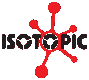

# 区块链如何重新定义游戏行业

> 原文：<https://medium.com/coinmonks/how-blockchain-can-redefine-the-gaming-industry-42472b29872d?source=collection_archive---------36----------------------->

乍一看，似乎游戏行业的核心是静态的，唯一变化的是图形质量，但这绝对不是真的。每年的技术进步都在推动游戏行业向前发展，增加新的元素和功能，现在，在区块链技术的帮助下，这个行业比以往任何时候都更接近变革。

微交易或微支付的使用预计将在游戏中增加，鼓励玩家之间的交易。微交易方式的不同之处在于，在智能合约的帮助下，支付可以分成更小的部分，流向不同的方向，确保每一个动作的正确处理。这可能会增加交易中涉及的每个人的利益，从创造者开始，他将从资产的每一次转售中获得收入。[区块链技术可以为用户提供安全保障](https://isotopic.io/)，在全球范围内提供更快、更低成本的交易，同时保留隐私和数据保护。

对于许多游戏玩家来说，这项技术的另一个令人兴奋的前景是能够利用游戏作为赚取收入的方式为[提供新的就业机会。物品和资产现在可以在现实世界中获得价值，实现了一个被广泛讨论的游戏赚取模型。玩家的积极参与，加上将权力和资产所有权转移给用户而不是公司，正在重建游戏行业的基础，以一种令人兴奋的新方式塑造它。](https://isotopic.io/)

# 负责任的游戏

区块链技术中的数据存储在以链状结构相互连接的数据块中，这种结构允许按时间顺序跟踪所有修改和交易，将不必要的修改概率降低到几乎为零。这一特性与技术的分散系统一起导致了[安全无作弊游戏与区块链技术](https://isotopic.io/)保护用户数据和游戏本身免受黑客和操纵。通过这种方式，复制一个物品变得极其困难，因为有可能提取关于该资产的旅程的所有信息，并证明其来源和合法所有者。当对游戏进行修改时，同样是可以实现的。不仅可以确定具体更改了什么，还可以确定谁进行了修改等等。了解每一个行动的后果和可追踪性将最终导致每个人都可以参与负责任和安全的游戏。

# 关系

积极参与游戏世界的玩家的预期增加很可能导致更多的游戏成瘾。不幸的是，游戏成瘾并不是一个新概念，其后果包括心理健康问题、经济困难等等。可以应用区块链技术特征来应用限制和跟踪已经超过这些限制的玩家，并且显著减少游戏上瘾人数，尤其是在年轻玩家中，并且创建安全的游戏环境。

文章由 Jenny Lis 撰写，来自[同位素](https://isotopic.io/)

[**同位素**](https://isotopic.io) **是一个支持区块链的软件分发服务，托管整合了 NFTs 和加密货币的游戏和应用。**

> 交易新手？在[最佳加密交易](/coinmonks/crypto-exchange-dd2f9d6f3769)上尝试[加密交易机器人](/coinmonks/crypto-trading-bot-c2ffce8acb2a)或[复制交易](/coinmonks/top-10-crypto-copy-trading-platforms-for-beginners-d0c37c7d698c)