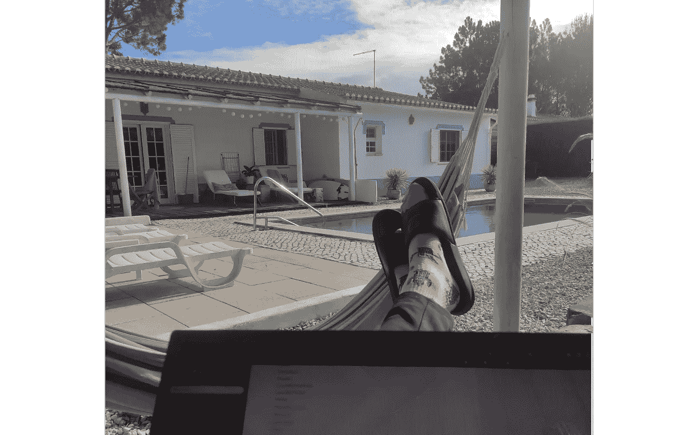

# 区块链如何改变了我的生活(剧透:不是通过让我变得富有)

> 原文：<https://medium.com/coinmonks/how-blockchain-has-changed-my-life-spoiler-its-not-by-making-me-rich-623cd173dd1c?source=collection_archive---------14----------------------->

## 深入探究；我！

区块链已经存在了将近 14 年，不管你相信什么，几乎每个人都同意区块链做得好和不好。我也不是来说服你的。这篇文章是关于区块链对我生活的影响，我会告诉你好的和坏的，因为博伊，有坏的吗…

*想阅读每一篇优质媒体文章？* [*用我的链接报名*](/@Igor.MD/membership) *！*

# **开始我的 web3 冒险**

我在 2020 年开始投资，虽然投资是一次令人惊奇(也有些痛苦)的经历，但这不是这件作品的巅峰。不，事实恰恰相反。我的投资把我带到了一个更有趣的目的地，也就是预示着我职业生涯的开始！

在科罗纳期间，我在荷兰找到了一份办公室工作，虽然很有趣，但却错过了刺激。我不能让自己每周坐在办公桌后超过 32 小时，我渴望有什么事情可以释放我的能量。那段时间，我也开始了我的区块链博客。那时我还不知道，但那将是一些令人惊奇的事情的开始！

# 进入区块链

不知何故，我的博客做得非常好！我就如何开始被动收入提出建议，分享我在协议方面的经验，讲述我的利润和亏损，并提醒人们警惕粗略的快速致富计划。我的博客正在运行，我很喜欢它！

这也是下一件大事发生的时候。还记得我说过的办公室工作吗？我的同事开始了他在区块链的创业；一个跨货币和跨境支付应用程序建立在恒星网络上。我对他的创业表现出兴趣，他对我的博客表现出兴趣，这就是我们合作的开始。

我开始是为他的初创公司写文案和内容，但很快我就成了社交媒体经理、社区经理和多面手。我可以在任何地方远程工作，薪水足够启动我的旅行和自由。我可以在法国冲浪，搬到葡萄牙，同时做我喜欢的事情；写作、编程、视觉设计和参与社区活动。

## 同时

我发现了分散的自由职业者网站，如 Dework、Voicedao 和 Layer3。我让自己进入了 Web3 和 DAOs 的迷人世界，它向我展示了用我的技能和时间换取金钱的方法。我设法成为了 DAOHQ 和 DIA 的一名基于文章的作家，在那里我可以扩展我的技能，赚更多的钱和兼职做加密。我可以不用投资一美元就能获得 DCA！

# 不仅仅是好玩和游戏:(

我希望这是一个大的快乐故事，但它并不都是有趣的游戏。虽然在区块链工作很有趣，但也很辛苦。竞争激烈，空间发展迅速，随着 crypto 最近的垮台，炒作和热情已经消失。这已经导致我大部分的被动收入流几乎耗尽，随着一大笔学生贷款悬在我的头上，有一天我的加密冒险可能会结束，我将脚踏实地地进入现实世界。我还没有月亮…

# 这就是我现在的处境！

我目前坐在葡萄牙，为[豆子 app](https://medium.com/u/b5d43223c1e?source=post_page-----623cd173dd1c--------------------------------) 做远程工作，做自己喜欢的事情；从事加密工作，冲浪和制作音乐。区块链给了我所有需要的工具。如果两年前有人告诉我区块链会如何改变我的生活，我会嘲笑他们，但不知何故这就是它对我的影响。

我非常感谢区块链和 crypto 给我的机会，我真诚地希望这个空间继续给我机会。我们正在用 Beans 构建一个应用程序，可以帮助数百万跨境汇款的人，并为没有稳固金融系统或银行账户的人提供解决方案。这是一份令人惊叹的工作，我仍然无法相信它让我能够达到现在的位置。

任何人，只要有正确的动机，都可以做到这一点，我会建议任何人走出去，将自己沉浸在这个美好但艰难的世界中。哪怕只是为了体验或者是为了钱！

# 链接>

*   *想阅读* *媒体上的每一篇文章，甚至是优质文章？在 medium 上注册，每月 5 美元！*[medium.com/@Igor.MD/membership](/plans?subscribeToUserId=211ebdfa9e24&susiEntry=entity_driven_subscription_lp&source=entity_driven_subscription-211ebdfa9e24------------------------------------)
*   为了让我的故事对每个人都免费，请给我买杯咖啡吧！[ko-fi.com/igormd](https://ko-fi.com/igormd)
*   如果你想开始交易，可以考虑用我推荐的库币！[www.kucoin.com/r/rf/1de5d](https://www.kucoin.com/r/rf/1de5d)
*   想成为页面上的特色吗？给我发邮件！

> 交易新手？尝试[加密交易机器人](/coinmonks/crypto-trading-bot-c2ffce8acb2a)或[复制交易](/coinmonks/top-10-crypto-copy-trading-platforms-for-beginners-d0c37c7d698c)