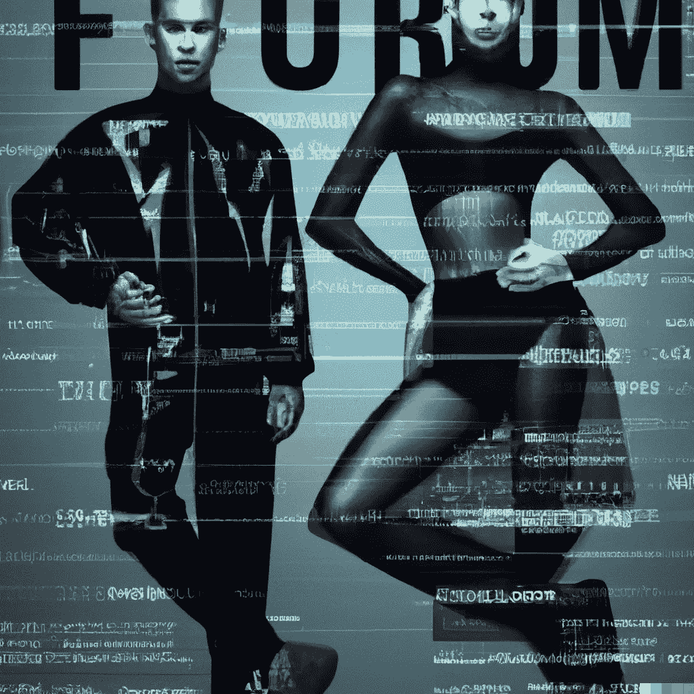

# 区块链如何颠覆时尚产业

> 原文：<https://medium.com/coinmonks/how-blockchain-is-disrupting-the-fashion-industry-5e4d4da0b1ce?source=collection_archive---------21----------------------->

Image created with [**DALL·E**](https://labs.openai.com/) **AI**

**区块链技术**有可能颠覆许多行业，包括时尚和影响者营销。通过利用区块链的分散和透明的性质，时尚公司和有影响力的人可以创造新的方式来吸引他们的观众并推动销售。

时尚行业面临的主要挑战之一是供应链缺乏透明度。许多服装品牌从世界各地的供应商处采购材料，因此很难追溯其产品所用材料的来源。这种缺乏透明度会导致工人工作条件差和环境破坏。

> 交易新手？在[最佳加密交易](/coinmonks/crypto-exchange-dd2f9d6f3769)上尝试[加密交易机器人](/coinmonks/crypto-trading-bot-c2ffce8acb2a)或[复制交易](/coinmonks/top-10-crypto-copy-trading-platforms-for-beginners-d0c37c7d698c)

区块链技术可以通过提供供应链的透明和不可改变的记录来帮助解决这个问题。通过使用智能合同和其他基于区块链的工具，时装公司可以从源头到最终产品跟踪他们的材料。这有助于确保他们的材料来源符合道德规范且可持续，从而提高品牌声誉并增加客户信任。

**影响者营销**是区块链技术可以产生重大影响的另一个领域。有影响力的人通常会因向其追随者推销产品或服务而获得报酬，但当前的系统往往不透明且难以追踪。这可能导致潜在的欺诈和虚假陈述，从而损害影响者和他们所推广的品牌的声誉。

区块链技术可以通过提供影响者营销交易的透明和不可变记录来帮助解决这个问题。通过使用智能合同，品牌和影响者可以就他们的合作条款达成一致，并实时跟踪结果。这有助于确保影响者得到公平的报酬，品牌从合作中获得预期的结果。

已经有几个加密项目致力于将区块链技术整合到时尚和影响者营销行业中。这里有三个例子:

1.  VeVe 是一个位于区块链的平台，它将时尚品牌、有影响力的人和顾客联系在一起。该平台允许品牌创建和跟踪影响者营销活动，也允许影响者展示他们的工作并与潜在客户联系。VeVe 使用自己的令牌，称为 VeVe Coin，以促进交易，并奖励用户对平台的贡献。
2.  **Zalando** 是一家欧洲在线时装零售商，它正在使用区块链技术来提高其供应链的可追溯性。该公司与 ConsenSys 和 BlockApps 合作开发了一个区块链平台，可以跟踪其产品中使用的材料的来源和旅程。这个平台将让顾客看到他们服装所用材料的完整历史，这有助于增加时装业的信任和透明度。
3.  **Lyst** 是一个全球时尚搜索平台，正在使用区块链技术来提高其产品的真实性。该公司已与 Arianee 合作，为其产品开发一个基于区块链的真品证书。这个证书将为顾客提供他们所购买的产品是真货而不是假货的证明。

总之，区块链技术有潜力通过提供更大的透明度和信任来颠覆时尚和有影响力的营销行业。通过利用区块链去中心化和不变的本质，时尚公司和有影响力的人可以创造新的方式来吸引他们的观众并推动销售。

感谢阅读，并让我知道你的想法！