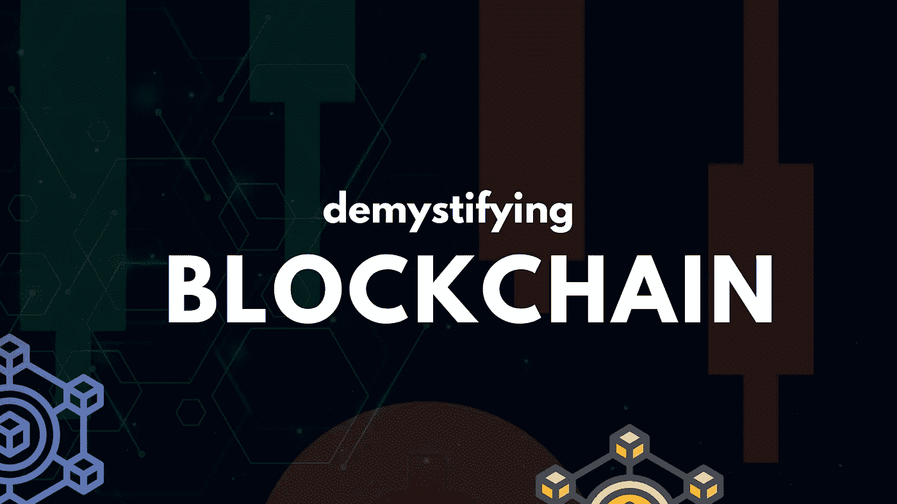

# 区块链到底是怎么运作的。

> 原文：<https://medium.com/coinmonks/how-blockchain-really-works-e89454e3b251?source=collection_archive---------37----------------------->

术语“区块链”通常用于指加密货币的核心技术。它能够实现资产的电子交换，同时记录交易的事实和细节；您只能添加新记录；以后不能对这些记录进行更改。这使得网络的客户能够相互独立地达成共识。

另一种方式可以认为它是推动比特币和以太坊等虚拟货币的引擎。作为一种先进的分布式公共分类帐技术，它保存着越来越多的记录(称为块)，这些记录使用加密技术安全地链接在一起。

在这种情况下，块是指分布式分类账中记录的一系列交易的信息，因此简单地说，区块链是“一系列块”块包含与特定交易相关的所有信息。时间、转账金额、发送者和接收者都被识别。任何人都可以追溯特定资产的整个交易历史，一直追溯到它的开始，因为一个链是一系列完整的块。

交易数据的存储方式——存储在相互链接形成一个链的数据块中——使术语“区块链”得名。交易的数量导致区块链的规模扩大。

任何真实的交易数据都被记录在区块链网络中，该网络受公认的点对点规则管理。交易记录(例如当各方交换任何商品或服务时)或权利特权(例如当链记录所有权信息时)可以包括在该数据中，以及以数字货币表示的块的“价值”。除了交易数据之外，每个块还可以包括前一个块的散列、它自己的现时值、最近认证的交易的时间戳以及它自己的密码散列，其用作唯一标识符或数字指纹。

如果在没有前一个块的正确散列的情况下将一个块添加到链中，则整个区块链可能会变得无效，因为每个新块都应该引用前一个块。区块链的不变性对他们的安全至关重要。

此外，经常使用各种共识协议来维护区块链的真实性。所有参与者必须达成共识，以便接受网络验证的交易。

例如，工作证明是一种流行的共识协议，它识别在投入一定量的计算努力后解决一个具有挑战性的数学问题的数字。使任何使用区块链网络的人很难识别这个号码，但却很容易核实这个号码，这是证明工作的主要目标。因此，它阻止垃圾邮件和篡改区块链的架构。

在大多数加密货币的区块链中添加一个新的区块需要解决一个具有挑战性的数学方程，随着区块链的扩张，这个问题会变得越来越难。因此，任何通过解决这个问题来证明自己努力的人都会得到一种虚拟货币作为报酬，这一过程被称为“挖掘”。

# 区块链的好处

# 高效交易

通过集中管理机构进行的交易结算可能需要很多天。例如，如果你试图在星期五晚上存入一张支票，直到星期一早上你才能看到你的账户上有任何钱。区块链全天候活跃，一周七天，一年 365 天，不像金融机构只在正常营业时间运营，通常是一周五天。在短短几个小时内，交易就可以完成并被认为是安全的。交易可以在短短 10 分钟内完成。由于时区问题和各方确认支付处理的要求，跨境交易通常需要更长的时间，因此可以从中特别受益。

**降低成本**

一般来说，顾客付钱给银行来确认交易，付钱给公证人来签署文件，或者付钱给牧师来主持婚礼。不再需要使用第三方验证以及相关费用。例如，企业主每次接受信用卡支付时都会支付少量费用，因为银行和支付处理公司必须处理这些交易。而比特币，交易费用可以忽略不计，没有中央权威。

# 准确(性)

由数千台计算机组成的网络验证了区块链网络上连锁交易的准确性。通过几乎消除验证过程中的人工参与，产生了更少的人为错误和准确的信息记录。即使网络中的一台计算机发生了计算错误，它也只会影响区块链的一个副本。一个庞大且不断扩大的网络会发现，如果至少有 51%的计算机能够做到这一点，那么这个错误几乎不可能传播到区块链的其他地方。

# 分散

区块链不会在一个地方保存任何数据。相反，一个计算机网络复制并传播区块链。每当新的块被添加到区块链时，网络中的每台计算机都更新其区块链。区块链通过将信息分散在网络上，而不是保存在一个单一的中央数据库中，使人们更难篡改这些信息。如果黑客获得了区块链的副本，那么面临风险的只是数据的一个实例，而不是整个网络。

# 安全交易

交易被记录后，必须由区块链网络确认其真实性。在区块链，成千上万台电脑争相验证交易数据的准确性。一旦事务被机器验证，它就被添加到区块链块。在区块链上，每个块都有自己的独特哈希和它之前的块的独特哈希。每当数据块上的信息以任何方式改变时，该数据块的散列码就会改变，而在它之后的数据块的散列码不会改变。由于这种不匹配，在没有通知的情况下修改区块链上的信息非常困难。

# 私人交易

由于许多区块链网络是作为公共数据库运行的，任何人只要有互联网连接就可以访问该网络的交易历史。用户可以查看交易信息，但他们无法获得会暴露执行交易的用户的数据。像比特币这样的区块链网络只是保密的；他们不是匿名的，尽管这是一个普遍的假设。

每当用户进行公共交易时，他们的唯一代码，也称为公钥，如前所述，被记录在区块链上。与他们无关。交易不会泄露任何个人信息，即使它与一个人的姓名相关联。然而，如果一个人通过要求认证的交易所购买比特币，他的身份仍然与其区块链地址相关联。

# 透明度

大多数区块链完全是开源软件。这意味着任何人都可以查看它的代码。这使得审计人员能够审查比特币等加密货币的安全性。这也意味着，对于谁控制比特币的代码或如何编辑代码，没有真正的权威。因此，任何人都可以建议对系统进行更改或升级。如果大多数网络用户同意升级后的新代码版本是合理且值得的，那么比特币就可以更新了。

# 最后

为了开发一个文档时间戳不可更改的系统，两位数学家 Stuart Haber 和 W. Scott Stornetta 在 1991 年首次提出了区块链技术的概念。此外，加密朋克尼克·萨伯(Nick Szabo)在 20 世纪 90 年代末主张利用区块链来保护比特黄金(bit gold)，这是一种从未实施的数字支付系统。

该技术在现实世界中的众多当代应用，如比特币和其他加密货币的发展，帮助区块链最终获得了牵引力。这个国家的每个投资者都熟悉“区块链”这个词，它有可能减少中间商，同时提高商业和政府运作的准确性、效率、安全性和成本。

随着我们准备进入该技术的下一个十年，传统组织是否会采用区块链技术不再是一个问题，而是一个时间问题。如今，NFT 变得越来越普遍，资产正在被令牌化。区块链将在接下来的几十年里经历显著的扩张。

关注我
[**推特**](https://twitter.com/Soy_Enigma)|[**insta gram |**](https://www.instagram.com/_enigma1337x/)[**LinkedIn**](https://www.linkedin.com/in/enigma-eo-22b7a51a7/)

> 交易新手？尝试[加密交易机器人](/coinmonks/crypto-trading-bot-c2ffce8acb2a)或[复制交易](/coinmonks/top-10-crypto-copy-trading-platforms-for-beginners-d0c37c7d698c)