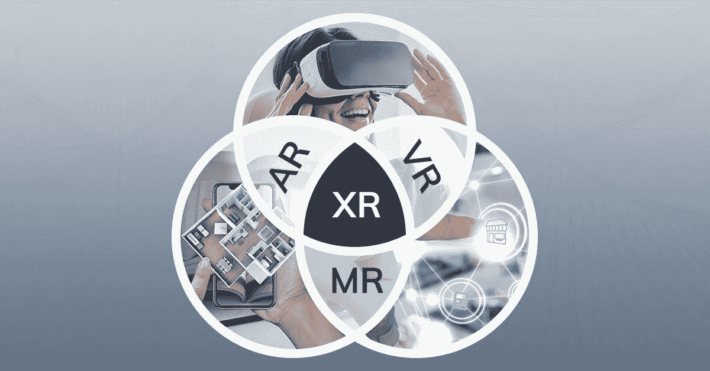
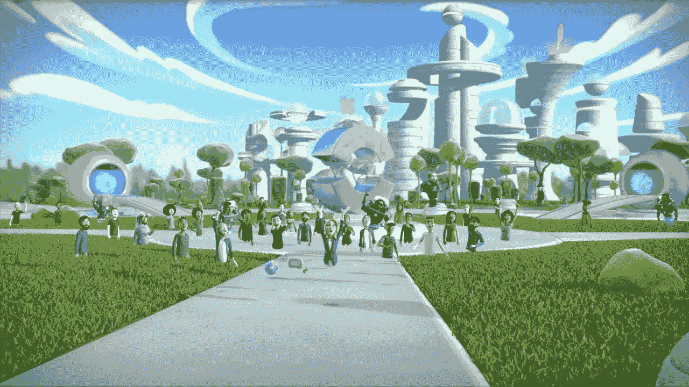
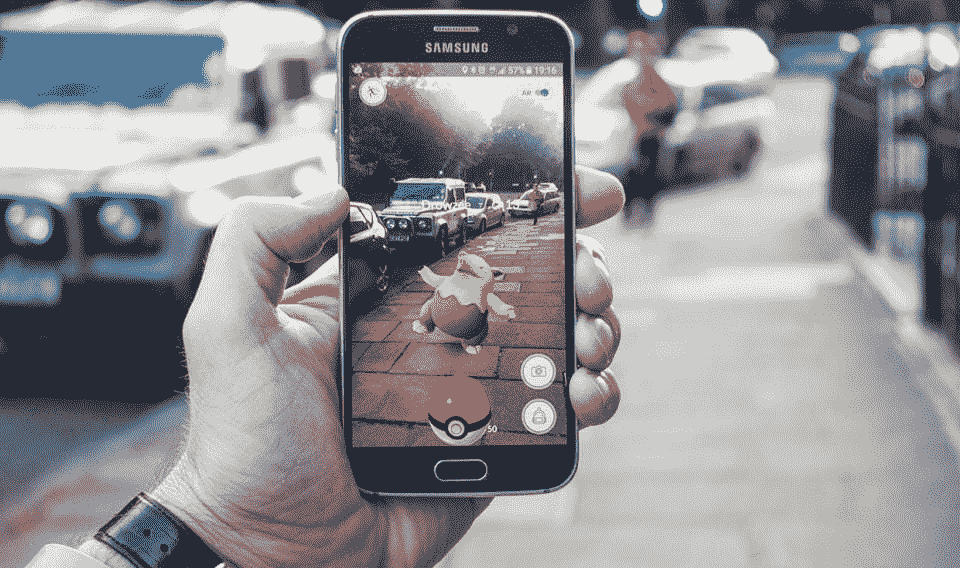
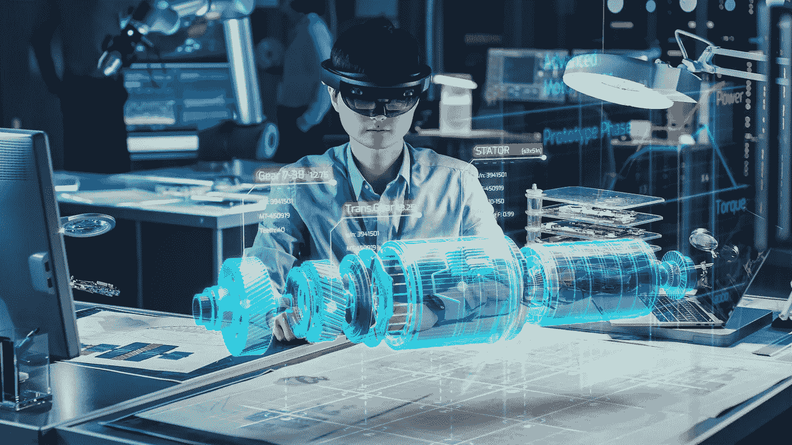
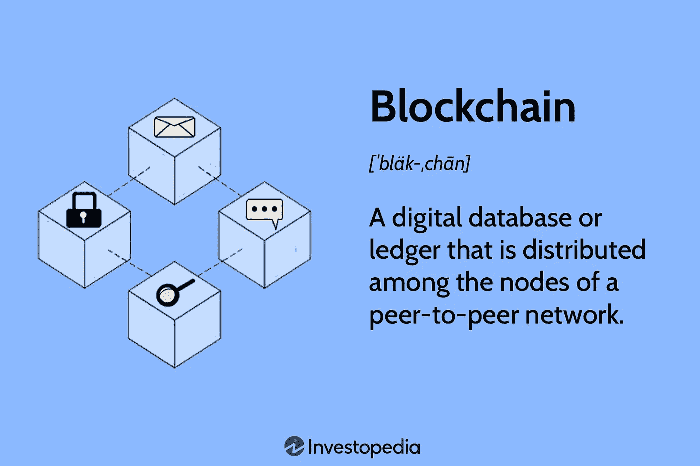
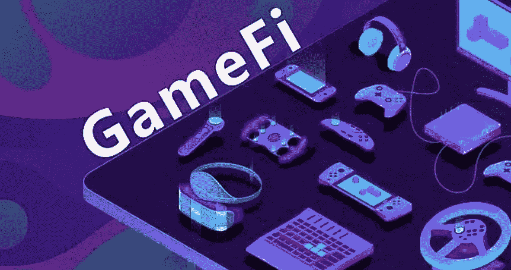

# 区块链技术如何融入扩展的虚拟体验；一个理想的 AR，VR 和元宇宙先生。

> 原文：<https://medium.com/coinmonks/how-blockchain-technology-can-be-seamed-into-extended-virtual-experiences-an-ideal-ar-vr-and-mr-e3dad3c014ff?source=collection_archive---------16----------------------->

毫无疑问，扩展现实(包括增强现实、虚拟现实和混合现实)正在席卷全球；我们可能拥有的元宇宙正在迅速发展，不可避免地接近现实生活的完全沉浸和虚拟化。但是，我们能断定这是明智之举吗？还是介于两者之间？嗯，答案是有也没有！

是的，因为它将彻底改变许多活动的执行方式，大大减少不请自来的费用，突破运输障碍。我的意思是，你不用花一毛钱来展示你的下一个大产品；只要让你的观众参与进来，剩下的就是历史了。

不，因为它会扰乱实际的物理互动；这对于深入联系至关重要(面对面的会议和活动往往更具参与性和“真实性”;你几乎不会真正地在虚拟世界中建立起一种深度联系)。

Image credits: [https://vrdirect.com](https://vrdirect.com)

> 我在这篇文章中的目的是发表我对区块链(web3.0)如何融入 XR 体验的看法。

# 理解扩展现实的概念

扩展现实(出于某种原因缩写为 XR；可能是为了让它看起来更好)，是除了物理体验之外的虚拟体验的总称，它提供了跨越各种感官(视觉、触觉、视觉，我们希望有一天能有嗅觉)的交互。

它被分为**虚拟现实(VR)** 、**增强现实(AR)** 和**混合现实(MR)** ，每一种都有细微的差异，稍后将进行讨论。

请注意，头盔或耳机形式的特殊配件被佩戴来感知这些现实。

## 虚拟现实

虚拟现实需要一个人沉浸在或被带入一个模拟的(或计算机生成的)环境或世界；也就是说，有点像被放在一个梦想的世界里，在那里你是唯一真实的人(即使你在它的前提下有一个图形表示，就像 1999 年的《黑客帝国》电影所说的“残余的自我形象”)。

在最近的大多数应用中，都支持点对点虚拟现实体验，使多个用户能够从不同的位置共享相同的虚拟体验，如 2018 年热门科幻电影[***Ready Player One***](https://en.wikipedia.org/wiki/Ready_Player_One_(film))中所见。

Image credits: [https://modemworld.me](https://modemworld.me)

你可以沉浸其中的世界看起来就像上图中的卡通一样；虚拟世界大多有非常丰富，令人上瘾和有趣的图形内容。

所以，VR 的概念很简单；用户沉浸在模拟中。

> PS:虚拟现实的感觉不能施加在你的身体上(可能还没有)。

要获得这个概念的详细解释，请访问[这篇文章](https://en.wikipedia.org/wiki/Virtual_reality)。但是不要马上离开:)即使你离开了，也一定要回来🙂

## 增强现实

增强现实的概念是反过来的，但是…有一个问题；人们无法与大自然互动。增强现实需要将虚拟组件或修改投射到一个人的物理世界中。上次你使用 Snapchat 滤镜的时候，你可能甚至不知道自己有过 AR 体验。正如你一定已经观察到的，真实世界(与你的脸、衣服等有关)被修改了；视觉效果或角色被投射到现实世界中。大多数时候，不需要特殊的头饰；只需你的智能手机就能完成这项工作。它通常涉及两种方法:建设性的(添加到自然环境中)或破坏性的(掩盖自然环境)。

Image credits: [https://fi.edu](https://fi.edu): Man looking at an AR toon character via a smartphone

需要注意的重要一点是，与 VR 和 MR(有待讨论)不同，用户或实体无法在 AR 体验中与视觉组件进行交互。

## 混合现实

增强现实和混合现实之间的差别非常小，大多数人通常会混淆两者，或者在不知道的情况下互换使用。AR 和 MR 的主要区别是交叉交互。物理组件可以与虚拟组件交互。典型的例子可以在科幻电影中看到， [***【钢铁侠】***](https://en.wikipedia.org/wiki/Iron_Man) 。

Image credits: [https://roboticsbusinessreview.com](https://roboticsbusinessreview.com)

> 混合现实还处于早期，势必会迎来终极的 XR 革命。

这些概念在科学、工程、教育、营销、会议和通信等领域发挥着重要作用，并且正在取得许多进步。

大型科技公司现在对 XR 的应用非常感兴趣，特别是 [Meta](https://en.wikipedia.org/wiki/Meta_Platforms) 和[微软](https://www.microsoft.com/en-us/mesh)。

现在已经明确了扩展现实的概念，让我们深入到事物的区块链方面。

区块链技术可以在 XR 的进步中发挥什么作用？或者更明确地说，区块链技术可以通过什么方式融入 XR？我们离找到答案只有几步之遥。简单的朋友…我知道你已经很好奇了，我也明白为什么。

如果你不熟悉“区块链”的概念，它是一个分散的 P2P 计算机网络，称为节点，它们在一个受监管的安全环境中共同工作，为交易提供基础设施，在一个分布式和不可逆的链(分类账)上索引。这样，没有一个中央政党或机构能够像中央银行那样控制或监管网络上的进程。区块链毫无疑问是未来，目前还处于早期阶段。要了解更多信息，请点击 IBM 的链接。

Image credits: [https://investopedia.com](https://investopedia.com)

我想很快提一个问题。想象一下，如果你能在虚拟世界中完成一项交易，并且它真的发生在现实生活中。

比方说，你想给某人转账 500 美元的比特币，你连接耳机，进入一个门口，你看到一扇门，门上有代表你钱包的密码，你走进去，然后你可以看到你所有的代币。然后通过钱包或类似的方式发送，通过一些交互，你就可以在虚拟世界中完成交易。很神奇吧。

# 区块链在 XR 中的合理应用

在这一部分，我会尽可能给出更多的建议，同时尽可能不支持或谈论任何项目或风险；我不给理财建议:)。

## GameFi & NFTs

Image credits: Bixin on Medium

最近几个月，NFTs 和 GameFi 的概念已经无处不在，尤其是在 Twitter 上，在 NFT 收藏品的推动下，已经开发了几款游戏。少数几个经受住了时间的考验，而其他人早已沉沦。处理 NFT 的主要挑战是不太合理的效用，或者在大多数情况下，是不必要的(或不相关的)效用。许多项目将 NFTs 限制在 PFP 和艺术展示上(这在某种程度上是不错的，但不应该被认为是可行的投资；如果你只是因为热爱艺术而想拿着它们，那就只买这样的东西。

但是，如果你有一个身临其境的游戏市场，其中列出的收藏品是 NFT，你可以在虚拟环境中展示它们，甚至在游戏场景中探索其他令人惊叹的 NFT，这可能会产生改变游戏的效果。如果有身临其境的现实支持，P2P 和 P2E 游戏可以在另一个层面上。

## 挑战

Image credits: RiveX on Medium

正如我在上一节中提到的钱包交易服务，在区块链的 DeFi 领域有大量的想法和资源可供探索。想象一下，能够创建一个虚拟的存在(如展位、结构等)，其中区块链上的几个生态系统项目有一个虚拟的地块，并且您能够使用 XR 耳机与它们进行交互，以交易资产、入股资产、参与拍卖、ico、参与治理轮次以及使用个性化化身进行更多操作。这将是一种非常迷人的体验，因为你可以实际上拥有一个进入区块链的有形入口，而不是使用按钮点击和有限的感官范围，我相信这将大大促进这项技术在全球的采用。

## 教育

Image credits: [https://guardian.ng](https://guardian.ng)

很多人不明白区块链技术是如何工作的，不是因为他们必然是哑巴，而是因为这些概念很难用外行的术语(或简单的语言)解释。XR 可以应用于以交互方式提供区块链网络(节点、共识和所有概念)的模拟，在这里他们将能够更容易地熟悉这些概念。

## 社区参与和营销

Image credits: https://neilpatel.com

想象一下这样一种情况，人们可以推广他们的项目，并与社区中与他们项目相关的其他成员建立联系。通过 AMAs，会议，公告大厅。通过使用聊天机器人插件，信息传递也可以变得更加流畅，有了视觉机器人，用户可以从它们那里请求信息，如资产价格、社交链接等。广告可以通过 AR 或 MR 制作。

XR 最吸引人的地方是它所附带的“真实”。

# 摘要和脚注

我希望你喜欢阅读我的诚实的意见。如果你喜欢，可以在 Twitter 上用 [@Eottoho](https://twitter.com/EOttoho) 关注我。干杯法国人💚

谢谢你的来访😎。

> 交易新手？试试[密码交易机器人](/coinmonks/crypto-trading-bot-c2ffce8acb2a)或者[复制交易](/coinmonks/top-10-crypto-copy-trading-platforms-for-beginners-d0c37c7d698c)