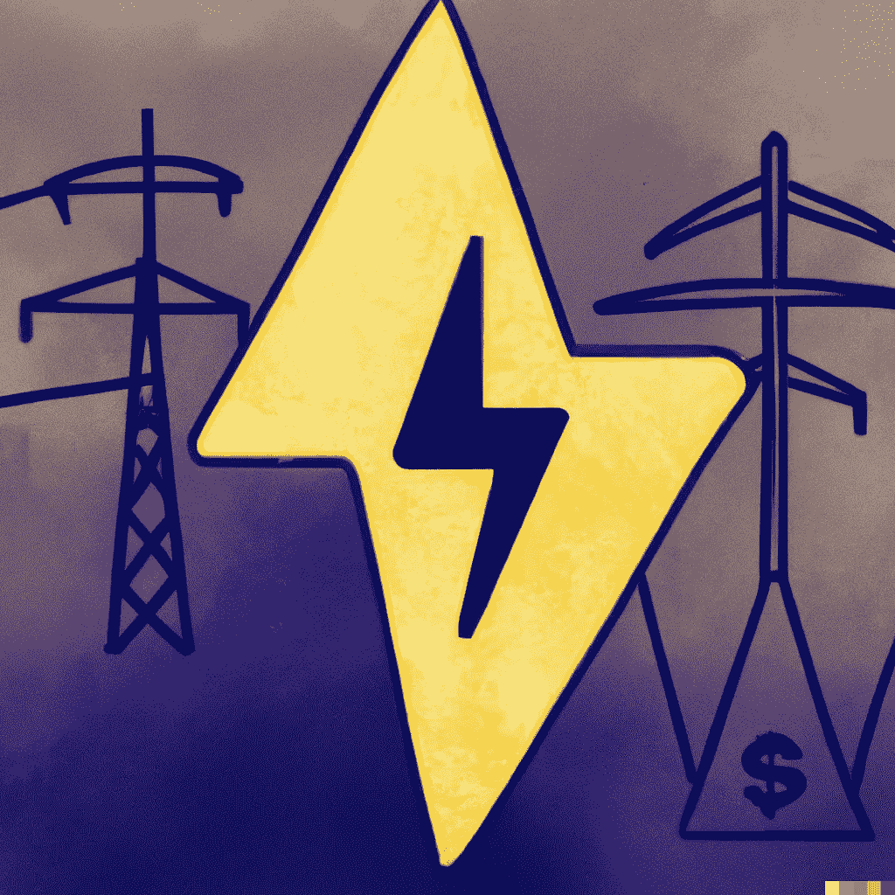
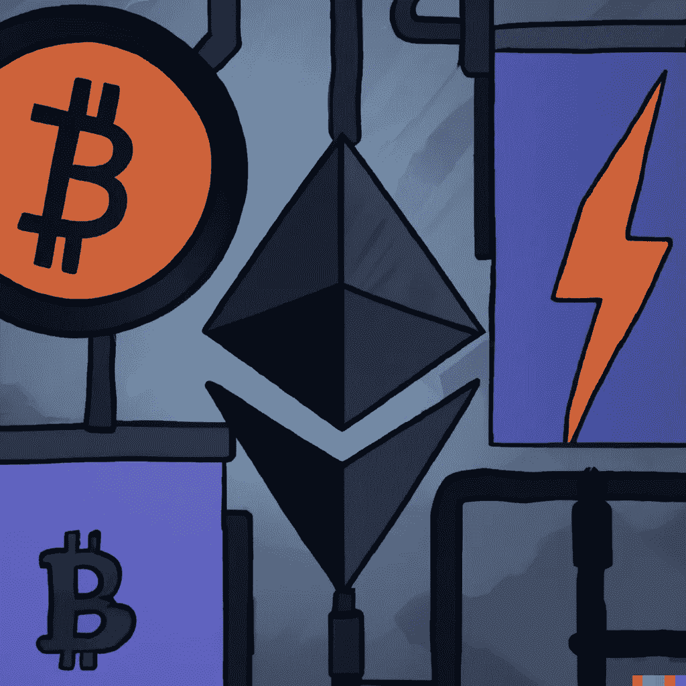
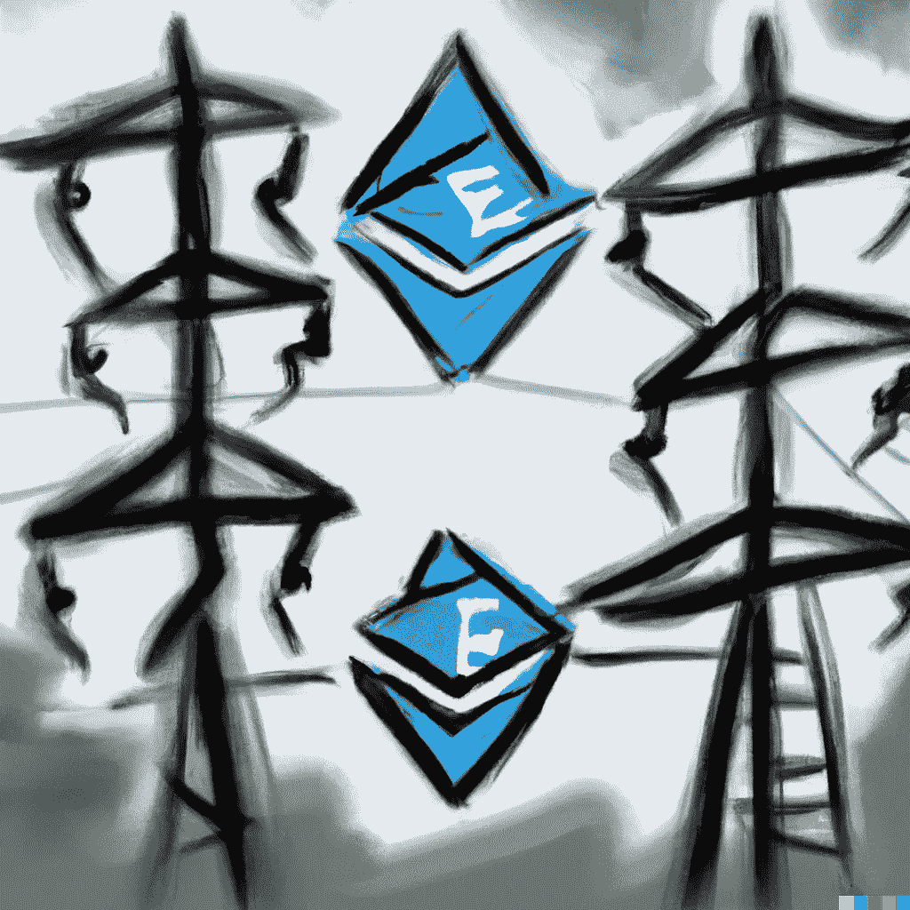

# 区块链技术如何惠及能源行业

> 原文：<https://medium.com/coinmonks/how-blockchain-technology-can-benefit-the-energy-sector-3879883ad98b?source=collection_archive---------44----------------------->

能源部门面临去碳化和去中心化的压力。区块链技术可以在帮助能源行业应对这些挑战方面发挥重要作用。

*区块链*是一个分布式数据库，允许安全、透明和防篡改的交易。这使得它非常适合用于需要安全、分散和透明的能源交易的能源部门。

区块链技术对能源公司有很多优势，包括创造新的商业模式，提高效率和降低成本。然而，一些挑战与在能源部门实施区块链技术有关。

尽管面临这些挑战，区块链技术对能源行业的未来仍有巨大的潜力。凭借其实现安全、分散和透明的能源交易的能力，区块链可以帮助能源部门实现脱碳和分散化目标。

**区块链如何惠及能源行业**

在能源领域使用区块链技术有可能为能源公司和消费者带来诸多好处。对于能源公司来说，区块链提供了一种安全透明地跟踪能源消耗和生产的方法。这些数据可用于提高效率和优化运营。此外，区块链通过提供防篡改的交易记录，有助于降低欺诈和腐败的风险。

对于消费者来说，区块链技术可以提高能源市场的透明度，让他们对自己的能源消耗做出更明智的选择。此外，基于区块链的应用程序有可能使消费者直接将可再生能源产生的多余电力销售回电网。

**区块链技术对能源公司的挑战**

然而，在能源部门实施区块链技术面临着几个挑战。一个挑战是许多现有的能源基础设施系统与区块链技术不兼容。另一个挑战是，目前对区块链能源部门的应用没有监管框架。最后，有人担心区块链技术的可扩展性，因为它需要能够处理全球能源市场产生的大量数据。

能源公司在实施区块链技术时面临的主要挑战是缺乏理解和知识。许多能源高管不熟悉区块链或其运作方式，因此很难就其实施做出明智的决定。此外，区块链行业缺乏标准化，这使得能源公司难以比较不同的解决方案并选择最适合其需求的解决方案。此外，区块链技术仍处于早期发展阶段，其长期可行性还有许多未知因素。例如，目前还不清楚区块链技术未来的可扩展性如何，以及它是否能处理大量的交易。

尽管面临这些挑战，区块链技术仍具有革新能源领域的巨大潜力。特别是，区块链可以创造新的商业模式，增加能源市场的竞争。最终，这可能会导致更低的消费价格和更可持续和更有效的能源系统。

**区块链技术给能源消费者带来的好处**

虽然在能源公司广泛采用区块链技术之前需要解决一些挑战，但对能源消费者来说也有一些潜在的好处。一个好处是，区块链可以实现点对点(P2P)能源交易，允许消费者将他们生产的多余可再生能源出售给电网。这将创造一个更加分散和民主化的能源系统，消费者可以更好地控制他们的电力消耗。此外，基于区块链的智能合约可以自动管理不同方之间复杂的计费安排，例如涉及分时定价或需求收费的安排。这可以提高计费过程的效率，降低出错或欺诈的风险。

**区块链技术在能源领域的潜力**

区块链技术在能源领域的前景是光明的。区块链有可能彻底改变能源的生产、分配和消费方式。例如，区块链可以实现点对点(P2P)能源交易，允许消费者将多余的太阳能直接出售给其他消费者。这将创造一个更高效、更分散的能源市场。

此外，区块链可以为太阳能电池板或电池等能源资产创建数字身份。随着时间的推移，这些数字身份将有助于跟踪这些资产的所有权和性能。这将提高透明度，减少能源行业的欺诈行为。

最后，区块链可以帮助公用事业公司管理智能电表和其他连接到电网的设备产生的越来越多的数据。公用事业公司可以使用区块链以安全和防篡改的方式存储和共享数据。这将使他们更好地理解消费模式，并识别潜在的电网问题。

**结论**

能源行业面临着去碳化和提高效率的压力。区块链技术有可能通过提高透明度、安全性和效率来帮助能源公司实现这些目标。然而，区块链技术也给能源公司带来了挑战，例如对新基础设施的需求和数据泄露的风险。区块链技术在能源领域的未来将取决于如何应对这些挑战。

> 加入 Coinmonks [电报频道](https://t.me/coincodecap)和 [Youtube 频道](https://www.youtube.com/c/coinmonks/videos)了解加密交易和投资

# 另外，阅读

*   [分散交易所](https://coincodecap.com/what-are-decentralized-exchanges) | [比特 FIP](https://coincodecap.com/bitbns-fip)
*   [用信用卡购买密码的 10 个最佳地点](https://coincodecap.com/buy-crypto-with-credit-card)
*   [加拿大最佳加密交易机器人](https://coincodecap.com/5-best-crypto-trading-bots-in-canada) | [Bybit vs 币安](https://coincodecap.com/bybit-binance-moonxbt)
*   [阿联酋 5 大最佳加密交易所](https://coincodecap.com/best-crypto-exchanges-in-uae) | [SimpleSwap 评论](https://coincodecap.com/simpleswap-review)
*   购买 Dogecoin 的 7 种最佳方式 | [ZebPay 评论](https://coincodecap.com/zebpay-review)