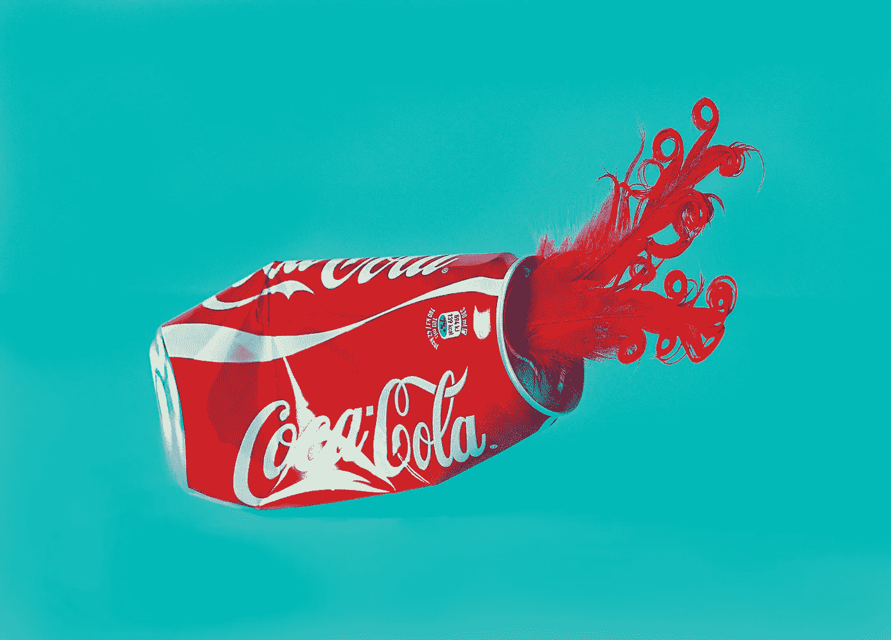

# 品牌如何使用 NFT

> 原文：<https://medium.com/coinmonks/how-brands-are-using-nfts-14cf3389dd0b?source=collection_archive---------1----------------------->

Photo by Monica Silva on Unsplash

各大品牌都加入了 NFT 热潮。

《时代》杂志的 NFT 战略始于一年前，该品牌已经带来了超过 1000 万美元的收入，另外还有 60 万美元用于慈善事业。

可口可乐[的第一批 NFT](https://www.coca-colacompany.com/news/coca-cola-nft-auction-fetches-more-than-575000)售价超过 57.5 万美元。

据报道，耐克在 NFT 的销售额为 1.85 亿美元，杜嘉班纳为 2560 万美元。