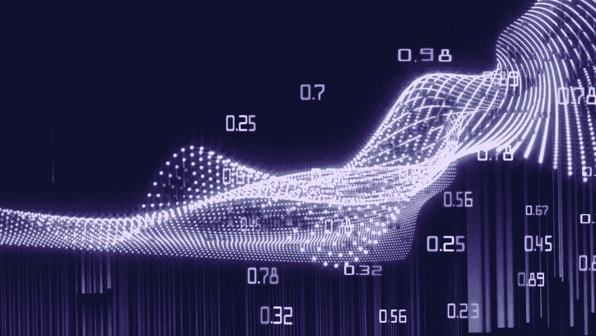
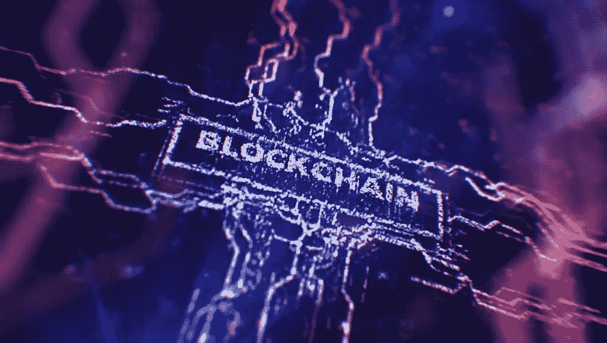
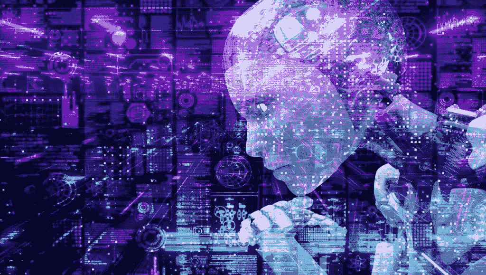

# 数据分析和机器学习如何帮助区块链解决方案？

> 原文：<https://medium.com/coinmonks/how-can-data-analytics-and-machine-learning-help-blockchain-solutions-2ffd99dfe74a?source=collection_archive---------36----------------------->

# 数据分析和机器学习

 [## 数据分析|机器学习|区块链- KOOP360

### 在本文中，了解数据分析和机器学习如何帮助区块链解决方案？

koop360.com](https://koop360.com/blog/data-analytics-and-machine-learning/) 

> 第一版区块链专注于基本功能和加密货币或金融科技的使用。相比之下，第二代以基于代码的支付系统的形式纳入了应用逻辑，以扩大其效用。第三代侧重于可伸缩性、互操作性，并开发合适的用户界面来与已建立的公司系统竞争。我们现在着眼于第 4.0 代，强调跨行业的接受，并使企业区块链在现实世界的业务中更加实用。

这就提出了一个问题，如何为这些区块链应用提供更多价值，以满足企业用户的期望。随着使用量的增长，事务的数量也在迅速增加，这导致了一个全新的信息数据湖。利用这个带有时间戳的数据池对于像 DA 和 ML 这样的技术来说具有巨大的潜力。作为在[甲骨文](https://www.oracle.com/in/)实习的一部分，我们调查了这些技术融合的前景。

# 通过数据分析和机器学习增强的区块链

[区块链](https://koop360.com/blog/what-is-blockchain/)已经发展成为一种技术推动者，成为越来越多商业活动的支柱。因此，虽然每个领域的侧重点可能有所不同，但企业区块链应用采用 DA 和 ML 来创造额外的商业价值。DA 可以通过将带有时间戳的数据可视化为实时时间线、库存热图、产品信息图表、[供应链](https://koop360.com/blog/supply-chain-with-blockchain/)连接以及其他图表和统计数据来增强区块链。这些可视化使区块链分类账上的信息更容易解读，也更全面。

另一方面，一旦为训练和预测 ML 模型收集了所有数据，就可以在以后使用 ML。它可以帮助发现有趣的模式、预测未来事件、检测异常和数据聚类。在未来，ML 甚至可以帮助改进智能合同代码的生产和最佳实践的应用。尽管这些技术有潜力相互补充，但它们仍处于早期阶段。甲骨文已经为其区块链产品添加了一项特殊功能来实现数据自动化:分类账信息和区块链运营记录被传输到甲骨文区块链平台丰富的历史数据库。

# 有前途的行业和用例

***区块链应用可以用几个行业的机器学习、人工智能、DA 来增强。我们将在此列出其中一些。***

# 医疗保健:

区块链网络可以帮助医疗服务提供者(例如，医学实验室和需要访问患者测试结果的外部专家)之间的安全和患者授权的数据流动。患者可以允许访问他们的医疗文件，而临床医生可以通过区块链安全地共享医疗结果。

在这种情况下，区块链的主要优势是管理、完全可见性、身份和安全性。DA 用于可视化数据，并显示每个医院/诊所的患者和医生分组。统计、异常和参考线提高了数据的可视化。例如，曼梯·里可以预测医院/诊所的占用率，这在新冠肺炎·疫情期间是一个有趣的前景。

# 企业融资:

区块链也进入了[的金融领域](https://koop360.com/blog/how-metaverse-is-transforming-industries/)。它能够在不同公司和业务单位之间安全地处理和核对账单。区块链提供了这些发票的全面视图以及完全的可追溯性。ML 可以实时评估带有时间戳的数据，以发现异常情况，并确定发票被拒绝或走了相当长的付款路线的原因。DA 可用于实时可视化数据，使用热图和桑基图来描述流量。

使用 Oracle Analytics 时，可以使用 AI/ML 生成数据的自然语言解释。这可以加速这个过程，揭示为什么特定的法案比其他法案更频繁地被拒绝，并消除低效率。

# 供应链:

区块链可以帮助开发可靠的供应链。这确保了企业和消费者的产品真实性。区块链加速了这一过程，实现了基于不可逆数据的实时跟踪，并提供了多级分销链的全面视角。DA 有助于在不变的供应链时间表中可视化带有时间戳的数据，甚至可以通过客户可以扫描的 QR 码在最终产品上查看这些数据。

客户可以查看不同供应商的产品构成和端到端采购，验证可持续发展声明，深入了解回收内容来源，等等。这不仅有利于可持续发展管理，因为客户和企业确信产品实际上是可持续的。

这也有助于零售商增加业务，因为案例研究表明，当客户能够访问这些数据时，他们更有可能从这些零售商那里购买。ML 还可以帮助优化供应链路线和预测可能的瓶颈或中断。

**结论**

我们觉得在区块链应用中加入 ML 和 DA 可以增加更多的价值，尤其是在我们迈向区块链 4.0 的时候。由于区块链在公司流程方面的颠覆性潜力，建议企业在使用这些技术增强区块链应用程序之前，首先了解区块链理念。

非功能性测试是区块链技术的重要组成部分，可以称之为其主干。NFT 是城里最热门的东西，有许多市场，你可以在那里买卖它们。如果你也想尝试 NFTs，你可以使用 [Koop360](https://koop360.com/) 。该软件为 NFT 生成 NFT 硬币或数字艺术品提供了一个很好的设置。它是一个用于开发 NFTs 的动态、开源和用户友好的框架。

> 交易新手？试试[密码交易机器人](/coinmonks/crypto-trading-bot-c2ffce8acb2a)或[复制交易](/coinmonks/top-10-crypto-copy-trading-platforms-for-beginners-d0c37c7d698c)