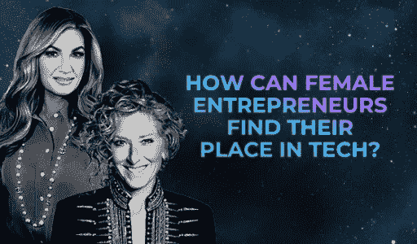

# 女性企业家如何在科技领域找到自己的位置？

> 原文：<https://medium.com/coinmonks/how-can-female-entrepreneurs-find-their-place-in-tech-f95576f05678?source=collection_archive---------25----------------------->

科技行业存在性别差距。据《哈佛商业评论》报道，在美国，女性仅占计算机和数学科学职位的 26%;15%的工程角色；而且只有 24%的技术职位，尽管包容性和多样性项目现在在公司中很普遍。

2019 年[科技行业女性](https://www.womenintech.co.uk/women-technology-survey-2019)调查发现了该行业的性别薪酬差距——60%的女性同意男性在科技行业的薪酬更高，而只有 8%的女性认为女性通常能获得同等的薪酬。由 [Tech Nation](https://technation.io/insights/diversity-and-inclusion-in-uk-tech-companies/#:~:text=When%20it%20comes%20to%20gender%2C%2077%25%20of%20tech%20director%20roles,%2C%20and%2029%25%20are%20women.) 在 2021 年发布的一份关注英国公司的报告显示，77%的技术总监由男性担任，而只有 19%的技术人员是女性。

这是一个系统性问题，显然需要整个行业来解决:公司需要更加努力地吸引女性担任高层职位，并在女性职业生涯的早期阶段为她们提供技能学习和教育，以便她们能够更快地晋升。但在这里，我们想采取一种更个人化的方法——利用两位杰出女性企业家的智慧来看看女性如何在科技领域找到自己的位置。

# 女性企业家的榜样有多重要？

卡伦·布雷迪 CBE 是一名企业家；上议院议员；西汉姆联队副主席。；她因在广受欢迎的英国电视节目《学徒》中扮演的角色而闻名。凯莉·赫本 CBE 是全球知名的室内设计师；企业家；九本书的作者；也是几部电视剧的明星，包括[龙穴](https://startups.co.uk/dragons-den/kelly-hoppen-mbe/)和[与凯莉·赫本的《超级内饰》](https://www.imdb.com/title/tt2065591/)。

他们都很年轻就开始工作，大约 16 岁。在#LEAP22，他们和 Andrew Bloch(Andrew Bloch & Associates 的创始人)一起走上舞台，问他们是如何开始职业生涯的，是什么激励他们达到如此高的高度。

“我年轻时有一个抱负，”布雷迪说，“那就是独立。”

“我想控制自己的生活，”她继续说道，“我想独立，我想自己做决定。我知道只有当你有了自己的钱，真正的独立才会到来。”

对 Hoppen 来说，是一种强烈的渴望激励着她去创造属于自己的东西。“我不适合学校，”她说，“所以当我有机会真正做这份微不足道的工作时，我在 16 岁半就意识到我想创业。我完全无所畏惧，我认为当你那么年轻的时候，你不会想到所有可能出错的事情。”

这是很重要的一点:在科技领域(或任何领域)取得成功，真的需要勇气去尝试，实验，甚至在失败后继续前进。你不必生来就无所畏惧(正如我们从朱利安·皮斯顿那里学到的一样，勇气是一种习得的技能),但对任何人来说——尤其是女性——要在科技领域开创事业，你必须能够拥抱逆境。

2022 年伦敦科技周的[研究](https://www.electronicspecifier.com/news/women-in-tech/iwd-women-in-tech-survey-to-breakthebias)显示，这种困境的部分原因是缺乏榜样——57%的女性认为这是科技的障碍。Hoppen 和 Brady 都在男性主导的行业建立了事业和企业，当他们开始时，没有明确的女性领导者让他们渴望成为那样的人。相反，他们自己的独立意识和证明自己的愿望激励着他们继续前进。

布雷迪说:“我选择了非常男性主导的环境。没有比英超联赛更由男性主导的了，我在那里度过了 30 年的职业生涯；还有政治，还有新闻。所以我没有任何真正的榜样，但我有一种真正的自我意识。我有一种真正的野心、欲望和激情。我很有勇气。”

“我从未想过要成为一名女性，”Hoppen 指出。“我在商界工作过，知道自己很优秀，我能做到，并继续做到，让人们对我的工作感到满意。”

# 当你走的时候，提升别人，了解你的核心价值观

由于没有什么榜样可以效仿，女性科技企业家几乎一开始工作就有可能影响其他女性。她在那里，做技术工作或设计产品，这一事实可以作为其他人的灵感。

布雷迪分享了她小时候祖母经常告诉她的话:“除非你在帮助别人，否则永远不要瞧不起他们。”

这是她整个职业生涯的框架。现在，作为他人的榜样，她想向女性展示“有事业和家庭是可能的，有勇气、有决心、抑制不住、有你的正直是可能的，用价值连城的伟大文化领导伟大的企业；但它的核心仍然是尊重、善良、雄心和正直。”

两位企业家还强调了他们的核心价值观有多重要——不仅是指导他们的个人生活，也是塑造他们的经营方式。发表在《国际企业家行为杂志》上的一项 2016 年研究发现，核心价值观(或“深刻的信念”)在企业家的工作方式中发挥着重要作用——支撑着他们的决策以及他们对商业和生活的看法。

该研究发现，特定的价值观(包括独立性和雄心壮志)与企业家行为之间存在密切联系。但它也发现，社会因素会影响一个人是否认为自己能够表达创业行为——例如，与农村地区相比，雄心勃勃在城市地区更被接受。

对于女性创业者来说，理解你的一些创业价值观可能因为你是女性而不受他人欢迎是有益的；同样，你可能会感到压力，被迫接受对你来说并不真实的价值观，因为你在一个由男人创造并为男人服务的环境中工作。

任何企业家都应该搞清楚他们的核心价值观是什么。但对于在男性主导的行业工作的女性来说，核心价值观可以作为个人关键，帮助你回到自己的中心，保持稳定的自我和你想要实现的目标，并建立一个反映你对世界的使命感的企业。

“当人们害怕说自己有雄心时，我会很恼火，”布雷迪说，“因为雄心不是一个肮脏的字眼。是那种火花，是你内心的火在驱使你前进。”

拥抱你的雄心。确定你的核心价值观。知道你永远不会真正知道你有多好，直到你尝试一些事情。

您想获得每周技术独家新闻吗？订阅我们的时事通讯:【https://bit.ly/3AVCwoQv 

> 交易新手？试试[密码交易机器人](/coinmonks/crypto-trading-bot-c2ffce8acb2a)或[复制交易](/coinmonks/top-10-crypto-copy-trading-platforms-for-beginners-d0c37c7d698c)