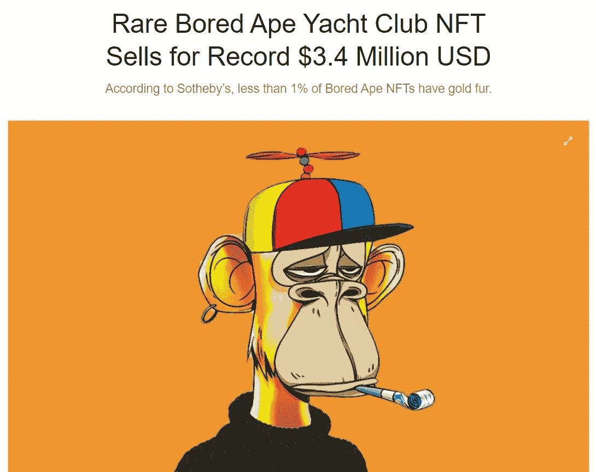

# NFT 怎么会这么值钱？

> 原文：<https://medium.com/coinmonks/how-can-nfts-be-so-valuable-a137d8289ab0?source=collection_archive---------3----------------------->

NFT 目前是密码世界中的锐舞。如果你还不知道，你可能想知道为什么，但是让我们先定义一下什么是 NFT，然后再解释为什么每个人都对它们如此着迷。

Source: [Hypebeast](https://hypebeast.com/2021/10/bored-ape-yacht-club-nft-3-4-million-record-sothebys-metaverse)

NFT 代表不可替代的代币。它的“可替代”部分可能有点难以理解，但可替代性意味着你可以复制某些东西。然而，NFT 是不可替代的，这意味着您不能复制它们，并且所有…