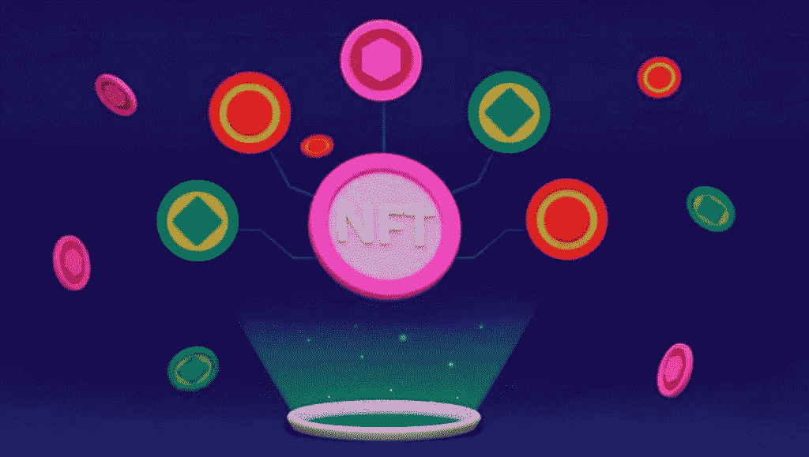
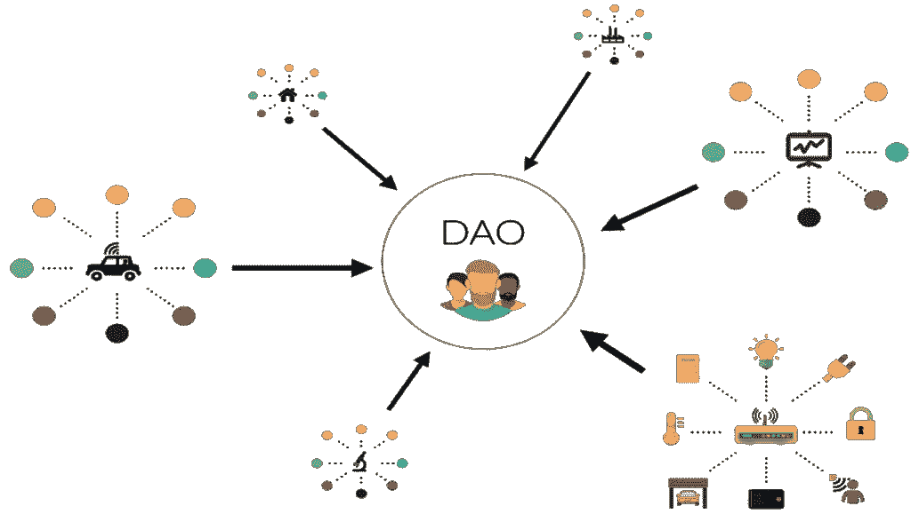

# 加密行业如何解决 DAO 操纵问题？

> 原文：<https://medium.com/coinmonks/how-can-the-crypto-industry-address-dao-manipulation-83d926e8c100?source=collection_archive---------48----------------------->

# 刀法

 [## 道操纵|加密货币|加密产业

### 加密行业如何解决 DAO 操纵问题？道的创造者必须公开讨论风险，并试图…

koop360.com](https://koop360.com/blog/dao-manipulation/) 

> 当“鲸鱼”——拥有最多钥匙的个体——最终拥有过多的影响力时，Dao 可能会遇到类似的问题。这是一个弱点，使得任何感觉受到 DAO 或整个系统威胁的人都有可能通过重大的、有针对性的投资来操纵它。以下是业内人士处理刀操作的 5 种方法。

分散式自治组织的优势在[密码](https://koop360.com/blog/crypto-regains-the-1-trillion-market-cap/)部门众所周知；它们是民主的、开放的，并由既定的协议管理。他们由参与者塑造和引导，而不是根据领导小组的突发奇想行事。不过，它们确实有一些固有的弱点。除了任何基于技术的过程对黑客的内在脆弱性，【道】在民主化方面的优势可能会对其产生不利影响。

# 公开讨论这个问题

一个[道](https://en.wikipedia.org/wiki/Decentralized_autonomous_organization#:~:text=A%20decentralized%20autonomous%20organization%20(DAO,influenced%20by%20a%20central%20government.)的创造者必须公开讨论风险，并与整个社区合作，试图找到解决方案。拥有应对挑战环境的策略至关重要。

然而，重要的是要记住，道越小，少数人对生态系统的控制就越大。

# 确保长期激励是一致的

精心设计并保持动态张力的激励系统是保证 [DAOs](https://en.wikipedia.org/wiki/Decentralized_autonomous_organization#:~:text=A%20decentralized%20autonomous%20organization%20(DAO,influenced%20by%20a%20central%20government.) 不受操纵的最有效方法。

最大的 DAO 比特币之所以成功，是因为尽管不同的用户类型(矿工、企业、客户等。)可能有不同的需求，他们都有一致的长期激励措施。

# 发行 NFT

发布不可实现的令牌是减少 DAO 操作危险的一种技术。 [DAOs](https://en.wikipedia.org/wiki/Decentralized_autonomous_organization#:~:text=A%20decentralized%20autonomous%20organization%20(DAO,influenced%20by%20a%20central%20government.) 可以通过向每个贡献者的钱包发送 NFT 来确认他们的唯一性。

与基于令牌的投票模式相反，NFT 分散可以改善权力下放，降低鲸鱼获得多数投票权的可能性。

# 其他刀手研究

[道](https://en.wikipedia.org/wiki/Decentralized_autonomous_organization#:~:text=A%20decentralized%20autonomous%20organization%20(DAO,influenced%20by%20a%20central%20government.)必须由个人以及**“行业演员】**巡逻和保护，而不仅仅是他们。对其他成员做一些调查，不要害怕揭露不诚实的人。在道中，每个人都应该被平等对待，只应该在该尊重的时候表现出尊重。

# 建立 KYC 或 KYB 进程

行业参与者可以通过强制持有者完成“了解你的客户/了解你的业务”流程来认证“道”成员的身份，从而降低一方操纵系统的能力。

**“了解你的”**流程确保参与者所投的票实际上是由大量不同的实体投出的，而不仅仅是由控制了匿名投票钱包的很大一部分的少数实体投出的。

**结论**

DAO 或分散自治组织基于区块链，通常由本地加密令牌控制。持有这种令牌的人能够就与道直接相关的重要事项进行表决。因此，这可能导致对道的操纵。

解决这个问题的一个方法是发布 NFT。[**koop 360**](https://koop360.com/)**为您提供，用户设计 NFTs。该平台是分散的和开源的。您可以使用该平台创建和销售您的 NFT 代币和数字艺术。社区驱动的平台是一个简单的即插即用系统。**

> **交易新手？试试[加密交易机器人](/coinmonks/crypto-trading-bot-c2ffce8acb2a)或者[复制交易](/coinmonks/top-10-crypto-copy-trading-platforms-for-beginners-d0c37c7d698c)**