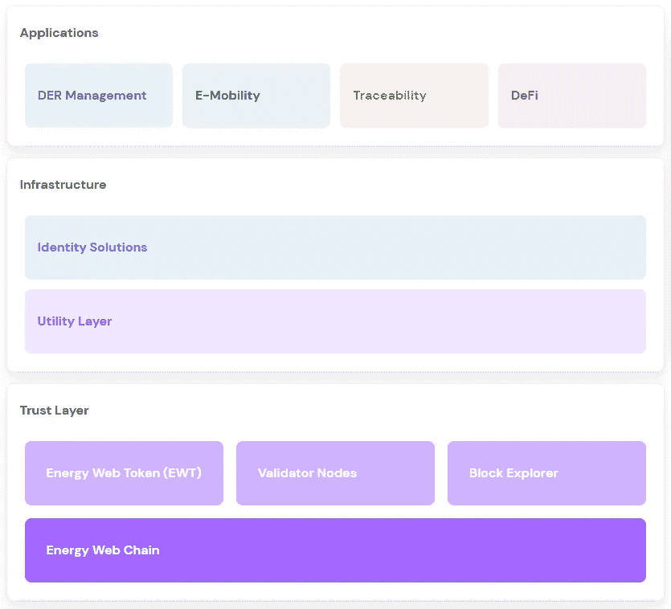
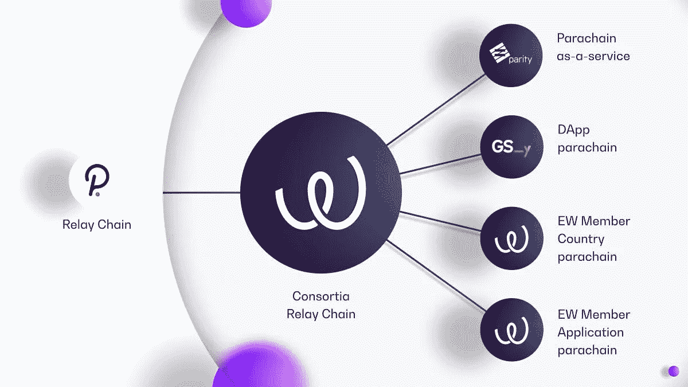

# 到 2030 年，能源网络令牌(EWT)如何进入 3 万亿美元的市场？

> 原文：<https://medium.com/coinmonks/how-can-this-crypto-project-tap-into-a-us-3-trillion-market-by-2030-c73b8f092f6?source=collection_archive---------11----------------------->

***免责声明:*** *本文提供的信息并非财务建议。您选择如何处理这些信息完全是您的责任。加密货币是不受监管且高度不稳定的资产，极有可能出现超过 100%的资本损失。*

***关注我上***[***Twitter***](https://twitter.com/observer_kel)**at**[**@ observer _ kel**](https://twitter.com/observer_kel)**，上**[***中***](https://keltheobserver.medium.com/) ***，并订阅我的免费子栈*** [***简讯***](https://substack.com/redirect/6451837a-7dc3-4f93-9724-47799f0dd647?u=23794576)

欧盟委员会关于区块链在能源领域的应用的专题报告展示了在能源网的分散化和稳定性方面应用该技术的用例。该报告讨论了包括区块链技术在内的工业 4.0 技术作为新工业格局推动者的作用。区块链技术可以帮助公共和私营部门与新能源范式的五项原则保持一致——去监管化、去碳化、去中心化、数字化和民主化。考虑到这一点，让我们讨论一个利用区块链技术帮助能源行业实现这些目标的前沿项目。

*能源网络基金会(EWF)*

EWF 是一家成立于 2017 年的非营利组织，利用其区块链基础设施推动低碳和可再生能源转型。该基金会于 2019 年推出了区块链——能源网络链(EWC)及其令牌，这是一个为能源部门的监管、运营和市场需求量身定制的企业级开源区块链。它还试图通过利用区块链技术公司提供的去中心化能力来促进电网去中心化。

*能源网链和能源网令牌*

EWC 生态系统由 100 多家公用事业公司、电网运营商、可再生能源开发商和企业能源买家组成，其中一些充当网络验证者。

EWC 生态系统合作伙伴包括著名的能源和基础设施公司，如 Centrica、Duke Energy、EDF、Engie、Equinor、通用电气、日立、Iberdrola、壳牌、道达尔等。

EWC 技术的核心是能源网络分散操作系统(EW-DOS)。这是一系列软件开发工具包(SDK ),用于构建与能源部门相关的应用程序。应用范围从能源市场到资产管理应用。EW-DOS 包括应用层、基础设施层和信任层。

应用层支持电网运营商和能源生产商部署分布式能源资源(DER)管理、电动汽车基础设施管理、能源来源和认证以及分散金融(DeFi)应用。DeFi 方面涵盖了现收现付解决方案和能源项目的众筹。

基础设施层包括身份解决方案和实用程序层。身份解决方案层支持能源网络生态系统的身份和访问管理(IAM)接口。身份解决方案层还包括一个分散标识符(DID)。DID 是一种数字的、可验证的身份，由用户生成，不与任何集中式机构相耦合，并识别分布式能源资源(如太阳能电池板、电池、电动汽车和智能电器)、个人或组织。EWC 上的用户、资产和组织可以将身份解决方案层集成到其应用程序的后端代码库中。

> 交易新手？试试[加密交易机器人](/coinmonks/crypto-trading-bot-c2ffce8acb2a)或者[复制交易](/coinmonks/top-10-crypto-copy-trading-platforms-for-beginners-d0c37c7d698c)

效用层有许多功能，包括但不限于:

分散式缓存 API —一个生产级 API 接口，用于从分散式存储(如 IPFS)和分散式分类帐中快速检索数据。

Enterprise Key Connect —一种实用程序，使企业员工能够使用 Azure AD 等成熟的身份提供商来访问 web3 应用程序中由 Azure Key Vault 等密钥管理系统提供的密钥存储。

瞭望塔生态系统——一个分散代理的生态系统，用于观察和测量能源网络软件即服务提供商和管理者提供的服务水平和质量。

最后，信任层包括能源网络令牌(EWT)、验证器节点、块浏览器和能源网络链。

EWT 是用于支付 EW-DOS 服务费用的能源网络链的本地公用令牌。验证器节点验证链上事务，并轮流创建新的块。Block Explorer 提供了关于能源网络链上的块、交易、帐户和令牌的链上信息。总体而言，能源网络链通过智能合同及其授权证明共识机制为 EW-DOS 和 DID 注册管理机构提供了信任机制。

**市场机会**

*机构关注可持续绿色数字资产*

技术和可持续发展正处于十字路口。至少像 BNY 梅隆和摩根士丹利这样的大型金融机构是这样认为的。对 ESG 投资和偏离叙事的财务影响的关注，让一些大投资者不敢涉足加密货币和区块链技术。毕马威(KPMG)、高盛(Goldman Sachs)、摩根大通(JP Morgan)、贝莱德(BlackRock)等大型机构不能再忽视数字资产类别，它们正感受到强烈的 FOMO。以太坊从工作证明(PoW)到利益证明(PoS)的转变据称将导致网络能耗降低 99%。这一举措让金融机构垂涎三尺，并可能引发对该资产的争夺，因为它现在将有利于环境、社会和治理。除了主导加密叙事的所有 DeFi、NFT、元宇宙和 GameFi 项目，还有一些项目可以对物理基础设施产生切实的影响。EWC 是一个可以激励和促进可再生能源发电、配电和消费的项目。

伦敦皇家学会为政策、教育和公众参与提供科学建议，并促进国际和全球合作。根据该学会的报告，有四个关键领域有助于确保数字主导的低碳转型。这些领域包括为净零构建可信的数据基础设施，优化数字碳足迹能力，建立数据支持的净零经济，以及设置研究和创新挑战以数字化净零过渡。EWC 及其基金会试图通过区块链技术和智能合同建立这种可信的数据基础设施，尽管这种基础设施是不可信的。

*迈向高效能源消耗的旅程包括数字资产*

根据国际能源署的数据，对开发能效相关技术的公司的早期投资增加了 7%，达到约 19 亿美元，为过去十年的新高。

与密码行业的数字相比，这个数字很小，但这个市场正在增长，并将在未来几年进一步呈指数增长。

这种增长的催化剂包括(但不限于):

1.  俄罗斯-乌克兰危机凸显了对能源独立的需求，这将来自核能、可再生能源和能效技术——进一步促进可再生能源的扩散/增长。
2.  家庭变得越来越智能，房主越来越多地使用能源管理软件和基础设施来监控他们的消费。
3.  发达经济体的国内分布式太阳能发电和储能技术继续大幅增长，将需要数字基础设施。
4.  非洲使用智能能源管理平台分散能源生产、储存和分配的时机已经成熟。
5.  电子移动技术和基础设施的使用越来越多，这就需要强大的记录保存和自动化，而智能合同和区块链可以提供这种功能。

全球去碳化之旅将产生一系列金融工具和产品，从可交易的碳证书到未来潜在的可交易的电力购买协议(PPAs)。EWC 将自己定位为一个平台，以促进这些金融工具和产品的交易，并有可能将其纳入几个区块链经济体的 DeFi 生态系统。例如，其能源网络联盟中继链与瑞士的 Parity Technologies 合作，将通过 Parity 的底层区块链框架实现 Polkadot parachains 即服务。

能源网络多链生态系统可以利用 DeFi 和其他区块链生态系统的其他应用中锁定的价值，以及这些生态系统中的车载能源和碳金融产品。EWC 甚至可能成为使比特币等工作证明(PoW)资产更加环保的途径，要么将资产纳入 EWC 生态系统，要么利用其应用程序套件为运行比特币节点提供可再生能源。

到 2030 年，可再生能源市场可能价值 1.9 万亿美元，全球碳市场可能价值 500 亿美元，全球能效设备市场可能达到 1.7 万亿美元。EWC 及其生态系统有能力进入这些市场。