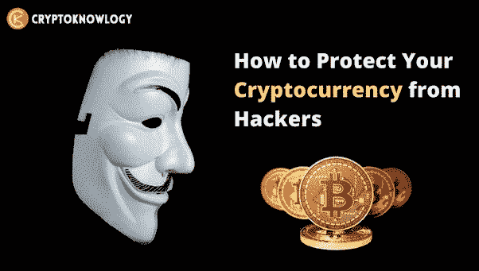
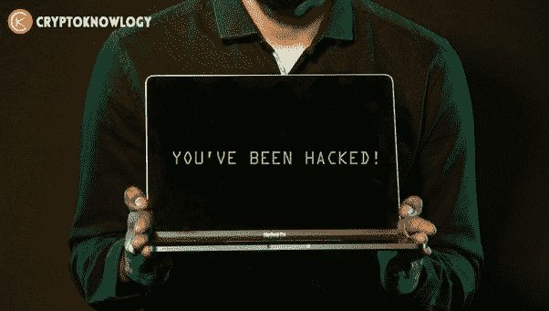
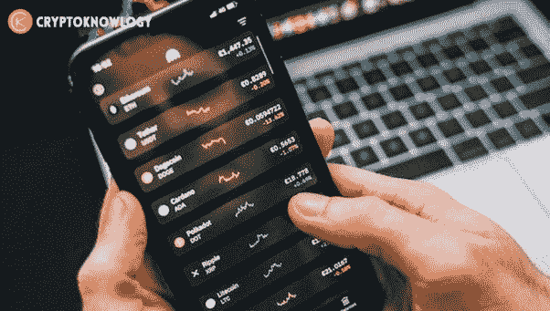

# 你如何保护你的比特币或加密货币免受黑客和小偷的攻击？

> 原文：<https://medium.com/coinmonks/how-can-you-keep-your-bitcoin-or-cryptocurrency-safe-from-hackers-and-thieves-6864178f3667?source=collection_archive---------33----------------------->

黑客喜欢窃取密码，因为它是分散的、私有的、不受审查的，而且如果我们被黑客攻击，没有银行或保险公司会出手相助。

黑客很容易拿走我们珍贵的硬币然后消失。

如果你认为它不会发生在你身上，但当它发生时，你会立即后悔。

Ledger hack 泄露了近 30 万美元的加密客户信息，如您的地址，姓名，电子邮件，电话号码等。

网络钓鱼攻击的数量和复杂性也越来越多。

你不能再依靠企业来保护你的信息和数据安全。

在这篇文章中，我将介绍保护加密货币免受黑客攻击的所有方法。

**密码:**

如果您正在设置一个 wallet exchange 帐户，请确保使用一个特别强的密码。与您或您周围的人无关的密码或日期。

你不知道现在的黑客工具有多复杂。黑客可以获得能够通过暴力攻击非常容易地破解密码的工具。

他们通常使用一个常用密码列表，这些密码很容易在黑网上买到，通常是来自众所周知的数据泄露的密码列表。

你的密码很有可能是数百万个密码中的一个，他们希望能幸运地击中你。

如果你想让你的密码更加安全，那么你需要为你所有不同的账户使用特别强和独特的密码。

**网络安全:**

在公共场所使用 VPN，这样他们就不会有被入侵的路由器窃取你的数据。

检查自己家的路由器，重置设置，设置非常安全的密码，不要随意转发端口。还要检查在过去的几天、几周或几个月里，是否有你不认识的设备的奇怪连接。

您也可以使用网络扫描仪。许多反病毒软件也包括这一点，它们会告诉您网络可能存在的所有漏洞。

**2FA 安全:**

您应该始终设置双因素身份验证。这包括您的 exchange 帐户、电子邮件、银行帐户，甚至社交媒体等。

我还会建议你使用基于电话的 2fa，而不是电子邮件的，以防你的电子邮件被泄露。你可以使用微软认证器、谷歌认证器或 Authy 等认证器应用。

然而，您应该避免的一种基于电话的双因素身份验证方法是基于 SMS 的方法。这是因为一种非常常见的攻击媒介，称为 Sim 交换。

基本上，这是当黑客能够通过你的电话或网络提供商获得你的电话号码时，他们欺骗他们将号码转移到他们控制的电话上，然后他们可以使用这个来更改你的所有密码，获得对你的电子邮件的访问权，最终获得你的密码。

这种事情已经发生了太多次，数都数不清，有些人已经偷了一亿多美元。

所以不要使用基于短信的认证，不值得冒这个险，用一个认证应用来代替。

**网页浏览器安全:**

不要像 Chrome 一样在你的浏览器中保存密码，因为如果黑客黑了你的帐户，他们可以很容易地访问你的浏览器。

恶意的浏览器扩展-非常小心你下载和使用的浏览器扩展。

标记重要的网站，尤其是加密网站，这样你就不会被看起来和真实网站非常相似的虚假网站所欺骗。

欲知详情，请访问****。****

> **交易新手？尝试[加密交易机器人](/coinmonks/crypto-trading-bot-c2ffce8acb2a)或[复制交易](/coinmonks/top-10-crypto-copy-trading-platforms-for-beginners-d0c37c7d698c)**