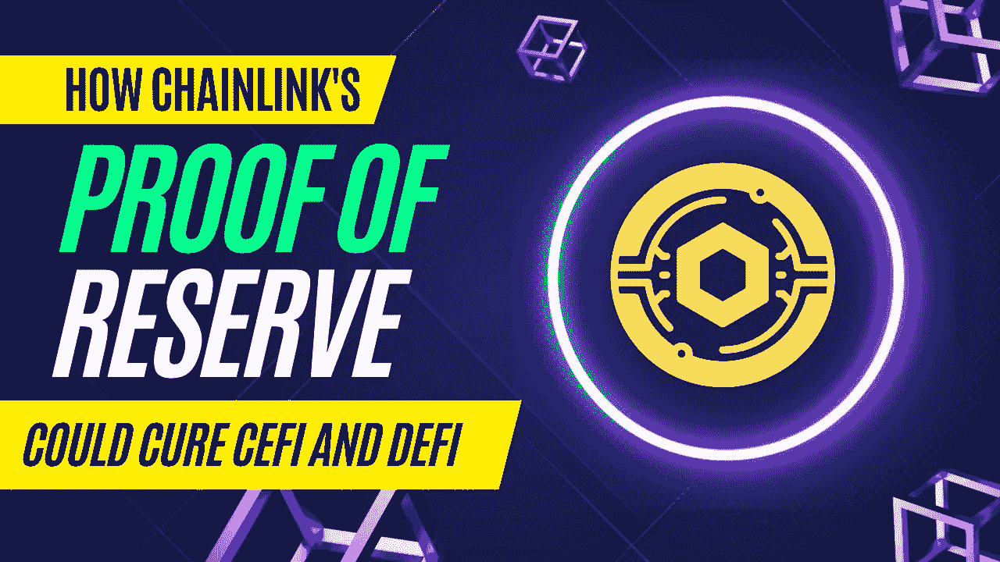

# Chainlink 如何防止像 FTX 这样的 CeFi 灾难

> 原文：<https://medium.com/coinmonks/how-chainlink-can-prevent-cefi-catastrophes-like-ftx-6fd5f66ef52c?source=collection_archive---------3----------------------->

|了解准备金证明如何使链内和链外流动性对账中的异常正常化

我的信用卡有一个功能，当我的信用余额，呃，有点失控的时候会提醒我。我要么忽略它，要么在它真正变得疯狂之前采取措施减少平衡。