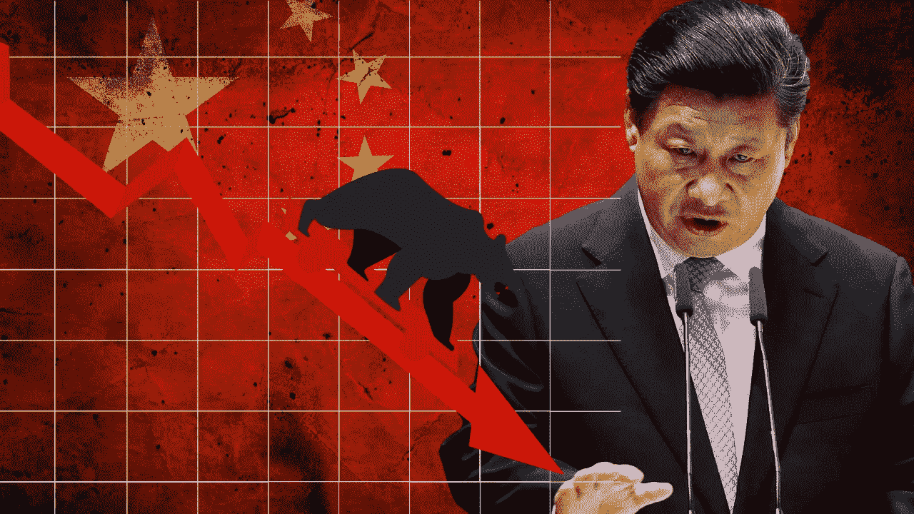

# 中国的崩溃如何影响加密市场

> 原文：<https://medium.com/coinmonks/how-chinas-collapse-affects-the-crypto-market-19fe9ccb5941?source=collection_archive---------8----------------------->

China is struggling with their real estate market. What happens to crypto if that bubble pops?

随着**美国**经历**历史性通货膨胀**、**欧洲**经历**能源危机**和一场疯狂的**战争**和**中国**处于**崩溃**的边缘，世界似乎正在崩溃。作为**加密投资者**，我们知道**美联储为了应对高通胀而提高利率**+**乌克兰战争**使得加密市场崩溃。然而，许多投资者可能不会想到中国，因为主流媒体 …